# The Growth Engine of Anthropic
**Decoding the $1T Trajectory**

 

---

# Prologue: $1.2 Trillion as an Observation Point

In May 2026, Anthropic's enterprise value reached approximately $1.2 trillion on the secondary market.

It surpassed OpenAI's roughly $880 billion, placing it among the world's 11th to 15th largest companies. 
Kelly Rodriques, CEO of Forge Global, acknowledged to Business Insider that Anthropic shares were "trading near the $1 trillion threshold." 
Around the same time, on-chain pre-IPO tokenized shares on Jupiter Prestocks rose approximately 20% in seven days, with a cumulative gain of around 900% since October 2025.

This number is not a confirmed enterprise value.

The confirmed value is the **$380 billion** post-money valuation from the Series G round on February 12, 2026. 
Led by GIC and Coatue, $3 billion was raised. 
Subsequent figures — the $350 billion reference point in April, the "up to $50 billion raise at around $900 billion" negotiation reported by Financial Times in May — 
are all reported valuation points, not closed primary rounds.

Even so, the $1.2 trillion figure carries meaning.

Secondary market participants, on-chain token holders, and strategic investors committing capital to Anthropic are all pointing in the same direction. 
The continuity of the trajectory — $380B → $900B → $1T — is folded into a span as short as four months. 
This is not a temporary valuation tied to a specific event. 
**It is the market's verdict on the structure of Anthropic itself as a company.**

The question of this book is clear. 
Why has this trajectory been established?

Standard corporate valuation is calculated from financial metrics: revenue, profit, growth rate. 
But in Anthropic's case, these metrics "explain" the trajectory but do not "predict" it. 
At the time of Series G, ARR (Annual Recurring Revenue) was $14 billion. 
Two months later, on April 6, it crossed $30 billion. 
The Financial Times reported on May 7 that the company was "expected to reach $45 billion soon."

Dario Amodei spoke at the "Code with Claude" developer conference in San Francisco on May 6, 2026:

> "We tried to plan very well for a world of 10x growth per year. And yet we saw 80x. And so that is the reason we have had difficulties with compute."

The meaning of this statement is not a superficial boast about growth rates. 
What happens when an organization that planned for 10x annual growth suddenly faces 80x? 
**Infrastructure redesign, organizational restructuring, strategic redefinition.** 
All of these are happening simultaneously during a few months of 2026.

This book dissects the structure that produced the $1.2 trillion observation point.

This is not a judgment. Not a comparison of superiority. 
Expressions like "Anthropic won" are never used in this book. 
This book describes — from observable facts — why, how, and through what structure Anthropic is tracing this trajectory.

## The Stance of This Book

[Silence of Intelligence](https://github.com/Leading-AI-IO/silence-of-intelligence) dissected Dario Amodei's **thought**. 
[Anatomy of Anthropic](https://github.com/Leading-AI-IO/anatomy-of-anthropic) dissected Anthropic as a **corporate entity in full**. 
This book, as their sequel, dissects Anthropic's **growth trajectory**.

Thought → Corporate entity → Trajectory. The scope expands progressively. 
By the time readers finish this book, they should have acquired a structural understanding articulated as follows.

> Anthropic's $1.2 trillion is neither accident nor luck.  
> It is the result of thought, organization, product, economics, and governance designed in coherence.  
> And that design is bending the gravitational field of the entire AI industry.

This book takes as its starting point the thesis announced by Latent.Space (swyx) on May 9, 2026 — "Anthropic continues 10x annual growth while every other AI-adjacent company is conducting workforce reductions exceeding 10%." 
Block (40%), Coinbase (14%), Cloudflare (20%). 
All of these companies have officially attributed the cuts to "AI readiness."

Value concentration is occurring toward the frontier model labs. 
At the center of that gravity sits Anthropic, dissected here across nine chapters.

## Notes

The valuations, ARR, and contract figures in this book fall into three tiers.

| Classification | Content | Treatment in This Book |
| --- | --- | --- |
| **Primary-source confirmed values** | Official Anthropic announcements / SEC and other public filings | Treated as confirmed |
| **Reported unconfirmed values** | Reporting by Bloomberg / FT / WSJ / Reuters | Marked explicitly as "reported" |
| **Secondary-market-derived estimates** | Forge Global / Jupiter Prestocks and other secondary markets | Marked explicitly as "secondary-market-derived estimates" |

In particular, the $1.2 trillion figure appears repeatedly from the book's opening, but **readers must not forget that it is a secondary-market-derived estimate**. 
The highest confirmed value from a primary round is the $380 billion of Series G.

To blur this distinction and assert "Anthropic is a $1 trillion company" would betray the worldview of this book.

 

---

# Chapter 1: From $14B to $30B — What Happened in Two Months

## 1.1 The ARR Trajectory

Based on Anthropic's official disclosures, the ARR (Annual Recurring Revenue) trajectory is drawn as follows.

| Point in Time | ARR | Source |
| --- | --- | --- |
| Early 2024 | ~$87M | Reuters / UNLEASH aggregated reporting |
| End of 2024 | ~$1B | Series F announcement (2025/9/2) |
| August 2025 | >$5B | Series F announcement (2025/9/2) |
| End of 2025 | ~$9B | Anthropic official blog (2026/4/6) |
| February 12, 2026 | **$14B** | Series G announcement |
| April 6, 2026 | **>$30B** | Anthropic official blog |

The most important rows in this table are the last two.

**ARR, which stood at $14 billion at the time of Series G (February 12, 2026), exceeded $30 billion in less than two months.** 
The delta is $16 billion. 
This means revenue at a scale that most SaaS companies take more than a decade to reach was "added on" in two months.

Dario Amodei wrote in the Series G announcement blog that ARR had been "growing more than 10x per year for the past three years." 
10x annual growth is, by itself, an abnormal velocity. 
But what was observed in Q1 2026 was annualized growth of **80x**.

## 1.2 The Origin of the "80x" Statement

The phrase "80x annualized growth" has been widely cited across business media. 
But the primary source of this statement can be pinpointed precisely.

**May 6, 2026, San Francisco "Code with Claude" developer conference. Dario Amodei's keynote.** 
VentureBeat (May 7 coverage) reported on it directly and recorded these words:

> "We tried to plan very well for a world of 10x growth per year. And yet we saw 80x. And so that is the reason we have had difficulties with compute."

The VentureBeat article also records the following data points Amodei mentioned at the same conference:

- Claude API volume grew approximately **70x year-over-year**
- The average developer using Claude Code currently spends **20 hours per week** working with it

"80x" is not a calculated metric. 
It is a word Dario Amodei used to express his company's situation. 
This book treats this term as "the annualized growth rate observed in Q1 2026."

## 1.3 The Latent.Space Interpretation: "$15B Jump in One Month"

The article Latent.Space's swyx published on May 9, 2026, 
used the phrase "miracle Q1 of 80x annualized growth and one month jump of 15B ARR."

This interpretation — "$15 billion added in one month" — is derived from the following delta.

| Point in Time | ARR | Source |
| --- | --- | --- |
| March 2026 | ~$19B | Bloomberg (anonymous source, March 3) |
| April 6, 2026 | >$30B | Anthropic official |

The Bloomberg $19 billion is based on anonymous sources ("people familiar with the matter"). 
It is not an official disclosure from Anthropic itself. 
The $30 billion on April 6, on the other hand, can be confirmed directly from Anthropic's official blog.

The delta between the two becomes "approximately $11 billion added in one month," 
and Latent.Space's "$15B" framing can be read as an interpretation including subsequent additional growth.

What must be noted here is that **Anthropic itself does not use the phrase "$15B added in one month."** 
What Anthropic has officially disclosed are only two observation points: "$14B on February 12" and "over $30B on April 6." 
The month-by-month trajectory between them has not been disclosed.

This book treats "$15B added in one month" as **an interpretation by business media**. 
It is not Anthropic's official position.

> **Fig.1: The ARR Trajectory — Distinguishing Confirmed and Interpreted Values**

```mermaid
flowchart LR
    A["Early 2024<br/><b>$87M</b><br/>(Anthropic official)"] --> B["End of 2024<br/><b>$1B</b><br/>(Anthropic official)"]
    B --> C["August 2025<br/><b>>$5B</b><br/>(Anthropic official)"]
    C --> D["End of 2025<br/><b>~$9B</b><br/>(Anthropic official)"]
    D --> E["2026/2/12<br/><b>$14B</b><br/>(Series G official)"]
    E -.->|Anonymous sources| F["2026/3<br/><b>~$19B</b><br/>(Bloomberg)"]
    F --> G["2026/4/6<br/><b>>$30B</b><br/>(Anthropic official)"]
    G -.->|FT reporting| H["Soon<br/><b>~$45B</b><br/>(unconfirmed)"]
    
    style A fill:#F0EEE6,color:#1F1F1F
    style B fill:#F0EEE6,color:#1F1F1F
    style C fill:#F0EEE6,color:#1F1F1F
    style D fill:#F0EEE6,color:#1F1F1F
    style E fill:#1F1F1F,color:#fff
    style F fill:#629584,color:#fff
    style G fill:#D97757,color:#fff
    style H fill:#629584,color:#fff
```

*Cream and dark indicate Anthropic's officially confirmed values; sage indicates unconfirmed values based on reporting.*

## 1.4 The Structural Meaning of 80x Growth

Let us compare the figure of 80x annually against other contexts.

| Company | Period | Same-period Growth Rate |
| --- | --- | --- |
| Stripe (early stage) | 2011→2012 | ~10x |
| Snowflake (early stage) | 2018→2019 | ~5x |
| OpenAI ChatGPT | 2022/11→2023/3 | Subscribers ~30x |
| **Anthropic (Q1 2026)** | **3 months → annualized** | **80x** |

OpenAI's "ChatGPT moment" is widely cited as the fastest consumer service growth in history, reaching 100 million users in two months. 
But that growth was **subscriber count growth**, and revenue growth was bottlenecked by free-tier conversion rates.

In Anthropic's case, the 80x is **ARR growth**. 
That is, growth of contractually committed annual revenue. 
Subscriber count growth and ARR growth are different in nature. 
ARR has higher inertia, since it is composed of enterprise contracts, multi-year agreements, and API consumption.

What does it mean for ARR — by nature heavy — to grow 80x annualized?

Three structural changes occur simultaneously.

1. **Existing customers' API consumption is increasing exponentially.**
2. **New enterprise customers (over $1M ARR) are being signed at a pace of 1,000+ companies.**
3. **A new revenue source (Claude Code) is being added at $2.5B ARR.**

This book devotes the rest of Chapter 1 to dissecting these three structural changes.

## 1.5 The Three Products That Drove the Growth

Anthropic's revenue is composed of three SKUs.

> **Fig.2: The Three Revenue SKUs**

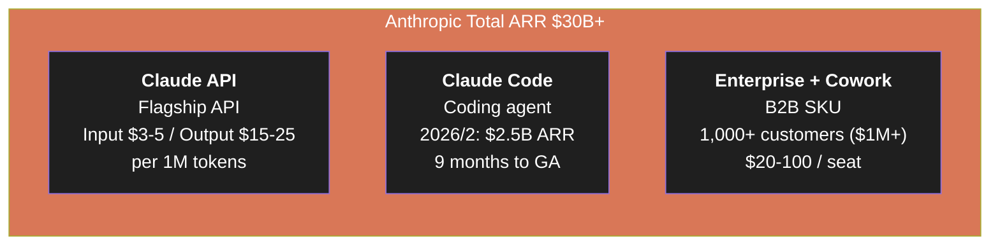

### Claude API (Flagship API)

The Claude API is the foundation that has driven Anthropic's growth. 
Pricing is publicly disclosed, with input at $3–5 per million tokens and output at $15–25, depending on the model.

The growth driver here is **token consumption by long-context agentic workloads**. 
Customers using Cursor, Cline, Continue.dev, and similar coding tools are consuming massive numbers of tokens via the Claude API, accelerating Anthropic's ARR growth.

### Claude Code (Coding Agent)

Claude Code was originally a CLI tool offered as a "research preview." 
But during 2025, it grew rapidly as a substantial product, reaching $2.5B ARR by February 2026 — only nine months after GA.

According to VentureBeat's reporting, Claude Code is used by **115 of the Fortune 100** (in some form), and **70% of those 115 are using the paid version**. 
The economic model is plainly stated as **"$13 per developer per day."**

Chapter 2 dissects Claude Code in detail.

### Claude Enterprise + Cowork (B2B SKU)

Claude Enterprise is a per-seat enterprise plan. 
The pricing range is publicly disclosed as $20–100 per seat per month. 
"Cowork," in particular, is positioned as a workspace product where AI agents and humans collaborate.

Anthropic's official blog stated in April 2026 that **over 1,000 customers have annual contract value exceeding $1 million**. 
Reaching the level of "1,000 enterprises with contract values exceeding $1M" is itself a clear sign that AI services have crossed from individual subscription tier into the enterprise commitment tier.

## 1.6 What Does 80x Growth Mean?

Returning to the question: what does 80x growth mean structurally?

**A SaaS company doubling annually is itself difficult.** 
Doubling annually means a company at $100M ARR reaches $200M next year. 
That alone requires hiring, infrastructure expansion, customer success scaling, and finance organization restructuring all running in parallel.

**Anthropic's 80x is on a different dimension.** 
$14B → $30B in two months means more than $1B in monthly ARR additions sustained. 
Per day, that is $30M+ in new ARR.

What kind of structure makes this possible? 
At least three things must happen simultaneously.

1. **Compute infrastructure must scale before demand**
2. **Enterprise sales engine must be functioning at scale**
3. **Product line must already include offerings to capture verticalized demand**

These three are mutually constraining. 
Compute lags demand, but enterprise sales must be ready in advance, and the product must have already been validated.

Dario Amodei's "we have had difficulties with compute" can be read as the bottleneck the company faced when these three were not aligned. 
Even with compute constraints, 80x was observed. 
This implies that with sufficient compute, growth could potentially be even higher.

## 1.7 Summary of This Chapter

This chapter dissected the two months from $14B to $30B from the following angles.

- **Quantitative facts**: The $14B → $30B ARR jump is officially confirmed by Anthropic, and the 80x annualized growth was stated by Dario Amodei himself at "Code with Claude"
- **Interpretive figures**: The "$15B added in one month" framing is from Latent.Space and others; Anthropic itself has not used this phrase
- **Three SKUs**: API (volume base) / Claude Code ($2.5B ARR) / Enterprise + Cowork (1,000+ contracts of $1M+)
- **Structural meaning**: 80x ARR growth requires the simultaneous functioning of compute, sales engine, and product line — and the bottleneck has appeared in compute

From the next chapter onward, the book dissects each layer in sequence. 
Chapter 2 covers Claude Code and the compute alliance. 
Chapter 3 covers the trust economy generated by Constitutional AI. 
Chapter 4 covers the structural comparison with frontier labs. 
Chapter 5 covers organizational and capital structure. 
Chapter 6 covers Anthropic Japan as a forward base.

### References

> **Primary Anthropic sources:** 
> [Series G announcement (2026/2/12)](https://www.anthropic.com/news/series-g) 
> [Anthropic official blog (2026/4/6, ">$30B ARR" announcement)](https://www.anthropic.com/news/scaling-the-frontier-of-economic-value)
>
> **Reporting:** 
> [VentureBeat: "We saw 80x" (2026/5/7)](https://venturebeat.com/ai/anthropic-revenue-growth-80x-code-with-claude/) 
> [Bloomberg: $19B ARR anonymous source (2026/3/3)](https://www.bloomberg.com/news/articles/2026-03-03/anthropic-revenue-runs-near-19-billion) 
> [Financial Times: "$45B soon" (2026/5/7)](https://www.ft.com/content/anthropic-arr-45-billion) 
> [Latent.Space (swyx): "80x annualized growth" thesis (2026/5/9)](https://www.latent.space/p/anthropic-80x)

 

---

# Chapter 2: Claude Code and the Compute Alliance — The Product Engine and Its Physical Foundation

## 2.1 Why Product and Physical Infrastructure Cannot Be Separated

In discussing Anthropic's growth engine, Claude Code (product) and the Compute Alliance (physical foundation) **cannot be argued in isolation**.

There are two reasons.

First, once Claude Code alone reaches a scale that generates $2.5B in ARR, 
the compute required to support its inference workload climbs into the **multi-gigawatt range**. 
Product success runs immediately into the constraints of physical infrastructure.

Second, the words Dario Amodei spoke at the Code with Claude conference (2026/5/6) directly express this inseparability.

> "We saw 80x. And that is the reason we have had difficulties with compute."

Growth rate is directly linked to compute constraints. 
Product demand has exceeded $30B, and physical supply capacity is rate-limiting growth. 
This chapter dissects this **dual relationship between the demand side (Claude Code) and the supply side (Compute Alliance)**.

## 2.2 Claude Code — A Product That Reached $2.5B in Nine Months

Claude Code holds one of the fastest ARR growth records in SaaS history.

| Point in Time | Claude Code ARR | Months Since GA | Source |
|---|---|---|---|
| 2025/2/24 | Research Preview launch | -3 months | Claude 3.7 Sonnet announcement |
| 2025/5/22 | General Availability (GA) | 0 months | Claude 4 announcement |
| 2025/11 | $1B run-rate | +6 months | Bun acquisition announcement (2025/12) |
| 2026/2/12 | **$2.5B run-rate** | **+9 months** | Series G announcement |

By comparison, Slack took 3 years to reach $100M ARR, and Snowflake took 5 years. 
Claude Code has passed in under a year the scale that those products took a decade to reach.

This velocity is not an accidental demand spike in the market. 
**It is the result of structural fit with the business category of coding.**

## 2.3 From "Assistive Tool" to "Primary Work Environment"

The starting point for understanding Claude Code is to recognize that **it is not a coding-assistive tool**.

Traditional AI coding tools, represented by GitHub Copilot, 
were "completion engines" predicting the next line of code a developer was writing. 
The developer remained central, the AI an assistant.

Claude Code is different. 
The developer **gives instructions to Claude Code, which then reads, writes, tests, and commits across the entire filesystem**. 
The developer becomes the conductor; Claude Code becomes the executor.

> **Fig.1: Assistive vs. Agentic — The Reversal of Roles**

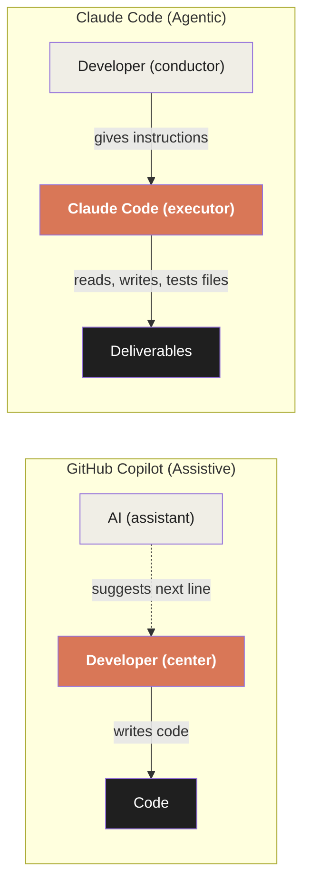

This reversal of roles has a decisive impact on revenue structure.

The value of an assistive tool is limited to "raising the productivity of the developer." 
A monthly subscription of tens of dollars is the revenue ceiling. 
GitHub Copilot's individual plan at $10/month exemplifies this structural ceiling.

The value of an agentic tool reaches "replacing the working hours of the developer." 
According to data Anthropic itself disclosed, **the average developer using Claude Code spends 20 hours per week working with it**. 
(2026/5/6, Dario Amodei, Code with Claude conference) 
When half of a 40-hour workweek runs through Claude Code, token consumption grows by one to two orders of magnitude over the assistive model.

## 2.4 The Economic Model of "$13/Developer/Day"

According to Anthropic's official documentation (updated 2026/4/15-16, reported by Business Insider), 
the average cost of Claude Code in enterprise deployment is recorded as follows.

| Metric | Value |
|---|---|
| Average cost | $13 / developer / active day |
| Monthly average | $150 – $250 / developer |
| 90th percentile upper bound | $30 / active day |

This figure is current as of April 2026. 
What is noteworthy is that this figure has **doubled since February 2025 (pre-GA)**. 
Anthropic's previously published documentation listed "$6 / developer / active day" and "$12 / active day as the 90% upper bound."

In response to Business Insider's reporting, an Anthropic spokesperson explained:

> "There has been no change to pricing or the product. As Opus 4.7 became the frontier model for Claude Code, the improvement in model capability expanded usage, and we updated the figures to reflect that."

In other words, prices were not raised. 
**The same developers, using a more capable model for longer hours on deeper tasks, doubled their consumption.** 
This shows that the economic model of agentic tools is a consumption-based model where "revenue scales with usage."

> **Fig.2: Economic Models of Coding Tools — Comparison**

| Tool | Pricing Model | Revenue Ceiling | Per Developer / Month |
|---|---|---|---|
| GitHub Copilot Individual | Subscription | Yes ($10/month) | $10 |
| GitHub Copilot Business | Subscription | Yes ($19/seat/month) | $19 |
| GitHub Copilot Enterprise | Subscription | Yes ($39/seat/month) | $39 |
| **Claude Code** | **Consumption-based + seat** | **Scales with usage** | **$150–$250 (observed)** |

For an enterprise with 500 developers, this becomes $75,000–125,000 per month, or $900,000–1.5M annually. 
**A single company already qualifies for Anthropic's "$1M+ annual customer" list.** 
The fact that customers paying Anthropic more than $1 million annually exceeded 500 at the time of Series G and surpassed 1,000 two months later is a direct consequence of this economic structure.

## 2.5 4% of GitHub Commits, and the Bun Acquisition as Stack Completion

Among the data Anthropic disclosed in the Series G announcement of February 12, 2026, 
the statement carrying the most structural meaning was the following.

> "Recent analysis estimates that code written by Claude Code accounts for **4% of all public GitHub commits worldwide** — double what it was just one month ago."

The figure of 4% of all public GitHub commits is hard to evaluate without context. 
But GitHub's public repositories receive contributions from hundreds of millions of developers worldwide, and even individual tech giants like Google, Microsoft, Meta, and Amazon account for only a few percent each. 
**Claude Code, as a single product, is generating commit volume comparable to the world's largest tech giants.**

And the growth rate of "double a month ago." 
That implies 2% in January 2026, 4% in February. 
If the same pace continues, an exponential trajectory of 8% in March and 16% in April is implied.

To support this growth, Anthropic acquired **Bun** in November 2025, immediately after Claude Code reached the $1B run-rate. 
Bun was an independent JavaScript/TypeScript runtime with 7 million monthly downloads and 82,000 GitHub stars.

> **Fig.3: The Claude Code Stack — The Strategic Position of the Bun Acquisition**

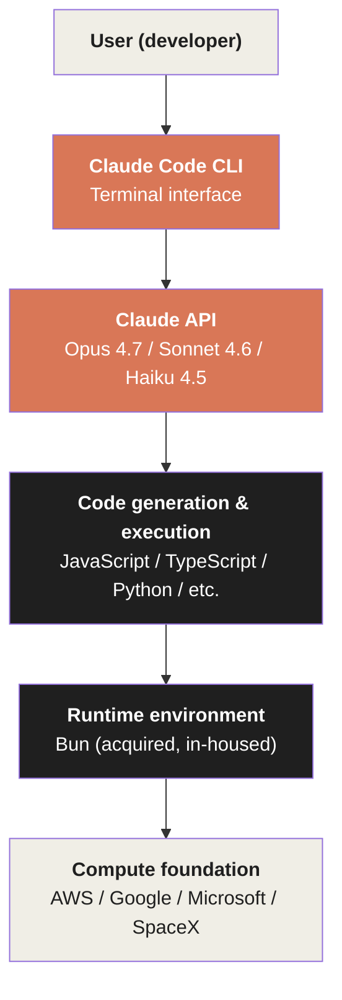

The Bun acquisition was not merely a technical acquisition but a strategic layer completion to make Claude Code a complete "coding platform." 
From code generation (Claude API) to execution (Bun), the full stack was brought under in-house control.

## 2.6 Customer List and Competitive Structure

Public materials from Series G and after explicitly name enterprise customers that have adopted Claude Code.

| Category | Customers |
|---|---|
| Media & Entertainment | Netflix, Spotify, Disney |
| Finance | Salesforce, Nordea, IG Group, Block, Coinbase |
| Automotive & Mobility | Cox Automotive, Uber |
| Life Sciences | Novo Nordisk, Genmab, Sanofi |
| Cybersecurity | Palo Alto Networks |
| Cosmetics & Retail | L'Oreal, KPMG |

Multiple strong players run in parallel in the AI coding market.

| Product | Provider | Valuation / ARR | Product Form |
|---|---|---|---|
| **Claude Code** | Anthropic | ARR $2.5B (2026/2) | Terminal-based agent |
| **GitHub Copilot** | Microsoft | 4.7M paid subscribers (2026/1) | IDE-integrated assistive |
| **Cursor / Anysphere** | Anysphere | Valuation $29.3B, ARR $2B (2026/2), $50B negotiation (2026/4) | IDE replacement |
| **OpenAI Codex** | OpenAI | 4M weekly developer users (2026/4/21) | API + CLI |

A structural feature worth noting is **the simultaneous existence of competition and collaboration**. 
Cursor is a customer that consumes Claude API heavily, and GitHub Copilot added Claude (Sonnet 4.5) as a default model option. 
Despite Microsoft having invested $130B in OpenAI, 
Anthropic was chosen as the frontier model for the most widely used coding products.

> **Fig.4: AI Coding Market Structure — The Duality of Competition and Collaboration**

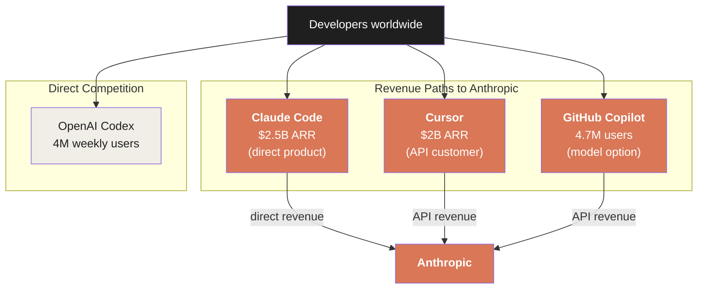

Anthropic earns revenue from three paths in the coding market. 
Only OpenAI Codex sits outside Anthropic's revenue paths as pure competition. 
At least 70–80% of the total AI coding market may be, in some form, monetized by Anthropic.

## 2.7 The Compute Alliance — The Physical Boundary of the Product

Up to here is the structure of "Claude Code as a product." 
But for a $2.5B ARR product to sustain an 80x growth trajectory, **physical compute resources** become the decisive constraint.

From 2025 to 2026, Anthropic signed **four massive compute-securing contracts in parallel**. 
These are not mere cloud contracts but **commitments to physical infrastructure that consumes multi-gigawatt-class power**.

> **Fig.5: Anthropic's Compute Alliance — Four-Party Parallel Procurement Structure**

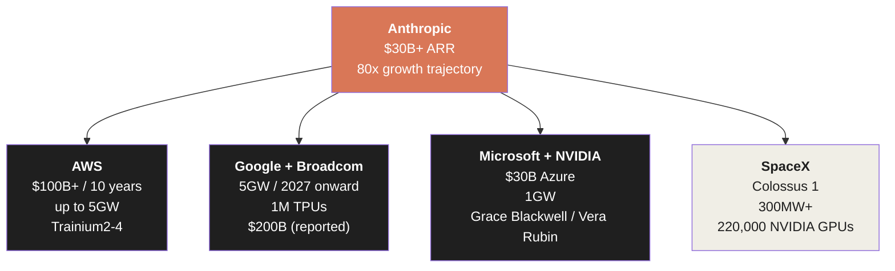

We examine the structure of each contract in turn.

## 2.8 AWS — $100B+ / 10 Years / 5GW

The relationship with AWS forms the **base layer** of Anthropic's compute strategy.

| Point in Time | Content | Source |
|---|---|---|
| 2023/9/25 | Amazon invests up to $4B | Anthropic official |
| 2024/11/22 | Amazon adds $4B (cumulative $8B); AWS becomes "primary cloud and training partner" | Anthropic official |
| 2026/4/20 | Major expansion with AWS, $5B immediate investment + up to $20B additional | Amazon official |

In the April 2026 expansion, Anthropic officially committed:

> "We will invest more than $100B in AWS technology over the next 10 years. We will secure up to 5GW of new capacity to train and operate Claude. This commitment spans Graviton, Trainium2, Trainium3, and Trainium4."

The scale of "5 gigawatts" is equivalent to the power consumption of five nuclear power plants. 
A contract dedicating this scale to a single company's single use (AI inference) is **without precedent** in the technology industry.

The core of the partnership with AWS is a cluster called "**Project Rainier**." 
According to information Anthropic disclosed on October 29, 2025, 
Project Rainier contains **approximately 500,000 Trainium2 chips**, making it one of the world's largest AI inference clusters.

Andy Jassy (Amazon CEO) evaluated this commitment as follows.

> "Anthropic's decision to run large language models on AWS Trainium for the next 10 years reflects the custom-silicon progress we have advanced together."

## 2.9 Google + Broadcom — 5GW / from 2027 / TPU

The partnership with Google moves on a different timeline from AWS.

| Point in Time | Content | Source |
|---|---|---|
| 2025/10/23 | Expanded use of Google Cloud TPUs, up to 1M TPUs, 1GW+ within 2026 | Anthropic official |
| 2026/4/6 | Next-generation TPU contract with Google + Broadcom, multi-gigawatt from 2027 onward | Anthropic official |
| 2026/4/24 | Alphabet invests up to $40B (immediate $10B + conditional $30B) | WSJ / Bloomberg |
| 2026/5/6 | Summarized as "5GW Google–Broadcom contract" | Anthropic official |

The Google contract differs from AWS's "Trainium2-4" in centering on **custom TPUs co-designed with Broadcom**. 
This is **next-generation infrastructure** coming online from 2027 onward and is not yet operational.

Some media (The Information, 2026/5/5) reported the contract's monetary scale as "$200B over 5 years." 
However, since neither Anthropic nor Google has officially confirmed the figure, this book treats "$200B" as a **reported unconfirmed value**. 
What is confirmed: **5GW of physical capacity** and **Alphabet's $40B investment commitment**.

## 2.10 Microsoft + NVIDIA — $30B Azure + 1GW

The Microsoft partnership (announced November 18, 2025) is structurally the most fascinating contract.

| Content | Value |
|---|---|
| Anthropic's Azure purchase commitment | $30B |
| Additional capacity | up to 1 GW |
| Microsoft's investment in Anthropic | up to $5B |
| NVIDIA's investment in Anthropic | up to $10B |
| Technical partnership | Grace Blackwell / Vera Rubin systems |

What is striking is that Microsoft, in its **position of having invested $130B in OpenAI**, 
is simultaneously executing a $30B Azure contract and $5B investment with Anthropic.

This is part of Microsoft's multi-model strategy of "selecting the best model regardless of provider." 
But as a result, Anthropic gained **a path of direct access to Microsoft's enterprise customer base**. 
Claude integration into Microsoft 365 (Copilot Cowork), the model option in GitHub Copilot, cloud distribution on the Azure Marketplace — 
all of these open Microsoft's vast distribution to Anthropic.

## 2.11 SpaceX Colossus 1 — 300MW Immediate Injection

The newest and most immediately effective contract is the SpaceX deal (announced May 6, 2026).

Anthropic's official announcement records the following:

> "We have entered into a contract with SpaceX to use all of the compute capacity of the Colossus 1 data center. This will give us access this month to **over 300MW of new capacity (more than 220,000 NVIDIA GPUs)**."

"Colossus 1" was a data center originally built for xAI (Elon Musk's AI company). 
After SpaceX acquired and integrated xAI in February 2026, its capacity was **leased entirely to Anthropic**.

This timing falls on the same day as Dario Amodei's "we saw 80x, that's why we have had difficulties with compute" statement (May 6, Code with Claude conference). 
**It signifies an extraordinary measure: in response to explosive growth in demand, the company leased an entire competitor's data center as the only solution capable of immediate deployment.**

300MW is small compared to AWS's 5GW or Google's 5GW. 
But AWS's and Google's capacity comes online **in the second half of 2026 to 2027 onward**. 
Colossus 1 comes online **"within this month."** 
It is emergency bridge capacity for responding to a short-term demand explosion.

## 2.12 The Structural Meaning of the Multi-Cloud Strategy

Anthropic's structure of running compute contracts in parallel with four entities (AWS / Google / Microsoft / SpaceX) is **without precedent in the industry**.

| Aspect | OpenAI | Anthropic |
|---|---|---|
| Primary cloud partner | Microsoft (exclusive) | AWS (primary) + Google + Microsoft + SpaceX |
| Custom silicon | NVIDIA-centric | AWS Trainium + Google TPU + NVIDIA |
| Multi-model cloud distribution | Azure-centric | AWS Bedrock + Google Vertex + Azure Foundry |

Anthropic explicitly stated in the Series G announcement (2026/2/12) that "**Claude is the only frontier model offered across all three major clouds — AWS Bedrock, Google Cloud Vertex AI, and Microsoft Azure Foundry**."

This structure carries three strategic meanings.

**1. Avoidance of single-platform lock-in**

In contrast to the structure where OpenAI depends on Microsoft, 
Anthropic is locked into no single cloud. 
This sustains negotiating leverage.

**2. Maximizing reach to enterprise customers**

Enterprise customers want to call Claude seamlessly from the cloud they are already using (most often AWS, Azure, or GCP). 
Supporting all three major clouds **minimizes the friction for customers to adopt Anthropic**.

**3. Risk distribution through hardware diversity**

Training and inference across NVIDIA GPUs, AWS Trainium, and Google TPUs — three silicon types — 
creates **immunity against specific hardware supply constraints**. 
Even if NVIDIA GPU supply tightens, Trainium2 or TPU can substitute.

## 2.13 The Structural Advantage of "Coding" as a Category

Up to here, we have examined both Claude Code (demand side) and the Compute Alliance (supply side). 
Finally, let us organize the structural factors for why "coding" became the first killer category of the AI agent economy.

Three factors can be identified.

**1. High verifiability**

Code's "works or doesn't work" can be judged immediately. 
Code generated by AI passes through objective verification processes: compilation, testing, execution. 
Even if generation is wrong, the developer can immediately detect and correct it. 
This is decisively different from areas requiring subjective evaluation, like text or image generation.

**2. Structured input/output**

Programming languages, unlike natural language, have **strict grammar and semantics**. 
"Hallucination" when an LLM generates code is made visible as syntax errors or test failures. 
For AI, coding is a task "where correct answers exist and can be mechanically judged."

**3. High economic value of developers**

Software engineers' wages stand at an extremely high level among all occupations (US average annual salary $130K–$200K). 
If 20 hours of weekly work is replaced by Claude Code, 
the value to the company is $30K–$50K per developer per year. Claude Code's cost of $150–250 per developer per month is less than 20% of that. 
**ROI is overwhelmingly positive.**

With these three factors aligned, coding became the first large-scale commercialization area of the AI agent economy. 
And to support that commercialization, **multi-gigawatt-class compute alliances** with AWS, Google, Microsoft, and SpaceX became physically necessary.

## 2.14 Summary of This Chapter

| Aspect | Value | Source |
|---|---|---|
| Claude Code GA | 2025/5/22 | Claude 4 announcement |
| ARR reached in 9 months | $2.5B | Series G announcement |
| Average developer cost | $13 / active day | Anthropic official |
| Average usage time | 20 hours per week / developer | Amodei statement |
| Share of public GitHub commits | 4% (doubled in one month) | Anthropic official |
| AWS contract scale | $100B+ / 10 years / up to 5GW | Anthropic official |
| Google+Broadcom contract | 5GW / from 2027 | Anthropic official |
| Microsoft Azure contract | $30B + up to 1GW | Microsoft official |
| SpaceX Colossus 1 | 300MW+ / 220,000 GPUs | Anthropic official |
| Alphabet's investment commitment | up to $40B | WSJ / Bloomberg |

The product (Claude Code) and physical foundation (Compute Alliance) constitute the twin wheels of Anthropic's growth engine. 
Precisely because a $2.5B ARR product is riding an 80x growth trajectory, the necessity of running **multi-gigawatt-class compute contracts in parallel with four partners** arises. 
Conversely, securing this much compute is what frees product growth from rate-limiting.

The duality between the two means that Anthropic is **a software company and a physical infrastructure company at the same time**. 
This is a structure that traditional SaaS valuation models cannot explain. 
The valuation non-linearity detailed in Chapter 5 originates in this physicality.

The next chapter dissects another foundation that supports the physical structure of demand and supply — **the trust economy generated by Constitutional AI**. 
Why do enterprises choose Anthropic? Why do regulated industries (finance, healthcare, government) reach Anthropic first? 
The answer is not in product features or compute scale. It is in **the trust that thought produces**.

### References

1. Anthropic. (2026/2/12). "Anthropic raises $30 billion in Series G funding at $380 billion post-money valuation." *anthropic.com*
2. Anthropic. (2025/12). "Anthropic acquires Bun as Claude Code reaches $1B milestone." *anthropic.com*
3. Anthropic. (2025/2/24). "Claude 3.7 Sonnet and Claude Code." *anthropic.com*
4. Anthropic. (2025/5/22). "Introducing Claude 4." *anthropic.com*
5. VentureBeat. (2026/5/7). "Anthropic says it hit a $30 billion revenue run-rate after 'crazy' 80x growth." *venturebeat.com*
6. Business Insider via Yahoo Finance. (2026/4). "Anthropic raises Claude Code cost estimates."
7. Anthropic. (2026/4/20). "Anthropic and Amazon expand collaboration for up to 5 gigawatts of new compute." *anthropic.com*
8. Anthropic. (2025/10/23). "Expanding our use of Google Cloud TPUs and Services." *anthropic.com*
9. Anthropic. (2026/4/6). "Anthropic expands partnership with Google and Broadcom for multiple gigawatts of next-generation compute." *anthropic.com*
10. Microsoft. (2025/11/18). "Microsoft, NVIDIA, and Anthropic announce strategic partnerships." *blogs.microsoft.com*
11. Anthropic. (2026/5/6). "Higher usage limits for Claude and a compute deal with SpaceX." *anthropic.com*
12. AWS. (2025/10/29). "AWS activates Project Rainier: One of the world's largest AI compute clusters comes online." *aboutamazon.com*
13. WSJ. (2026/4/24). "Google Expands Anthropic Investment With $40 Billion Commitment."
14. The Information. (2026/5/5). "Anthropic said to commit to $200B in AI capacity on Google Cloud."

 

---

# Chapter 3: The Trust Economy Generated by Constitutional AI — A Structure Where Thought Drives Revenue

## 3.1 Why Regulated Industries Reach Anthropic

Anthropic's customer list shows a peculiar bias. 
Finance, healthcare, government — **the most heavily regulated industries** — are the ones reaching Anthropic first. 
Brex (fintech), Coinbase (crypto), Visa (payments), Bridgewater (hedge fund), 
Banner Health (healthcare system), Sanofi (pharmaceuticals), Novo Nordisk (pharmaceuticals), the U.S. Department of Defense, the U.S. GSA, Lawrence Livermore National Laboratory.

Normally, for an emerging tech company to reach these industries requires 5 to 10 years of trust-building. 
But Anthropic has acquired these "most cautious customers" within five years of founding.

Why?

The answer is neither in product features nor in price. 
**The trust generated by Constitutional AI as a philosophy** is Anthropic's most powerful entry barrier. 
This chapter dissects the structure where thought is directly connected to revenue.

## 3.2 Constitutional AI — The Economic Value of Thought

The technical details of Constitutional AI (CAI) were covered in Chapter 2 of the sister book *Anatomy of Anthropic*. 
This chapter focuses on its **economic consequences**.

At the core of Constitutional AI is a method that gives AI a "constitution" — a set of explicit principles — 
and has the AI itself evaluate and revise its own outputs. 
A scalable, consistent safety mechanism that does not depend on human evaluators.

This approach is often discussed as something that limits AI capabilities. 
But from the perspective of enterprise customers, Constitutional AI functions as **part of the product's features**.

> **Fig.1: The Economic Value Structure Generated by Constitutional AI**

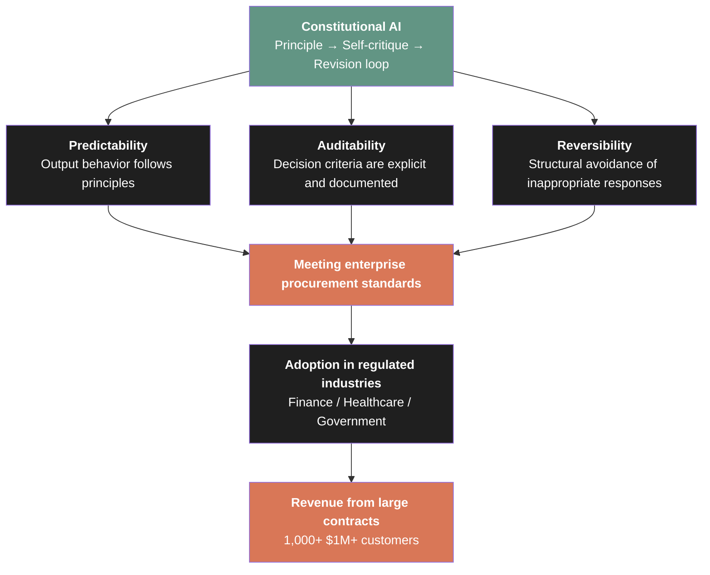

Predictability, auditability, reversibility — 
in enterprise procurement these are evaluation axes as important as the presence or absence of features. 
Constitutional AI gives Anthropic a structural advantage on these axes.

## 3.3 Customer Voices — "Trust" Articulated as the Reason for Selection

It is rare in the tech industry for enterprises to state "trust" as their reason for choosing a product. 
Normally, selection reasons are expressed as specific elements: features, price, support, ecosystem.

But Anthropic's customers **explicitly articulate Constitutional AI and the safety approach as their selection reasons**.

| Customer | Industry | Substance of Statement | Source |
|---|---|---|---|
| Banner Health | Healthcare system | "Drawn to Anthropic's focus on safety and the Constitutional AI approach" | Anthropic official |
| Elation Health | EHR | "The balance of performance and trust was the decisive factor" | Anthropic official |
| Brex | Fintech | "Conversations with customers begin with data privacy" | Anthropic official |
| Coinbase | Crypto | "Anthropic's security profile met all of our requirements" | Anthropic official |
| Visa | Payments | "Emphasized consent, privacy, transparency, and security" | Anthropic official |
| Salesforce Ventures | Venture investment | "Our customers, especially in finance and healthcare, asked us to deepen our relationship with Anthropic" | Salesforce Ventures official |

What is striking is that these statements are **not template-style praise for marketing purposes**. 
Each company describes Constitutional AI or the safety approach as **a concrete selection criterion** in its own procurement process.

The Salesforce Ventures statement is especially important structurally. 
The phrasing "**customers asked us to deepen our relationship with Anthropic**" 
shows that trust functions as a **pull-type signal originating from customers**. 
It is not push-type sales; safety operates as a request from the customer side.

## 3.4 Government Access — The Final Form of Trust

The final form of enterprise trust is **reaching government**. 
From 2025 to 2026, Anthropic deepened its relationship with the U.S. government in stages.

| Point in Time | Content | Source |
|---|---|---|
| 2025/6/6 | Claude Gov model announced, deployed at "the highest levels of U.S. national security" | Anthropic official |
| 2025/8/5 | Registration on GSA Schedule (made available to all federal agencies for $1) | GSA official |
| 2025 | FedRAMP High and DoD IL4/5 certification (via AWS Bedrock) | AWS official |
| 2025 | $200M ceiling contract with DoD (via CDAO) | Anthropic official |
| 2025 | Lawrence Livermore National Laboratory: 10,000-seat Claude for Enterprise deployment | Anthropic official |
| 2025/10/29 | Memorandum of Cooperation with Japan AI Safety Institute | Anthropic official |
| Pre-2025 | Memoranda of Cooperation with UK AISI and US AISI | Anthropic official |

Registration on the GSA Schedule means all U.S. federal agencies can **use Claude for $1**. 
As a commercial contract this looks irrational, but it makes sense if understood as **a strategy to embed government into the product development feedback loop**.

The 10,000-seat deployment to Lawrence Livermore National Laboratory is **the largest single public-sector deployment** Anthropic has disclosed. 
The laboratory, under the U.S. Department of Energy, conducts frontier research in nuclear weapons simulation, climate modeling, and materials science. 
The fact that an organization requiring the strictest information controls adopted Claude shows the reach of the trust generated by Constitutional AI.

> **Fig.2: Government Access Structure — Trust Institutionalized as Legal Certification**

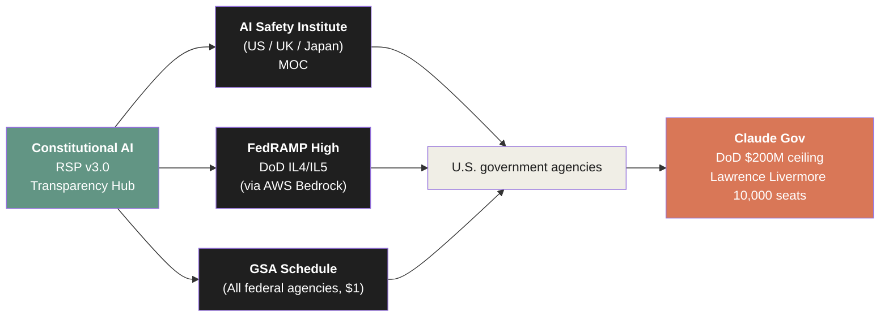

## 3.5 Rapid Enterprise-Scale Growth

Trust generates adoption in regulated industries, and adoption in regulated industries generates **structural expansion of ARR**.

| Point in Time | Number | Source |
|---|---|---|
| 2025/9/2 (Series F) | 300,000+ business customers | Anthropic official |
| 2025/9/2 (Series F) | $100K+ ARR customers up 7x YoY | Anthropic official |
| 2025/9/2 (Series F) | 500+ customers with $1M+ ARR | Anthropic official |
| 2026/4/6 | **1,000+** $1M+ ARR customers (doubled in 2 months) | Anthropic official |

The fact of "large customers doubling in two months" suggests an **avalanche effect** in trust formation in the enterprise market. 
Once 2-3 companies in an industry (such as finance) adopt, peers follow. 
In comparing compliance and procurement standards, the reference point "that company also uses it" accelerates subsequent decisions.

## 3.6 Industry-Specific Solutions — Structurally Aligning Trust with Industry Regulation

From 2025, Anthropic has been progressively announcing industry-specific specialized solutions. 
This is not merely a product line expansion but a **structural design that aligns Constitutional AI's "trust" with industry regulation**.

| Solution | Announcement | Industry-Specific Elements | Named Customers |
|---|---|---|---|
| Claude for Enterprise | 2024/9/10 | SSO, RBAC, audit logs, SCIM, 500K context | GitLab, Midjourney |
| Claude for Financial Services | 2025/7/15 | FactSet · S&P Global · PitchBook integration | Bridgewater, Brex, Block, Coinbase, Visa |
| Claude for Healthcare | 2026/1 | HIPAA compliance, life sciences toolkit | Banner Health, Novo Nordisk, Sanofi, Genmab |
| Claude Gov | 2025/6/6 | National security ready | DoD, Lawrence Livermore |

The announcement of industry-specific solutions shows **the process by which trust is translated from "general reputation"**  
**into "concrete compliance features aligned with industry regulation."**

For example, Claude for Financial Services 
provides integration with FactSet, S&P Global, PitchBook, Daloopa, Palantir, and Bloomberg alternative data sources. 
This is a layer for connecting directly to existing data infrastructure in financial institutions, and 
**a design that embeds Claude in a form that meets all of the industry's regulatory, data, and workflow requirements**.

## 3.7 Intellectual Authority — From Constitutional AI to Economic Research

The trust generated by Constitutional AI does not only function as a selection criterion in enterprise procurement. 
Anthropic is extending this trust into **intellectual authority across the entire industry**.

At its core is the "**Anthropic Economic Index**."

In February 2025, Anthropic announced the Anthropic Economic Index. 
A project that **measures directly from actual Claude conversation data** — not from speculation or surveys — 
the impact of AI on the economy and labor market.

> **Fig.3: The Construction of Intellectual Authority — From Thought to Research**

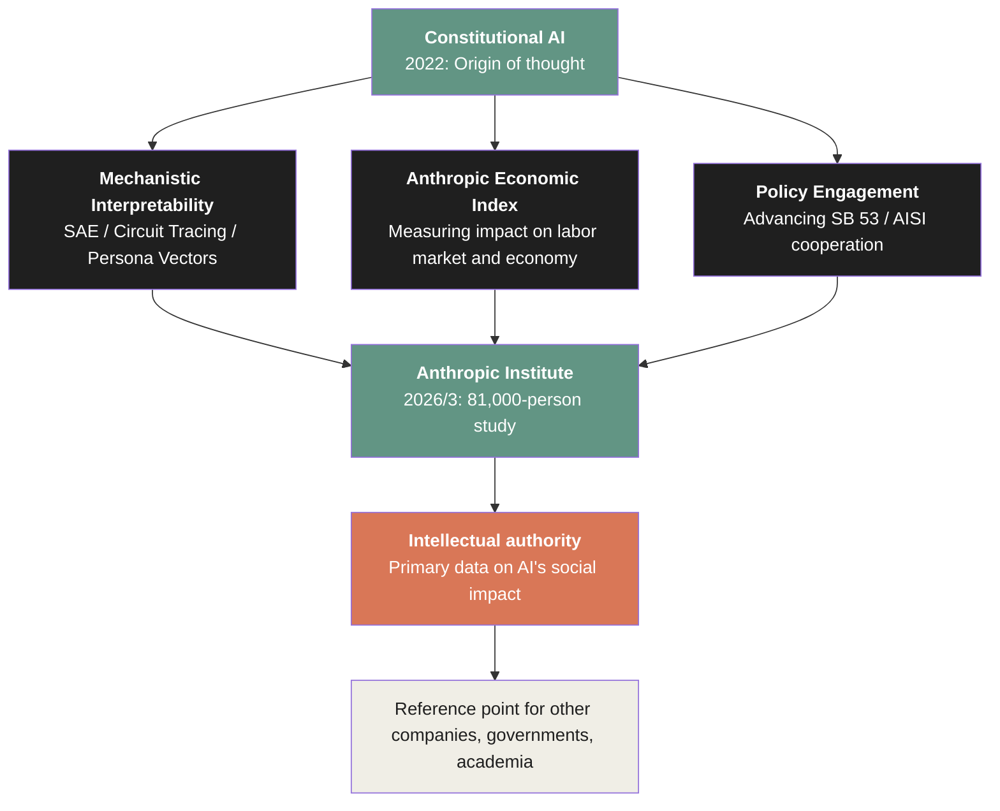

The Anthropic Economic Index, having anonymized **approximately one million Claude conversations**, 
**mapped them to the U.S. Department of Labor's O\*NET database (approximately 20,000 work tasks)**. 
It derives "what occupations and what tasks Claude is actually used for," from real data rather than speculation.

This project has three structural meanings.

**1. Monopoly on primary data about AI's social impact**

Neither OpenAI nor Google nor Meta has published large-scale data on how their products are used in the real world. 
Anthropic, by **disclosing its own data as a public-good research resource**, has taken the position of "primary source" in discussions of AI's social impact.

**2. Penetration into academic and policy communities**

The Economic Index research is led by Anthropic economists such as Maxim Massenkoff and Peter McCrory. 
Their papers are widely cited in academic media and have become reference points in policy debates. 
Discussion of AI's labor market impact can no longer be conducted without Anthropic's research.

**3. The meta-structure of "measuring a crisis our own product is causing"**

The Economic Index is research that **warns about AI's impact on the labor market**. 
Dario Amodei publicly stated that "half of entry-level white-collar jobs could disappear within five years," 
and Anthropic itself is collecting and publishing data supporting that prediction. 
**A phenomenon caused by one's own product is measured and warned about by oneself** — this peculiar structure 
transforms Anthropic from "merely a product vendor" into "a public-good entity that articulates the social structure of the AI era."

## 3.8 Labor Market Research — The 75% and 14% Figures

On March 5, 2026, Anthropic published a report titled "**Labor market impacts of AI: A new measure and early evidence**." 
Research by Maxim Massenkoff and Peter McCrory 
that builds a measurement framework for detecting AI's labor market impact **proactively rather than post-hoc**.

There are two principal findings.

**1. Computer programmers have an observed exposure level of 75%**

"Computer programmers" emerged as the occupation with the highest exposure, 
with **75% of work tasks covered by AI in current usage patterns**. 
Followed by customer service representatives at 70.1% and data entry workers at 67.1%.

The "75%" figure is consistent with Claude Code's $2.5B ARR. 
Because the majority of coding work is replaceable by AI, the economic value of that work flows to Anthropic.

**2. Employment rate decline of 14% in workers aged 22-25**

The report observed that since ChatGPT's emergence (late 2022), **employment rates among 22-25-year-olds in occupations with high AI exposure have declined by approximately 14%**. 
The difference in unemployment rates between "high AI exposure" and "low AI exposure" occupations is not statistically significant, and no impact is observed for workers aged 26 and over. 
But for **young workers and new entrants**, AI's substitution effects are made visible as employment slowdown.

> **Fig.4: Labor Market Exposure Map — From the Anthropic Economic Index**

| Occupation Category | Observed AI Exposure | Structural Meaning |
|---|---|---|
| Computer programmer | **75%** | Source of Claude Code's $2.5B ARR |
| Customer service representative | 70.1% | Second large-scale commercialization candidate |
| Data entry worker | 67.1% | Third automation target |
| (Other occupations) | 30-50% | Progressively expanding |

| Impact on Young Worker Employment | Observed Value |
|---|---|
| 22-25-year-olds in high-AI-exposure occupations | -14% (since ChatGPT emergence) |
| 26+ year-olds in high-AI-exposure occupations | No statistically significant difference |

The structural meaning of this research is profound. 
As an AI company, Anthropic is **academically measuring the impact its own product has on the labor market**. 
This is a structure close to "a pharmaceutical company publishing the side effects of its own product," and it has no precedent in the industry.

## 3.9 SB 53 — Translating Thought into Law

In 2025, Anthropic officially supported **California Senate Bill 53 ("Transparency in Frontier Artificial Intelligence Act")**. 
This is a law requiring frontier AI developers to **publish standardized safety frameworks and incident reports**.

To comply with this law, Anthropic itself published the "**Frontier Compliance Framework (FCF)**," 
structuring and disclosing its catastrophic risk assessments.

Why would Anthropic **actively support and advance** regulation that binds itself?

The answer is consistent with the philosophy of Constitutional AI. 
Anthropic has publicly stated that "for AI development to proceed safely, regulation across the entire industry is necessary." 
Even if one's own company invests in safety alone, if competitors disregard safety, the risk for the entire market does not decline. 
**Imposing equivalent regulation across the industry creates a structure where safety investments do not become a competitive disadvantage**.

This is the unusual position of "a company that welcomes regulation." 
But it is precisely this position that strengthens trust from government, academia, and civil society.

> **Fig.5: Thought → Trust → Revenue Flywheel (Complete Form)**

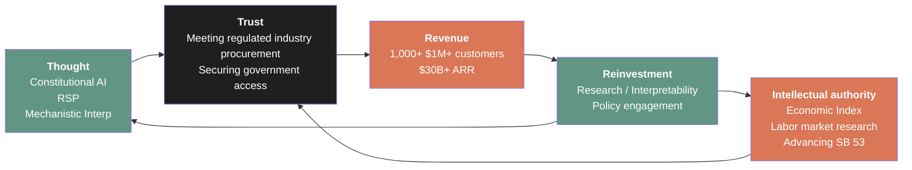

This flywheel is **the deepest layer** of Anthropic's growth engine. 
The product (Claude Code) is the surface, compute (AWS / Google / Microsoft / SpaceX) is the middle layer, and the structure of thought and trust forms the deep layer.

## 3.10 Summary of This Chapter

| Aspect | Value | Structural Meaning |
|---|---|---|
| Enterprise customers | 300,000+ (2025/9) | Quantitative indicator of trust |
| $1M+ ARR customers | 1,000+ (2026/4, doubled in 2 months) | Qualitative indicator of trust |
| Government access | GSA $1, DoD $200M ceiling, LLNL 10,000 seats | Final form of trust |
| Industry-specific solutions | Financial / Healthcare / Gov / Enterprise | Translation of trust to industry regulation |
| Anthropic Economic Index | ~1M conversation analysis | Construction of intellectual authority |
| Labor market research | Programmers 75% exposure / 22-25-year-olds -14% | Self-measurement of own product's social impact |
| Supporting SB 53 / Publishing FCF | Advancing regulation that binds itself | Translation of thought into law |

Constitutional AI is not a feature of Anthropic's product but **a mode of existence of Anthropic as a company**. 
Thought generates trust, trust generates adoption in regulated industries, adoption generates large contracts, 
revenue from contracts is reinvested into research, and research deepens thought further.

This flywheel means Anthropic is **structurally a different kind of entity** from OpenAI and other AI companies. 
While OpenAI chose to compete on "fastest to market with the highest-performing AI," 
Anthropic chose the path of "embodying the most trustworthy AI most carefully as an organization." 
The latter path appears slow in the short term. 
But as of 2026, that path is **generating larger and more sustainable revenue and social impact**.

The next chapter positions this structure, from objective facts, in comparison with four frontier labs — OpenAI, Google DeepMind, Meta, and xAI.

### References

1. Bai, Y., Kadavath, S., Kundu, S., et al. (2022). "Constitutional AI: Harmlessness from AI Feedback." *arXiv:2212.08073*
2. Anthropic. (2025/9/2). "Anthropic raises $13B Series F at $183B post-money valuation." *anthropic.com*
3. Anthropic. (2026/4/6). "Anthropic expands partnership with Google and Broadcom..." *anthropic.com* (source for 1,000+ $1M+ customers)
4. Anthropic. (2024/9/10). "Claude for Enterprise." *anthropic.com*
5. Anthropic. (2025/7/15). "Claude for Financial Services." *anthropic.com*
6. Anthropic. (2026/1). "Advancing Claude in healthcare and the life sciences." *anthropic.com*
7. Anthropic. (2025/6/6). "Claude Gov models for U.S. national security customers." *anthropic.com*
8. GSA. (2025/8/12). "GSA strikes OneGov deal with Anthropic."
9. Anthropic. (2026/1). "Anthropic Economic Index report: Economic primitives." *anthropic.com*
10. Massenkoff, M., McCrory, P. (2026/3/5). "Labor market impacts of AI: A new measure and early evidence." *anthropic.com/research*
11. Anthropic. (2025). "Anthropic is endorsing SB 53." *anthropic.com*
12. Anthropic. (2026). "Sharing our compliance framework for California's Transparency in Frontier AI Act." *anthropic.com*
13. Salesforce Ventures. (2025/9/30). "Behind the Investment: Anthropic."

 

---

# Chapter 4: Structural Comparison of Frontier Labs — OpenAI / Google / Meta / xAI

## 4.1 Methodology for Comparison

This chapter compares Anthropic with four frontier labs running in parallel — OpenAI, Google DeepMind, Meta, and xAI — based on observable facts.

Two things must be noted at the outset.

First, this chapter is **not a judgment of superiority**. 
Each company has made different strategic choices, and each choice generates its own structure. 
We do not argue "who is winning," but describe "how they structurally differ."

Second, comparable data has **information asymmetries**. 
OpenAI is private, so its financial disclosure is limited. 
Google and Meta are public but do not break out AI division revenue. 
xAI has ceased to exist as a standalone company through SpaceX's acquisition. 
Working with this varied data granularity, we attempt comparison from **primary sources** wherever possible.

## 4.2 Current State of the Five Companies — Status Based Only on Public Facts

We organize the major public figures for each company as of May 2026.

> **Fig.1: Structural Comparison of Five Frontier Labs**

| Item | Anthropic | OpenAI | Google | Meta | xAI |
|---|---|---|---|---|---|
| **Latest valuation** | $380B (Series G, 2026/2/12) | $852B (2026/3/31) | Parent Alphabet public | Parent Meta public | $230B (2026/1) → SpaceX acquisition ($1.25T combined) |
| **Reported additional raise** | ~$50B for ~$900B-1T (FT, 2026/5/7) | - | - | - | - |
| **Most recent ARR / revenue** | $30B+ (2026/4/6 official) | $2B/month = ~$24B annualized (2026/3/31) | Google Cloud Q1 $20B; Gemini revenue not broken out | Q1 $56B (company-wide); AI not broken out | $3.3B annualized (Sacra estimate) |
| **Corporate form** | PBC (public benefit corporation) | Capped-profit | Part of public listed company | Part of public listed company | LLC (former) → SpaceX integrated |
| **Main partners** | AWS / Google / Microsoft / SpaceX | Microsoft (exclusive) | In-house | In-house | SpaceX / NVIDIA |
| **Main investors** | GIC / Coatue / Amazon / Google / Microsoft / NVIDIA | Microsoft / SoftBank | Within Alphabet | Within Meta | SpaceX |
| **CapEx 2026** | Securing $11+ GW of compute | Stargate $500B initiative | Alphabet $175-185B | $125-145B | Integrated into SpaceX |

We now interpret the structural differences readable from this in turn.

## 4.3 OpenAI — Maximizing the Product Ecosystem

On March 31, 2026, OpenAI officially announced that it had **raised $122B at a valuation of $852B**. 
The major figures disclosed at the same time are as follows.

| Metric | Value |
|---|---|
| Monthly revenue | $2B (annualized $24B) |
| Weekly active ChatGPT users | 900M+ |
| Paid subscribers | 50M+ |
| Enterprise paid users | 9M |
| Enterprise revenue ratio | 40%+ of total |
| Codex weekly users | 4M (2026/4/21) |

OpenAI's strategy is clear. 
**Building a broad ecosystem starting from consumer-facing ChatGPT** and developing all-directional products atop it. 
ChatGPT, Codex, Sora, Dall-E, Custom GPTs, Operator — a diverse product line integrated under a single brand.

There are three structural differences from Anthropic.

**1. Concentration of cloud dependency**

OpenAI signed an exclusive partnership with Microsoft from 2019 and only deployed commercially on Azure. 
The October 2025 restructuring ended the exclusivity, but Microsoft still has **invested $130B+** and remains the largest strategic dependency. 
Anthropic, in contrast, has parallel procurement across four parties.

**2. Consumer vs. enterprise ratio**

900M weekly users of ChatGPT means domination of the consumer market. 
But enterprise revenue is 40% of the total. 
Anthropic also has consumer-facing Claude.ai, but its revenue core is **enterprise and developers**.

**3. Corporate structure**

OpenAI transitioned to "capped-profit" in 2019 and underwent "governance restructuring" in 2024, 
still holding a complex structure that is not a fully for-profit corporation. 
Anthropic is consistently a PBC (public benefit corporation).

| Aspect | OpenAI | Anthropic |
|---|---|---|
| Strategic center | Consumer ChatGPT ecosystem | Enterprise × developer |
| Cloud strategy | Microsoft-centric | Four-party parallel |
| Corporate form | Capped-profit | PBC |
| Safety positioning | Implemented as part of features | Built into corporate structure |

## 4.4 Google DeepMind — Integrated In-House Infrastructure

Google does not have an independent "DeepMind" entity but operates with an integrated structure of 
**research division under Alphabet + Google Cloud distribution**. 
Financial information is included in parent Alphabet's public financials.

The major figures for Q1 2026 (2026/1-3) are as follows.

| Metric | Value |
|---|---|
| Google Cloud Q1 revenue | $20B+ (+63% YoY) |
| Cloud backlog | $462B (all-time high) |
| Gemini Enterprise paid MAU | +40% QoQ |
| 1st-party model token processing | 16B tokens / minute (direct API) |
| Alphabet 2026 CapEx guidance | $175-185B |

Google's structural feature is **full-stack in-house production**.

| Layer | Google's Position |
|---|---|
| Silicon | TPU (in-house design, co-manufactured with Broadcom) |
| Data centers | Self-operated (multiple continents) |
| Foundation model | Gemini (in-house developed) |
| Distribution platform | Google Cloud Vertex AI |
| Consumer products | Google Search, YouTube, Workspace |

This full-stack structure could generate a **cost-structure advantage** over the long term. 
No need to buy NVIDIA GPUs; training and inference done on in-house TPUs. 
No margin paid to cloud providers.

However, as of May 2026, **Alphabet does not break out Gemini's ARR or revenue**. 
Google Cloud's $20B/Q includes Gemini Enterprise revenue, but 
how much Gemini alone generates cannot be confirmed externally.

What is worth noting is the fact that **Alphabet has invested up to $40B in Anthropic** (2026/4/24, WSJ reporting). 
Alphabet, while holding its own Gemini, is pursuing a strategy of massive investment in competitor Anthropic. 
This shows the recognition that "the frontier model market will not be monopolized by a single company; long-term reality is the coexistence of multiple models."

## 4.5 Meta — In-House + Open Weights

Meta is taking a distinctive strategy in the frontier model space. 
**Open weights** — publishing model weights — is at the core of its strategy.

| Metric | Value |
|---|---|
| 2026 Q1 revenue | $56.3B (company-wide) |
| 2026 Q1 CapEx | $19.84B |
| 2026 Q1 R&D | $17.7B |
| 2026 CapEx guidance | $125-145B (raised) |
| Meta Superintelligence Labs | Launched 2025/6 |
| Muse Spark (frontier model) | Released 2026/4/8 |
| Employees | 77,986 |

In the 2026 Q1 earnings call, Mark Zuckerberg explicitly stated **"the realization of Personal Superintelligence"** as Meta's long-term goal. 
Meta Superintelligence Labs (MSL) is the internal research organization for that realization.

The core of the structural difference with Anthropic is **open weights vs. closed weights**.

| Aspect | Anthropic | Meta |
|---|---|---|
| Model delivery form | Closed via API | Llama open + Muse Spark closed |
| Revenue structure | API / subscription direct | Advertising (FB/IG) + AI infrastructure sales |
| Safety approach | Constitutional AI (pre-control) | Open publication + community governance |
| Reach to enterprise customers | Direct (including regulated industries) | Mainly via cloud partners |

Meta's "open weights" strategy stands on the philosophical opposite of Anthropic's Constitutional AI. 
While Anthropic believes "safety cannot be guaranteed without internal model control," 
Meta believes "by widely publishing the model, the community can verify safety."

This philosophical opposition also affects enterprise customer choice. 
Regulated industries (finance, healthcare, government) tend to prefer **a single vendor with clear accountability**, 
which aligns with Anthropic's closed Constitutional AI approach. 
On the other hand, technically mature developer communities tend to prefer **customizable open models**.

## 4.6 xAI — Integration and Disappearance

xAI (Elon Musk's AI company) was **acquired and integrated into SpaceX** in 2026. 
This was one of the most structurally consequential events in the frontier lab industry of 2026.

| Point in Time | Content | Source |
|---|---|---|
| 2026/1/6 | xAI Series E: raised $20B at $230B valuation | Reporting |
| 2026/2 | SpaceX acquires xAI, forming a $1.25T combined entity | Reporting |
| 2026/5/6 | xAI's Colossus 1 data center (300MW, 220K NVIDIA GPUs) **leased to Anthropic** | Anthropic official |
| 2026/5 | Reports of rebranding the xAI brand to "SpaceXAI" | Reporting |

xAI's existence as a standalone company effectively ended in May 2026. 
Most dramatic is that the **Colossus 1 data center** xAI built 
was leased entirely to competitor Anthropic.

This fact shows **the fluidity of compute assets** in the frontier model market. 
Data centers are starting to take on the character of a financial asset that "the heaviest user borrows" rather than a "property" of a specific company. 
The moment xAI no longer needed compute, it flowed immediately to Anthropic.

The disappearance of xAI suggests **the possibility that the number of frontier labs is trending downward**. 
As of 2025, "OpenAI, Anthropic, Google, Meta, xAI" — five companies — ran in parallel. 
As of May 2026, this has effectively consolidated to four. Further consolidation may proceed going forward.

## 4.7 Comparison of Monetization Structures — Where Does Revenue Come From?

Organizing the revenue sources of the five companies clearly reveals each strategic choice.

> **Fig.2: Revenue Source Matrix of Frontier Labs**

| Company | API / Model Provision | Consumer Subscription | Advertising | Integration with Existing Business | Hardware / Compute Sales |
|---|---|---|---|---|---|
| **Anthropic** | ◎ Core | ○ Claude.ai | ✕ | △ Via Microsoft / AWS | ✕ |
| **OpenAI** | ○ | ◎ Core (ChatGPT) | △ Some discussion of ad integration | ◎ Microsoft 365 integration | ✕ |
| **Google** | △ Vertex AI | ○ Gemini Advanced | ◎ Core (advertising) | ◎ Search/YouTube/Workspace | △ TPU sales |
| **Meta** | △ Limited | ✕ | ◎ Core (advertising) | ○ Meta AI in WhatsApp/IG | ✕ |
| **xAI** | △ Limited | △ Grok | ✕ | △ X integration | (SpaceX integrated) |

Anthropic's position is clear. 
**It has the simplest revenue structure, centered on API / model provision.** 
No advertising, no integration with existing business, no hardware sales. 
Sell the product (Claude API, Claude Code, Claude Enterprise) and receive payment.

This simplicity increases the transparency of Anthropic's valuation model. 
The "multiple against ARR" detailed in Chapter 5 works because the revenue source is unitary. 
For Google or Meta with composite revenues from advertising, existing business integration, and hardware, 
breaking out the valuation of the AI division is itself difficult.

## 4.8 Structural Comparison of Safety Positioning

"Safety" is a frequently mentioned topic in the frontier lab industry, but 
**how it is implemented in the organization** differs significantly across the five companies.

| Company | Organizational Position of Safety | Published Methodology | Published Policy Engagement |
|---|---|---|---|
| **Anthropic** | Built into corporate structure (PBC) / company-wide | Constitutional AI / RSP v3.0 / Mechanistic Interp / Transparency Hub | Advancing SB 53 / AISI cooperation |
| **OpenAI** | "Safety & Alignment" team | Preparedness Framework / partial publication | Limited |
| **Google** | "Responsible AI" initiative | Responsible AI Practices | Policy proposals |
| **Meta** | "Trustworthy AI" initiative | Community governance / open publication | Advancing open weights |
| **xAI** | Limited disclosure | "Maximum truth-seeking" principle | Limited |

What decisively distinguishes Anthropic's safety positioning from others is the point 
that **safety is built into the corporate structure itself**. 
As a PBC (public benefit corporation), it is legally required to "balance public benefit and shareholder interests." 
The Long-Term Benefit Trust (LTBT) holds the right to appoint directors. 
These are not management decisions but **institutional designs that are difficult to change**.

In other labs, safety is treated as "an important management issue," 
but is not embedded in the governance structure. 
If management's judgment changes, priorities can shift.

This difference carries meaning in enterprise procurement. 
"That company is now emphasizing safety" and "that company is structurally unable to abandon safety" are 
fundamentally different as judgment criteria for long-term contracts.

## 4.9 The Observation Point of "Center of the Gravitational Field"

The structure argued through Chapter 3 can be reconfirmed from the comparison of four frontier labs.

The thesis announced by Latent.Space's swyx on May 9, 2026 
— "Anthropic continues 10x annual growth while every other AI-adjacent company is conducting workforce reductions exceeding 10%" — 
suggested that the gravitational field of the frontier lab industry is **being drawn toward Anthropic**.

> **Fig.3: Gravitational Field of the Frontier Lab Industry — May 2026**

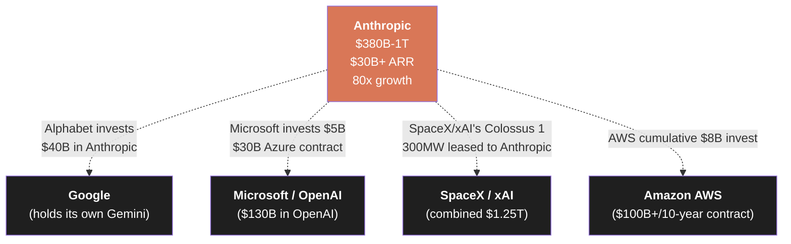

What is striking is the fact that **the main competitor (Google), the main cloud competitor (Microsoft), and the main AI competitor (xAI) are all flowing capital or assets into Anthropic**. 
This is an anomalous state.

Normally, competition between companies unfolds as competition for capital. 
But in the frontier model market, competitors are **investing in and depending on each other**. 
Microsoft invests $130B in OpenAI while investing $5B in Anthropic and signing a $30B Azure contract. 
Alphabet holds its own Gemini while investing $40B in Anthropic. 
xAI fully leases Colossus 1 to its competitor Anthropic.

What this pattern signifies is that **the scale of the AI market exceeds the standalone growth capacity of each company**. 
As the scale at which "satisfying global AI demand with one's own model alone" is physically impossible has been reached, 
investment in competitors connects to **securing distribution for one's own AI infrastructure business (cloud, chips)**.

At the center of that gravitational field, currently, sits Anthropic.

## 4.10 Summary of This Chapter

| Company | Major Valuation | ARR / Revenue | Strategic Center | Corporate Form |
|---|---|---|---|---|
| **Anthropic** | $380B (confirmed) / ~$1T (secondary market estimate) | $30B+ ARR | Enterprise × developer · PBC | PBC |
| **OpenAI** | $852B | $24B annualized | Consumer ChatGPT ecosystem | Capped-profit |
| **Google** | (Alphabet public) | Not separately disclosed | Full-stack in-house | Part of public listing |
| **Meta** | (Meta public) | Not separately disclosed | Open weights + in-house | Part of public listing |
| **xAI** | (SpaceX integrated) | $3.3B annualized | SpaceX/X integration (disappeared) | LLC → integrated |

What emerges from the comparison of five frontier labs is the fact that each company has made **different strategic choices**, 
and those choices generate their respective structures.

Anthropic's distinction lies in simplicity. 
Sell APIs and products to enterprises and developers. 
Build the structure of thought and trust centered on Constitutional AI into the corporate form. 
Procure compute in parallel across four parties. 
No advertising, no existing business integration, no hardware sales.

It is precisely this **simple structure** that places Anthropic at the center of the current frontier lab industry. 
Avoid complex diversification and maximally extend the most scalable single revenue engine.

That said, the industry structure is fluid. 
OpenAI's ecosystem expansion, Google's full-stack integration, Meta's open-weight strategy — 
the possibility that these will threaten Anthropic's position in the future cannot be denied.

The next chapter dissects the **organizational design, talent strategy, and capital structure** that supports this structure. 
Why can Anthropic generate $30B+ ARR with an organization of merely 2,500 people and acquire a $1T-scale valuation? 
We will see how the non-linearity of organization and capital makes possible the simplicity discussed in this chapter.

### References

1. Anthropic. (2026/2/12). "Anthropic raises $30 billion in Series G funding at $380 billion post-money valuation." *anthropic.com*
2. OpenAI. (2026/3/31). "OpenAI raises $122 billion to accelerate the next phase of AI." *openai.com*
3. Alphabet. (2026/Q1). "Q1 2026 Earnings Call." *abc.xyz/investor*
4. Meta. (2026/Q1). "Meta Reports First Quarter 2026 Results." *investor.atmeta.com*
5. Sacra. "xAI revenue, valuation & funding." *sacra.com/c/xai*
6. Bloomberg. (2026/4/24). "Google Expands Anthropic Investment With $40 Billion Commitment."
7. Microsoft. (2025/11/18). "Microsoft, NVIDIA, and Anthropic announce strategic partnerships." *blogs.microsoft.com*
8. Anthropic. (2026/5/6). "Higher usage limits for Claude and a compute deal with SpaceX." *anthropic.com*
9. Latent.Space (swyx). (2026/5/9). "AINews: Anthropic growing 10x/year while everyone else is laying off >10% of their workforce." *latent.space*
10. Anthropic. (2025). "Anthropic is endorsing SB 53." *anthropic.com*
11. Financial Times. (2026/5/7). "Anthropic weighs deal for near $1tn valuation as revenue surges."
12. Sherwood News. (2026/5/7). "Anthropic's Amodei: We could grow 80x this year." *sherwood.news*

 

---

# Chapter 5: The Non-Linearity of Organization, Capital, and Valuation — Dissecting the Management Structure

## 5.1 The Anomaly of 2,500 People × $30B+ ARR

As of May 2026, Anthropic's headcount is estimated at **approximately 2,500 people**. 
(Across multiple reports, the range disperses between 1,500 and 5,000 depending on source) 
At the same time, ARR is **$30B or higher**.

This ratio has almost no precedent in SaaS history.

| Company | Headcount | ARR | ARR per Employee |
|---|---|---|---|
| **Anthropic (2026/5)** | ~2,500 | $30B+ | **$12M+** |
| Salesforce (mature) | ~75,000 | $35B | $467K |
| Snowflake (post-IPO) | ~5,000 | $2.5B | $500K |
| Slack (at IPO) | ~2,500 | $400M | $160K |
| Microsoft (company-wide) | ~230,000 | $250B | $1.1M |
| Apple (company-wide) | ~165,000 | $390B | $2.4M |

More than $12M in ARR per employee. 
25x Salesforce, 75x Slack. 
Substantially exceeding even giants like Microsoft and Apple.

This anomaly suggests that Anthropic's organizational structure is **something that has departed from the traditional scaling laws of SaaS**. 
This chapter dissects how a small organization can generate ARR at this scale.

## 5.2 The Seven Co-Founders and the Organizational Core

Anthropic was founded in 2021 by **seven co-founders**.

| Name | Role | Function |
|---|---|---|
| Dario Amodei | CEO | Overall strategy, external communication |
| Daniela Amodei | President | Management, organizational operations |
| Tom Brown | Co-founder | GPT-3 co-first-author (ex-OpenAI) |
| Sam McCandlish | Chief Science | Research oversight |
| Jared Kaplan | Chief Science Officer | Scaling Laws co-author |
| Jack Clark | Head of Policy | Policy, intellectual authority |
| Chris Olah | Interpretability Research | Mechanistic Interpretability core |

Including Ben Mann, the founding core team comes to **eight**.

All of these founders are still at Anthropic as of 2026. 
(Daniela Amodei stepped back from day-to-day operations in early 2026 but remains on the board) 
**That the founding core has not splintered after three and a half years** is rare in the tech industry.

What is striking is that the founding core is **concentrated in the research, thought, and policy lines**. 
Heads of traditional corporate functions like "sales," "marketing," and "BizDev" are not included in the founding core. 
These were filled later by hiring outside enterprise veterans.

> **Fig.1: Anthropic's Organizational Structure — Separation of the Founding Core and Bolt-On Functions**

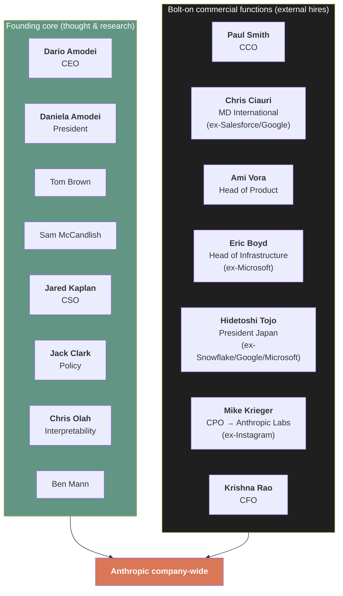

This structure shows **the separation of those who create thought from those who commercialize that thought**. 
The founding core concentrates on thought, research, and policy; commercial functions are handled by a different group of specialists. 
The two playing different roles within the same organization enables large-scale commercialization while preserving the purity of thought.

## 5.3 Compensation and Attrition — The Structure of "The AI Company People Most Want to Work At"

According to Levels.fyi (updated 2026/5/9), the **median total compensation for Anthropic employees is $420,388**. 
The maximum for a Lead Software Engineer is **$784,781**.

On Glassdoor (as of 2026), 222 employee reviews give a **4.4/5.0** overall rating. 
Specifically:

- 95% of employees would "recommend to a friend"
- 93% approve of Dario Amodei as CEO
- Compensation rating of **4.8/5.0** — **the highest** among 45 AI companies tracked by JobsByCulture

Anthropic **has not announced any layoffs in 2026**. 
While tech companies in the same period — Block (40%), Coinbase (14%), Cloudflare (20%) — executed large workforce reductions, Anthropic continued hiring. 
According to Tracxn, as of March 2026 Anthropic has **423-443 open public job postings**.

This structure speaks to **Anthropic's gravitational pull in the talent pool**.

| Aspect | Anthropic | Industry-Average AI Company |
|---|---|---|
| Median compensation | $420K | $200-300K |
| Top engineer compensation | ~$780K | $400-600K |
| Employee recommendation rate | 95% | 60-70% |
| CEO approval rate | 93% | 60-80% |
| Layoffs (2026) | None | Many |

This is consistent with the background that Meta's Superintelligence Labs is attempting to poach talent from Anthropic and OpenAI 
with **compensation packages of up to $300M**. 
In the talent war among frontier labs, Anthropic holds **the strongest gravitational pull**.

## 5.4 The Structural Meaning of ARR per Employee

Why can Anthropic generate $30B+ ARR with 2,500 people?

Three structural factors can be identified.

**1. The zero-marginal-cost property of software is operating to its limit**

In traditional SaaS, increasing customers brings the following scaling costs:

- Customer success teams
- Sales engineers
- Sales organizations
- Support organizations

In Anthropic's case, the API-based delivery form and the "explainable, predictable AI" property generated by Constitutional AI make **these scaling costs structurally low**. 
Since enterprises can procure Claude via the AWS / Google / Azure marketplaces, Anthropic's own sales organization can be kept minimal.

**2. Because the product itself possesses some intelligence, support hours are compressed**

In ordinary SaaS products, customer support is handled by humans. 
Answering questions, troubleshooting, configuration guidance. 
At Anthropic, **much of this is handled by Claude itself**. 
Help on Claude.ai is provided via Claude. 
Claude Code's documentation is explained interactively via Claude. 
The structure is one where **the product is reducing its own support overhead**.

**3. The four-party parallel compute alliance externalizes infrastructure operations**

The physical operation of data centers is handled by AWS / Google / Microsoft / SpaceX. 
Anthropic itself can concentrate on running models on top of this infrastructure. 
Infrastructure scalability is entrusted to partners; the company concentrates resources on **the core of research and product**.

> **Fig.2: Structural Explanation of ARR per Employee**

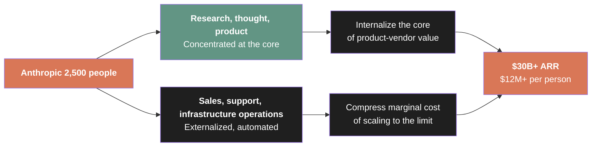

## 5.5 Capital Structure — A Design Where Shareholders Do Not Hold Management Control

Anthropic's capital structure differs decisively from traditional tech companies.

As mentioned in Chapter 3, Anthropic is registered as a **Public Benefit Corporation (PBC)**. 
Furthermore, the **Long-Term Benefit Trust (LTBT)** holds the right to appoint directors.

The consequence of this structure is that **even major investors do not hold management control**.

| Investor | Cumulative Investment | Board Representation |
|---|---|---|
| Amazon | $13B ($8B + $5B + up to $20B additional) | None (information rights only) |
| Alphabet | up to $40B ($10B + conditional $30B) | None |
| Microsoft | up to $5B | None |
| NVIDIA | up to $10B | None |
| GIC | Series G lead (size undisclosed) | None |
| Coatue | Series G lead (size undisclosed) | None |
| Many others | Cumulative ~$67B+ | None |

Precedent for this structure is extremely limited in the tech industry. 
Normally, investors putting in $10B or more secure the right to send a representative to the board. 
In contrast to Microsoft, which invested $130B in OpenAI and is deeply involved in OpenAI's governance, 
Anthropic maintains **management independence** from investors.

> **Fig.3: Contrast in Capital Structure — Location of Management Control**

| Aspect | OpenAI | Anthropic |
|---|---|---|
| Major investor management control | Microsoft is heavily involved | LTBT independently appoints directors |
| Board composition | Includes investor representatives | Founders + LTBT-appointed |
| Profit distribution constraints | Capped-profit (complex) | PBC (public benefit priority) |
| Ease of governance change | Multiple structural changes executed | Stability via LTBT |

Why are Amazon, Alphabet, Microsoft, and NVIDIA putting more than $67B into 
Anthropic, **where they hold no management control**?

The answer is that these companies **find value in Anthropic's governance independence**. 
They are competitors with each other. 
If Anthropic were under Microsoft's management control, Amazon would not invest. 
The reverse is also true. 
**It is precisely because Anthropic is under no one's management control that all major cloud providers can invest in it**.

The LTBT structure is often explained philosophically as "to secure autonomy from investors," 
but it also functions as **a commercial structure that enables joint investment among competing cloud providers**.

## 5.6 Valuation Trajectory — 380x in Four Years

Track Anthropic's valuation trajectory using only confirmed rounds.

| Point in Time | Round | Size | Valuation (post-money) | Lead Investor |
|---|---|---|---|---|
| 2021/5/28 | Series A | $124M | ~$550M (per some reporting) | Jaan Tallinn |
| 2022/4/29 | Series B | $580M | Undisclosed | FTX / SBF |
| 2023/5/23 | Series C | $450M | $4.1B | Spark Capital |
| 2023/9/25 | Amazon Strategic | $4B | - | Amazon |
| 2024/11/22 | Amazon additional | $4B (cumulative $8B) | $18.4B (as of Jan 2024, reported) | Amazon |
| 2025/3/3 | Series E | $3.5B | $61.5B | Lightspeed |
| 2025/9/2 | Series F | $13B | $183B | ICONIQ |
| 2025/11/18 | Microsoft / NVIDIA Strategic | up to $15B | ~$350B (CNBC reporting) | Microsoft / NVIDIA |
| **2026/2/12** | **Series G** | **$30B** | **$380B** | **GIC / Coatue** |

By confirmed values alone, from Series A's $550M to Series G's $380B, 
**a valuation expansion of approximately 690x in 4 years 9 months**.

Including raises that are reported but not closed:

| Point in Time | Reported Content | Valuation (reported) |
|---|---|---|
| 2026/4/20 | Amazon additional $5B + up to $20B (aboutamazon.com, Amazon official) | $350B (Bloomberg reporting) |
| 2026/4/24 | Alphabet up to $40B (WSJ / Reuters) | $350B reference |
| 2026/4/29 | New raise being considered at ">$900B" (Reuters) | ~$900B |
| 2026/5/7 | "~$50B for ~$900B-1T" (Financial Times) | ~$1T |
| 2026/5/9 | Secondary market (Forge / Jupiter Prestocks) implied | **~$1.2T** (estimate) |

From Series G's $380B to a secondary market implied $1.2T in only 3 months — **about 3x**. 
This is consistent with "$14B to $30B, 80x growth" discussed in the prologue.

## 5.7 Multiple Analysis — The Discipline of Valuation against ARR

While valuation has soared, 
**the multiple against ARR (valuation/ARR ratio) remains consistent** — 
one of the most structural findings of this book.

| Point in Time | Valuation | ARR | Multiple |
|---|---|---|---|
| 2026/2/12 (Series G) | $380B | $14B | **27.1x** |
| 2026/4/6 (report) | ~$350B (reference) | $30B+ | ~11.7x |
| 2026/5 (secondary market implied) | $1.0-1.2T | ~$30B+ | 33-40x |
| 2026/5 (FT report) | ~$1T | ~$45B (estimated) | ~22x |

The 27.1x multiple at the confirmed Series G round 
sits at the upper end of the SaaS industry standard range (10-30x). 
Comparable to the OpenAI peer ($852B / $2B/month = $24B annualized = ~35.5x).

If we adopt the secondary market implied $1.2T, the multiple expands to 33-40x, 
but as ARR also expands to $45B, it again converges around 22x. 
**Because valuation and ARR are growing rapidly simultaneously, the multiple stays within a "reasonable range" rather than an "anomalous value"**.

> **Fig.4: Multiple Discipline — Simultaneous Expansion of Valuation and ARR**

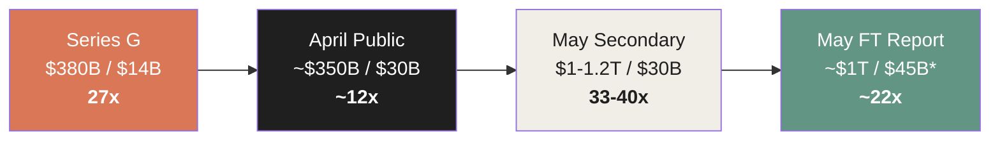

*: $45B is the assumed value from Financial Times reporting, not officially confirmed by Anthropic.

This "multiple discipline" suggests that Anthropic's valuation trajectory is 
**a rational expansion reflecting rapid ARR growth, not a speculative bubble**. 
Of course, 33-40x is a high level, and if ARR growth stops the valuation will rapidly be re-evaluated. 
But at present, ARR and valuation are not each anomalous values independently. 
**The two are expanding in tandem**.

## 5.8 Strategic Meaning of the Investor Composition

Anthropic's investor list has a strategically important structure.

| Classification | Major Investors |
|---|---|
| **Strategic (cloud)** | Amazon, Alphabet, Microsoft, NVIDIA |
| **Sovereign wealth** | GIC (Singapore), Qatar Investment Authority |
| **Top-tier VC** | Lightspeed, ICONIQ, Coatue, Founders Fund, Spark Capital, General Catalyst, Bessemer, Sequoia, Menlo |
| **Financial institutions** | Fidelity, BlackRock, Blackstone, D.E. Shaw, Dragoneer, Cisco, Salesforce Ventures |
| **Government-related** | MGX (UAE) |

Three features are worth noting.

**1. All four major cloud providers have invested**

Amazon, Alphabet, Microsoft, NVIDIA. 
These are mutually fierce competitors, yet all have invested in Anthropic. 
This is possible only because of the LTBT structure, 
and because each company shares "the economic incentive to distribute Claude on its own platform."

**2. Large-scale participation by sovereign wealth funds**

GIC (Series G lead), QIA, MGX. 
They have investment horizons measured in decades and do not seek short-term returns. 
They are the most aligned capital source for Anthropic's long-term structural investments.

**3. Diversity of financial institutions**

From public-market financials (Fidelity, BlackRock) to hedge funds (D.E. Shaw) to PE (Blackstone), diverse. 
This suggests Anthropic equity has **liquidity across broad financial markets**. 
It can also be interpreted as preparing ground for a future IPO.

## 5.9 The Blend of "Physicality" and "Software-Nature"

As discussed in Chapter 2, Anthropic is **a software company and a physical infrastructure company at the same time**. 
This duality has important implications for the valuation model.

Traditional SaaS company valuations are calculated as a function of ARR and its growth rate. 
But in Anthropic's case, beyond ARR there is another source of value: **access rights to physical compute assets**.

| Source of Value | Content | Impact on Valuation |
|---|---|---|
| ARR | $30B+, 80x growth | 27-40x multiple |
| Claude API/Code | Developer / enterprise dependence | Extends customer LTV |
| Compute secured | 11+GW multi-cloud contracts | Physical entry barrier |
| Constitutional AI | Trust in regulated industries | Lowers customer acquisition cost |
| LTBT structure | Enables joint investment by all competing cloud providers | Expands investor access |

All of these simultaneously constitute Anthropic's value. 
A $1T-scale valuation cannot be explained by ARR alone. 
Physicality and software-nature, thought and commerce, small-organization size and large influence — multiple factors **stack non-linearly** to constitute the current valuation.

## 5.10 Summary of This Chapter

| Aspect | Value | Structural Meaning |
|---|---|---|
| Headcount | ~2,500 (estimated) | A small organization rare in SaaS history |
| ARR per employee | $12M+ | 25x Salesforce, 75x Slack |
| Founding core retention | All 7 (5 years on, Daniela stepping back) | Continuity of thought preserved |
| Compensation (median) | $420K | Highest level among frontier labs |
| Layoffs (2026) | None | Counter to the industry-wide workforce reduction trend |
| Major investors | 4 cloud, sovereign, top VC, financial institutions | Management independence via LTBT enables joint investment |
| Series G valuation | $380B (2026/2/12) | Highest confirmed value |
| Secondary market implied | ~$1.0-1.2T | Reported reference point |
| Multiple (Series G) | 27.1x | Upper end of SaaS standard range |
| Multiple discipline | ARR and valuation expand together | Structural growth, not speculative bubble |

Anthropic's organization, capital, and valuation can be understood as **a stack of anomalies**. 
A small number of people generate massive ARR, the founding core does not break apart, all competing cloud providers co-invest, and the multiple maintains discipline while expanding. 
These anomalies do not arise independently but form **a structure where they reinforce each other**.

A small headcount keeps the purity of thought. 
Purity of thought builds trust. 
Trust drives adoption in regulated industries. 
Adoption in regulated industries expands revenue. 
Expanded revenue attracts top talent. 
Top talent generates large ARR with few people — the flywheel completes.

And the LTBT structure **protects this flywheel from external attack**. 
Investors cannot warp management judgment by seeking short-term returns. 
Founders' thought cannot be rewritten by shareholder will.

The final chapter dissects Anthropic Japan as a **geographic deployment example** of these structures. 
Why did Anthropic choose Tokyo as its first Asia-Pacific outpost? 
We will see how the adoption patterns of Japanese enterprises — NEC, Rakuten, NRI, Mercari, DeNA, Classmethod — 
connect with the structures discussed throughout this book.

### References

1. Anthropic. (2026/2/12). "Anthropic raises $30 billion in Series G funding at $380 billion post-money valuation." *anthropic.com*
2. Anthropic. (2025/9/2). "Anthropic raises $13B Series F at $183B post-money valuation." *anthropic.com*
3. Anthropic. (2025/3/3). "Anthropic raises Series E at $61.5B post-money valuation." *anthropic.com*
4. Anthropic. (2026/4/6). "Anthropic expands partnership with Google and Broadcom..." *anthropic.com*
5. Crunchbase News. "Anthropic Raises $30B At $380B Valuation In Second-Largest Venture Funding Deal Of All Time."
6. Anthropic. (2025/9). "Anthropic expands global leadership in enterprise AI, naming Chris Ciauri as Managing Director of International." *anthropic.com*
7. Anthropic. (2026/1/13). "Introducing Anthropic Labs." *anthropic.com*
8. Levels.fyi. (updated 2026/5/9). "Anthropic salaries."
9. Glassdoor. "Anthropic employee reviews."
10. Tracxn. "Anthropic 2026 Funding Rounds & List of Investors."
11. DeepLearning.ai. "Meta's Hiring Spree Raised Compensation for Top AI Engineers and Executives."
12. Bloomberg. (2026/4/20). "Amazon to Invest an Additional $5 Billion in Anthropic."
13. WSJ. (2026/4/24). "Google Expands Anthropic Investment With $40 Billion Commitment."
14. Financial Times. (2026/5/7). "Anthropic weighs deal for near $1tn valuation as revenue surges."
15. Anthropic. (2023). "Anthropic's Long-Term Benefit Trust." *anthropic.com*

 

---

# Chapter 6: Anthropic Japan as a Forward Base — Geographic Deployment of the Global Structure

## 6.1 Tokyo as the Origin Point of Asia-Pacific

On October 29, 2025, Anthropic opened **its first Asia-Pacific office in Tokyo**. 
The same day, Dario Amodei met with Prime Minister Sanae Takaichi and Digital Minister Takeaki Matsumoto. 
He also signed a **Memorandum of Cooperation** with the Japan AI Safety Institute.

The choice of Tokyo sends multiple strategic signals.

**1. Reflecting Asia-Pacific revenue growth**

Simultaneously with the Tokyo opening, Anthropic announced that "**Asia-Pacific run-rate revenue has grown more than 10x in the past year**." 
This region — including Japan, Korea, Singapore, Australia, and Southeast Asia — has become an important engine of Anthropic's rapid growth.

**2. A market with high regulatory alignment**

Japan stands in a leading position globally in the discussion of AI regulation. 
The Hiroshima AI Process, the establishment of the AI Safety Institute, international coordination as G7 chair. 
Anthropic's safety approach centered on Constitutional AI is **philosophically aligned** with Japan's regulatory environment.

**3. Alignment with a "Claude-using culture"**

The Anthropic Economic Index (2026/1) 
lists the United States, India, Japan, the United Kingdom, and South Korea as top-using countries for Claude.ai. 
Japan's Claude usage stands at **the global top tier** alongside Western nations.

## 6.2 Hidetoshi Tojo — The Choice of Japan Lead

On August 7, 2025, Anthropic appointed **Hidetoshi Tojo** as Japan lead. 
He leads the Tokyo office as Representative Executive Officer and President.

Tojo's career symbolizes Anthropic's strategic choices.

| Period | Position |
|---|---|
| Before | Microsoft (Japan) |
| Before | Google Cloud (Japan) |
| Immediately prior | President, Snowflake Japan |
| 2025/8/7 | Representative Executive Officer and President, Anthropic Japan |

**Microsoft → Google Cloud → Snowflake → Anthropic.** 
A career launching enterprise technology in the Japanese market, repeated three times.

This choice indicates that Anthropic Japan is **optimized for enterprise from the start, not for consumers**. 
Snowflake's deployment in the Japanese market has a track record of deep penetration into major financial institutions, retail, and manufacturing as a data platform. 
The design is to reproduce the same pattern with Claude.

## 6.3 NEC — Full-Scale Deployment as "Client Zero"

The most emblematic customer of Anthropic Japan is **NEC**.

On April 24, 2026, Anthropic and NEC announced a **strategic partnership**. 
NEC became **Anthropic's first Japan-based global partner** and is deploying Claude at the following scale.

| Item | Content |
|---|---|
| Deployment headcount | ~30,000 across NEC Group |
| Main products | Claude Code, Claude Cowork |
| Integration targets | NEC BluStellar scenarios, Security Operations Center (SOC) |
| Goal | Build one of Japan's largest AI-native engineering teams |

NEC's announcement stated:

> "NEC aims to build one of Japan's largest AI-native engineering teams."

This "Client Zero" model — where a major enterprise becomes a case study of **whole-company AI-native transformation**, creating a ripple effect across the industry — 
is the core of Anthropic's Japan strategy. 
NEC's 30,000-seat deployment generates structural pressure on competing Japanese enterprises: "we also need to become AI-native."

> **Fig.1: Structure of the NEC Client Zero Model**

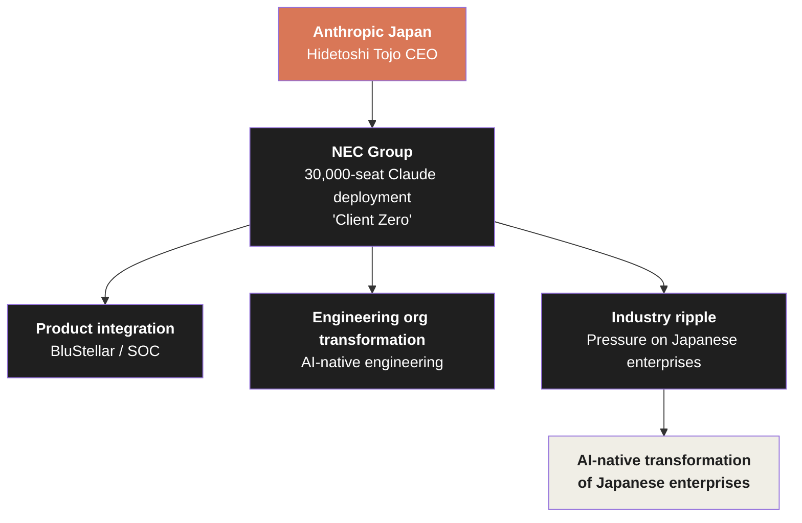

## 6.4 Adoption Patterns in Japanese Enterprises

With NEC at the center, Anthropic Japan is building relationships with multiple Japanese enterprises.

| Company | Industry | Claude Adoption | Reported Effect |
|---|---|---|---|
| **NEC** | Technology / Telecom | Claude Code / Cowork, 30,000 seats | AI-native engineering organization |
| **Rakuten** | E-commerce / Finance / Mobile | Claude Code (autonomous coding) | Improved developer productivity |
| **NRI** (Nomura Research Institute) | Consulting / IT | Claude (via Amazon Bedrock) | 50% reduction in Japanese document analysis time |
| **Mizuho** | Finance | Confirmed customer (Digital Today Korea reporting) | - |
| **Panasonic** | Electronics / Appliances | Enterprise-wide integration | Business operations / consumer apps |
| **Mercari** | E-commerce / Marketplace | Contact center renewal (20% workload reduction with AI) | Internal API "Ellie" published |
| **DeNA** | Gaming / IT | AI Coding Hands-on Workshop, hundreds of engineers participated | Penetration into engineering culture |
| **Classmethod** | Cloud integration | Anthropic Authorized Reseller (2026/3) | 10x productivity, 99% of code Claude-generated |

What is striking is the **breadth of industries** of these companies. 
Technology, finance, manufacturing, consulting, e-commerce, gaming — 
core players from Japan's major industries are each adopting Claude in their own context.

NRI's "50% reduction in Japanese document analysis time" is particularly structurally important. 
Japanese enterprises' business documents are an area where **English-centric LLMs struggle to achieve high accuracy**. 
Claude shows superior performance in Japanese processing compared to competitors, and this has accelerated adoption in the Japanese market.

## 6.5 Building the Reseller Network

Anthropic Japan is building a **Japan-specialized reseller network**, not just direct sales.

| Reseller | Certification | Role |
|---|---|---|
| **NRI (Nomura Research Institute)** | November 2025 | Japan's first Anthropic Authorized Reseller (via Amazon Bedrock) |
| **Classmethod** | March 2026 | Cloud integration / implementation support |
| **NHN Techorus** | March 2026 | Cloud infrastructure deployment |

The fact that NRI became "Japan's first Authorized Reseller" 
indicates Anthropic's **finance-and-consulting-first** approach to the Japanese market. 
NRI is a comprehensive think tank and SIer under Nomura Holdings and is positioned to support AI adoption at Japan's major financial institutions. 
Through NRI, Anthropic gained a path of reach into the entire financial industry — megabanks, regional banks, insurance companies.

Classmethod's case symbolizes penetration into the technical community. 
Classmethod is known as a top-tier partner of AWS and Google Cloud and holds strong influence in the engineering community. 
The company's public statement that "**99% of code was generated by Claude Code**" 
has rapidly elevated trust in Claude within Japan's technical community.

## 6.6 The Relationship with the Japanese Government

Anthropic Japan is also rapidly deepening its relationship with the Japanese government.

| Point in Time | Content |
|---|---|
| 2025/10/29 | Memorandum of Cooperation with Japan AI Safety Institute, Tokyo office opening |
| 2025/10/29 | Meeting between Prime Minister Sanae Takaichi and Dario Amodei |
| 2025/10/29 | Meeting with Digital Minister Takeaki Matsumoto |
| 2025/10/29 | Dialogue with the LDP Digital Promotion Headquarters Committee |

These government-relationship buildings are the Japanese version of the **trust economy** discussed in Chapter 3. 
A structure similar to GSA Schedule, DoD, and Lawrence Livermore in the United States is also being built in Japan.

The Memorandum of Cooperation with the AI Safety Institute is particularly important. 
The Japan AI Safety Institute is an organization under the Ministry of Economy, Trade and Industry, positioned to formulate safety evaluation standards for generative AI. 
For Anthropic to form a cooperative relationship with this organization means **having a voice in shaping the framework of AI regulation in Japan**.

## 6.7 Builder Summit Tokyo — Penetration into the Developer Community

Simultaneously with the October 2025 Tokyo office opening, Anthropic held the **Builder Summit Tokyo**. 
More than 150 Japanese startups and founders attended.

The structural meaning of this event is that 
Anthropic is simultaneously investing in **not only enterprises but also the ecosystem of emerging companies** in the Japanese market.

Japan's startup ecosystem, compared with the United States, China, and India, is small in scale. 
But there are **startups specialized in deep domain areas** — robotics, manufacturing AI models, financial AI, healthcare AI. 
Anthropic is intentionally nurturing the ecosystem where these startups build products based on Claude.

## 6.8 Tokyo as the Origin Point of Asia-Pacific

For Anthropic, Tokyo is **not just an outpost for the Japanese market**. 
It functions as the origin point for the entire Asia-Pacific.

| Country | Anthropic's Major Deployment |
|---|---|
| Japan | Tokyo office, NEC, NRI, Rakuten, Mercari, DeNA, Classmethod |
| Korea | Confirmed customers such as Mizuho (Digital Today reporting) |
| India | Top-using country for Claude.ai (Anthropic Economic Index) |
| Singapore | GIC as Series G lead investor |
| Australia | Commonwealth Bank of Australia (Anthropic official customer) |

The fact that GIC (Government of Singapore Investment Corporation) became the lead investor for Series G 
indicates that the Singaporean government is **strategically making a long-term investment in Anthropic**. 
Anthropic's presence in the Asia-Pacific region is being built as a network connecting Tokyo, Singapore, and major customer cities.

## 6.9 Items Not Yet Confirmed

Maintaining the stance of Chapter 3, this book explicitly marks items that cannot be confirmed as **unconfirmed**.

- The exact registration date of Anthropic Japan as a Godo Kaisha (estimated mid-to-late 2025 from multiple reports, but the precise date confirmed by official gazette has not been obtained as of writing)
- The exact location and size of the Tokyo office
- The headcount of Anthropic Japan
- What percentage of Anthropic's global ARR is contributed by Asia-Pacific revenue

These are matters that will be clarified by Anthropic Japan's future public disclosures, commercial registration, or tax disclosures. 
This book avoids describing currently unconfirmable figures by speculation, 
and describes the structure of Japan deployment **only from confirmable facts**.

## 6.10 Summary of This Chapter

| Aspect | Value | Structural Meaning |
|---|---|---|
| Tokyo office opening | 2025/10/29 | First office in Asia-Pacific |
| Japan lead | Hidetoshi Tojo (ex-Microsoft/Google/Snowflake) | Experienced in enterprise deployment |
| NEC deployment scale | 30,000 seats | Client Zero model |
| NRI efficiency improvement | 50% reduction in Japanese document analysis time | Advantage in Japanese-language AI |
| Classmethod achievement | 99% of code Claude Code-generated | Penetration into the technical community |
| Asia-Pacific ARR growth | 10x+ in the past year | Major engine of global growth |
| Government relations | AI Safety Institute MOC, meetings with Prime Minister and Minister | Alignment with regulatory environment |

Anthropic Japan is the **geographic microcosm** of the structure discussed throughout this book.

The duality of product (Claude Code) and physical foundation (Japan deployment via AWS / Google). 
The trust generated by Constitutional AI enables early adoption by regulated industries (finance, telecom, manufacturing). 
A small headcount (the precise count of the Tokyo office is undisclosed, but a portion of Anthropic's company-wide 2,500) generating large-scale revenue. 
Strategic long-term investment from an investor (GIC).

All of these can be understood as **geographic embodiment** of the structures discussed in previous chapters. 
The Japanese market is the forward base where the structural characteristics of Anthropic as a global enterprise can be most vividly observed.

Next, we move to the final chapter integrating the arguments of this book.

### References

1. Anthropic. (2025/10/29). "Anthropic opens Tokyo office, signs a Memorandum of Cooperation with the Japan AI Safety Institute." *anthropic.com*
2. Anthropic. (2025/8/7). "Anthropic appoints Hidetoshi Tojo as Head of Japan and announces hiring plans." *anthropic.com*
3. Anthropic. (2026/4/24). "Anthropic and NEC partner to build AI-native engineering at scale in Japan." *anthropic.com*
4. NEC. (2026/4/23). "NEC Announces Strategic Collaboration with Anthropic Focused on Enterprise AI." *nec.com*
5. JCN Newswire via IPROS GMS. "Hidetoshi Tojo appointed as the representative executive president of the U.S. Anthropic Japan Corporation."
6. NRI. (2026/3/6). NRI Anthropic Authorized Reseller press release.
7. Anthropic. (2026/1). "Anthropic Economic Index report: Economic primitives." *anthropic.com*
8. Mercari Engineering Blog. "The Generative AI/LLM Team's Goal of Creating a Platform Equipped with a Wide Selection of AI Tools."
9. Zenn / mizchi. (2025/7). "Conducting an AI Coding Hands-on Workshop: A Case Study at DeNA."
10. TechTradeAsia. (2025/11). "Anthropic opens first Asia-Pacific office in Japan."

 

---

# Epilogue: The Implications of Structure — What Lies Beyond $1 Trillion

## E.1 Integration of the Six Layers

This book has dissected Anthropic's $1 trillion trajectory across six layers.

| Chapter | Subject of Dissection | Core Finding |
|---|---|---|
| Prologue + Ch.1 | Facts of the trajectory | $14B → $30B (2 months) / 80x annualized / $1.2T secondary-market implied |
| Ch.2 | Product engine + physical foundation | Claude Code $2.5B ARR / 11+ GW multi-cloud alliance |
| Ch.3 | Thought and trust | Constitutional AI / early adoption by regulated industries / 1,000+ $1M+ customers |
| Ch.4 | Comparison of four frontier labs | Anthropic is distinctive in "simplicity," "PBC," and "multi-cloud" |
| Ch.5 | Organization, capital, valuation | 2,500 people generating $30B+ ARR / multiple discipline / LTBT structure |
| Ch.6 | Anthropic Japan | Geographic embodiment of the global structure / NEC Client Zero model |

These six layers do not exist independently; 
they form **a flywheel where they reinforce each other**.

> **Fig.1: Integrated Structure of the Six Layers**

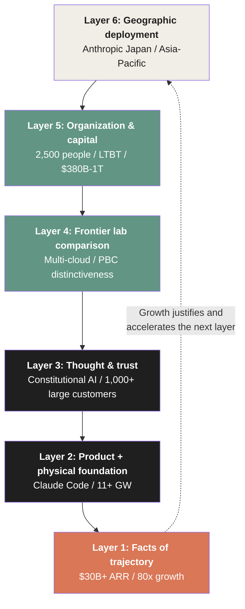

ARR growth → compute secured → trust deepened → differentiation from competitors → capital inflow → geographic expansion → further ARR growth. 
Each turn of the flywheel reinforces each layer.

## E.2 Revisiting swyx's Thesis

Let us cite once more the thesis of Latent.Space's swyx (2026/5/9) quoted at the opening of this book.

> "Anthropic continues 10x annual growth while every other AI-adjacent company is conducting workforce reductions exceeding 10%."

This thesis can be understood more deeply through the dissection of this book.

Anthropic's standalone growth does not mean the industry as a whole is shrinking. 
Rather, it shows that **value in the AI industry is being relocated**.

- Functions of traditional SaaS (ServiceNow, Salesforce, etc.) → partially absorbed into Claude Code / Cowork
- General software development man-hours → headcount reduced by the shift to Claude Code
- Mid-tier vendors → convergence toward frontier labs

A structural shift — "**frontier models become the gravitational center of the industry**" — is in progress. 
Anthropic is the **most visible beneficiary** of this shift, but Google, OpenAI, and Meta are also being drawn by gravity in the same direction.

## E.3 Why We Do Not Say "Anthropic Won"

In the prologue, this book declared that it would avoid the expression "Anthropic won." 
The epilogue maintains this policy.

There are three reasons.

**1. The trajectory is still in progress**

$30B+ ARR and a $1.2T implied valuation are striking numbers, but the structure of the AI industry is changing rapidly. 
OpenAI's ecosystem expansion, Google's full-stack integration, the emergence of new entrants — 
there is always a possibility that these will shift Anthropic's position. 
Saying "won" is **forcing past tense onto the future**, and it reduces the precision of structural analysis.

**2. Structural advantage is not "victory" but "position"**

Anthropic's distinctiveness lies not in having won a competition but in **playing a different game**. 
While OpenAI chose the consumer ecosystem, Google full-stack, and Meta open weights, 
Anthropic chose the simplicity of "enterprise + developer + Constitutional AI." 
Each company has taken a different position, and each position is functioning in its own market.

**3. The "winner" frame shuts down thinking**

The moment we say "Anthropic won," further structural analysis can feel unnecessary. 
The purpose of this book is **structural dissection, not verdict on victory or defeat**. 
After reading this book, the goal is that readers can observe 
not only Anthropic but also OpenAI, Google, Meta, and emerging companies 
through the same structural lens.

## E.4 Beyond a Trillion Dollars

This book is titled "The Growth Engine of Anthropic." 
Not "The Growth Story" or "The Anthropic Phenomenon." 
The purpose of this book was to dissect the **engine** — the structural mechanism driving growth.

An engine keeps turning as long as fuel keeps being supplied. 
In Anthropic's case, there are four fuels.

1. **Product demand**: Expansion of Claude Code, Cowork, and Enterprise
2. **Compute supply**: Physical capacity from AWS / Google / Microsoft / SpaceX
3. **Trust through thought**: Continued adoption by regulated industries and government
4. **Capital inflow**: Long-term commitments from strategic investors, sovereigns, and top VCs

These four fuels are currently all being supplied. 
Claude Code accounts for 4% of GitHub commits, 
compute is secured at 11+ GW, 
$1M+ customers doubled in two months, 
Series G raised $30B.

But no engine is eternal.

The possibility that OpenAI will take Claude's share with GPT-5, GPT-6, and new products. 
The possibility that Google will dramatically reduce compute costs with TPU advantages. 
The possibility that Meta's open-weight models will provide the option of **"free and good enough."** 
The possibility that Anthropic itself will slow down due to scale-related organizational issues.

If these risks materialize, parts of the engine will stop. 
The structural advantages discussed in this book are **observation results at the current moment, not guarantees of permanence**.

## E.5 Beyond This Book

Understanding Anthropic is only part of understanding the AI industry as a whole.

This book was written as the sequel to **Silence of Intelligence** (Dario Amodei's thought) and 
**Anatomy of Anthropic** (dissection of the corporate entity). 
To understand the AI industry in a broader context, all of the following themes are related.

- Competitive structure of the four frontier labs (overviewed in Chapter 4 of this book)
- AI's impact on the labor market (partially addressed in Chapter 3)
- AI regulation and government relations (addressed in Chapters 3 and 6)
- Physical constraints of compute supply (addressed in Chapter 2)
- Technical evolution of large language models (not addressed in this book)
- Connection with robotics and autonomous driving (not addressed in this book)

These adjacent areas are themes that require separate books. 
The purpose of this book was to dissect, as precisely as possible, **the structure of one company** called Anthropic.

And through that structural dissection, we hope readers acquire **the ability to observe the AI industry as a whole through a structural lens**. 
A lens that sees not "which company wins" but "what structure each company has and how it moves." 
Thinking that asks not the result of "Anthropic at $1 trillion" but "why it became so."

Anthropic's trajectory is still in progress. 
This book is a cross-section at one point of that trajectory. 
What happens at the next cross-section, no one knows with certainty. 
But as long as the structures dissected in this book do not collapse, the engine keeps turning.

That is, at this moment, the conclusion of **The Growth Engine of Anthropic**.

### References

1. Latent.Space (swyx). (2026/5/9). "AINews: Anthropic growing 10x/year while everyone else is laying off >10% of their workforce." *latent.space*
2. Anthropic. (2026/2/12). "Anthropic raises $30 billion in Series G funding at $380 billion post-money valuation." *anthropic.com*
3. Anthropic. (2026/4/6). "Anthropic expands partnership with Google and Broadcom..." *anthropic.com*
4. VentureBeat. (2026/5/7). "Anthropic says it hit a $30 billion revenue run-rate after 'crazy' 80x growth." *venturebeat.com*
5. Financial Times. (2026/5/7). "Anthropic weighs deal for near $1tn valuation as revenue surges."
6. Yamauchi, Satoshi. (2025). *Silence of Intelligence — A Structural Analysis of Dario Amodei's Thought*. Leading AI, LLC. CC BY 4.0. [GitHub](https://github.com/Leading-AI-IO/silence-of-intelligence)
7. Yamauchi, Satoshi. (2026). *Anatomy of Anthropic — The Philosophy, Products, Economics, and Governance Behind the World's Most Deliberate AI Company*. Leading.AI LLC. CC BY 4.0. [GitHub](https://github.com/Leading-AI-IO/anatomy-of-anthropic)

---

*The Growth Engine of Anthropic — Decoding the $1T Trajectory*
*© 2026 Satoshi Yamauchi / [Leading.AI LLC](https://www.leading-ai.io/)*
*Licensed under [CC BY 4.0](https://creativecommons.org/licenses/by/4.0/)*

*This work is an independent analysis. It is not affiliated with, endorsed by, or sponsored by Anthropic, PBC.*
