# The Growth Engine of Anthropic
**Decoding the $1T Trajectory / Anthropicの1兆ドル到達の構造解剖**

 

---

# 序章: $1.2兆ドルという観測点

2026年5月、Anthropicの企業価値が、二次市場で約1.2兆ドルに達した。

OpenAIの約8,800億ドルを上回り、世界で11位から15位の企業に並ぶ規模となった。 
Forge Globalの最高経営責任者ケリー・ロドリケスはBusiness Insiderに対して、Anthropic株が「1兆ドルの閾値付近で取引されている」と認めた。 
同じ時期、Jupiter PrestocksにおけるオンチェーンのプレIPOトークン化株式は、7日間で約20%上昇し、2025年10月からの累積で約900%上昇していた。

この数字は、確定された企業価値ではない。

確定値は、2026年2月12日のシリーズGラウンドにおける**3,800億ドル**のポストマネー評価額である。 
GICとCoatueが主導し、30億ドルが調達された。 
シリーズG以降の数字——4月の3,500億ドル参照点、5月のFinancial Tikes報道による「最大500億ドル調達、9,000億ドル前後」の交渉——は、 
いずれも報道されている評価点であり、クローズした一次ラウンドではない。

それでもなお、$1.2兆ドルという数字は意味を持つ。

二次市場の参加者と、オンチェーンのトークン保有者と、Anthropicに資金を投じる戦略投資家たちが、同じ方向を向いている。 
3,800億ドル → 9,000億ドル → 1兆ドルという軌道の連続性は、4ヶ月という短期間に折り畳まれている。 
これは、特定のイベントに対する一時的な評価ではない。 
**Anthropicという企業の構造そのものに対する市場の判定**である。

本書の問いは明快だ。 
なぜこの軌道が成立したのか。

通常の企業評価は、収益・利益・成長率といった財務指標から算出される。 
だがAnthropicの場合、これらの指標は軌道を「説明」するが「予測」しない。 
シリーズGの時点で、ARR（年間経常収益）は140億ドルだった。 
それが2ヶ月後の4月6日に300億ドルを突破した。 
Financial Timesは5月7日、「近々450億ドルに到達する見込み」と報じた。

ダリオ・アモディは2026年5月6日、サンフランシスコで開かれた「Code with Claude」開発者会議でこう語った。

> 「私たちは年間10倍成長の世界に向けて非常によく計画していたつもりだった。それでも、私たちは80倍を見た。だから、コンピュート（計算資源）に苦労してきたのだ。」

この発言の意味は、表面的な「成長率の自慢」ではない。 
年間10倍成長を前提に計画していた組織が、80倍に直面した時、何が起きるのか。 
**インフラの再設計、組織の再構築、戦略の再定義**。 
それら全てが2026年の数ヶ月間に同時進行している。

本書は、この$1.2兆ドルという観測点に至った構造を解剖する。

判定ではない。優劣の比較ではない。 
「Anthropicが勝った」のような表現は、本書では一度も使わない。 
本書は、Anthropicがなぜ・どのように・どんな構造でこの軌道を描いているかを、観測可能な事実から記述する。

## 本書のスタンス

[Silence of Intelligence](https://github.com/Leading-AI-IO/silence-of-intelligence)はダリオ・アモディの**思想**を解剖した。 
[Anatomy of Anthropic](https://github.com/Leading-AI-IO/anatomy-of-anthropic)はAnthropicという**企業体の全容**を解剖した。 
本書は、その続編として、Anthropicの**成長軌道**を解剖する。

思想 → 企業体 → 軌道。射程は段階的に拡張されている。 
本書を読み終えた時、読者は次のように理解できる構造を獲得しているはずだ。

> Anthropicの$1.2兆ドルは、偶然でも幸運でもない。  
> それは、思想・組織・製品・経済・統治が一貫して設計された結果である。  
> そしてその設計は、AI産業全体の重力場を歪めている。

本書は、Latent.Space（swyx）が2026年5月9日に発表したテーゼ——「Anthropicは年間10倍成長を続けている一方で、それ以外のAI関連企業は10%超の人員削減を行っている」——を起点とする。 
Block（40%）、Coinbase（14%）、Cloudflare（20%）。 
これらの企業はいずれも「AI対応のため」というコメントを公式に発信している。

価値の集約が、フロンティアモデル研究所に向かって発生している。 
その重力の中心にいるAnthropicという企業を、9つの章で解剖する。

## 注記

本書中の評価額・ARR・契約規模に関する数値には、以下の3層がある。

| 分類 | 内容 | 本書での扱い |
| --- | --- | --- |
| **一次情報源確定値** | Anthropicの公式発表 / SEC等の公的書類 | 確定値として使用 |
| **報道された未確定値** | Bloomberg / FT / WSJ / Reuters による報道 | 「報道された」として明示 |
| **二次市場由来の推計値** | Forge Global / Jupiter Prestocks 等の二次市場 | 「二次市場由来の推計値」として明示 |

特に1.2兆ドルという数字は、本書冒頭から繰り返し登場するが、**それが二次市場由来の推計値であることを忘れてはならない**。 
一次ラウンドで確定した最高値は、シリーズGの3,800億ドルである。

この区別を曖昧にしたまま「Anthropicは1兆ドル企業」と断定することは、本書の世界観に反する。

 

---

# 第1章: $14B から $30B へ — 2ヶ月で起きたこと

## 1.1 ARR推移という軌道

Anthropicの公式発表に基づくARR（年間経常収益）の軌道は、以下のように描かれる。

| 時点 | ARR | 出典 |
| --- | --- | --- |
| 2024年初頭 | 約8,700万ドル | Reuters / UNLEASH 集約報道 |
| 2024年末 | 約10億ドル | シリーズF告知（2025/9/2） |
| 2025年8月 | 50億ドル超 | シリーズF告知（2025/9/2） |
| 2025年末 | 約90億ドル | Anthropic公式ブログ（2026/4/6） |
| 2026年2月12日 | **140億ドル** | シリーズG告知 |
| 2026年4月6日 | **300億ドル超** | Anthropic公式ブログ |

この表で最も重要な行は、最後の2つだ。

**シリーズGの時点（2026年2月12日）で140億ドルだったARRが、2ヶ月足らずで300億ドルを超えた**。 
差分は160億ドル。 
これは、多くのSaaS企業が10年以上かけて到達する規模の収益が、2ヶ月で「上乗せ」された計算になる。

ダリオ・アモディはシリーズGの発表ブログで、ARRが「過去3年間、毎年10倍以上成長してきた」と記述した。 
年間10倍成長は、それ自体が異常な速度である。 
だが、2026年第1四半期に観測されたのは、年率換算で**80倍**の成長だった。

## 1.2 「80倍」という発言の起源

「80x annualized growth」というフレーズは、ビジネスメディアで広く引用されている。 
だが、この発言の一次情報源は厳密に特定可能だ。

**2026年5月6日、サンフランシスコ「Code with Claude」開発者会議。ダリオ・アモディの基調講演**。 
VentureBeat（5月7日報道）が直接取材し、以下の言葉を記録した。

> "We tried to plan very well for a world of 10x growth per year. And yet we saw 80x. And so that is the reason we have had difficulties with compute."

直訳すれば「私たちは年間10倍成長の世界に向けて非常によく計画していたつもりだった。 
それでも、私たちは80倍を見た。だから、コンピュート（計算資源）に苦労してきたのだ」となる。

VentureBeatの記事は、同じ会議でAmodeiが述べた以下のデータも記録している。

- Claude APIの取扱量は、前年同期比で**約70倍**増加した
- Claude Codeを使う平均的な開発者は、現在**週20時間**をClaude Codeとの作業に費やしている

「80倍」は、計算上の指標ではない。 
ダリオ・アモディが自社の状況を表現するために使った言葉である。 
本書では、この語を「Q1 2026に観測された年率換算成長率」として扱う。

## 1.3 「1ヶ月で15B増加」というLatent.Space解釈

Latent.Spaceのswyxが2026年5月9日に発表した記事は、 
「miracle Q1 of 80x annualized growth and one month jump of 15B ARR」というフレーズを使った。

この「1ヶ月で150億ドル増加」という解釈は、以下の差分から導かれている。

| 時点 | ARR | 出典 |
| --- | --- | --- |
| 2026年3月 | 約190億ドル | Bloomberg（匿名筋・3月3日） |
| 2026年4月6日 | 300億ドル超 | Anthropic公式 |

Bloombergの190億ドルは、匿名情報源（"people familiar with the matter"）に基づく報道である。 
Anthropic自身の公式発表ではない。 
一方、4月6日の300億ドルはAnthropicの公式ブログから直接確認できる。

両者の差分が「1ヶ月で約110億ドルの増加」となり、 
Latent.Spaceの「15B」表現は、その後の追加成長分を含めた解釈として読める。

ここで注意すべきは、**Anthropic自身は「1ヶ月で15B増加」という表現を使っていない**ことだ。 
Anthropicが公式に開示しているのは、「2月12日に14B」「4月6日に30B超」という2点の観測値のみ。 
その間の月次推移は公開されていない。

本書では、「1ヶ月で15B増加」を**ビジネスメディアによる解釈値**として扱う。 
Anthropicの公式立場ではない。

> **Fig.1: ARRの軌道 — 確定値と解釈値の区別**

```mermaid
flowchart LR
    A["2024年初<br/><b>$87M</b><br/>(Anthropic公式)"] --> B["2024年末<br/><b>$1B</b><br/>(Anthropic公式)"]
    B --> C["2025年8月<br/><b>>$5B</b><br/>(Anthropic公式)"]
    C --> D["2025年末<br/><b>~$9B</b><br/>(Anthropic公式)"]
    D --> E["2026/2/12<br/><b>$14B</b><br/>(Series G公式)"]
    E -.->|匿名筋| F["2026/3<br/><b>~$19B</b><br/>(Bloomberg)"]
    F --> G["2026/4/6<br/><b>>$30B</b><br/>(Anthropic公式)"]
    G -.->|FT報道| H["近々<br/><b>~$45B</b><br/>(未確認)"]
    
    style A fill:#F0EEE6,color:#1F1F1F
    style B fill:#F0EEE6,color:#1F1F1F
    style C fill:#F0EEE6,color:#1F1F1F
    style D fill:#F0EEE6,color:#1F1F1F
    style E fill:#1F1F1F,color:#fff
    style F fill:#629584,color:#fff
    style G fill:#D97757,color:#fff
    style H fill:#629584,color:#fff
```

*青がAnthropic公式の確定値、紫が報道に基づく未確定値。*

## 1.4 80倍成長の構造的意味

年間80倍という数字を、別の文脈で比較してみる。

| 企業 | 期間 | 同期間の成長率 |
| --- | --- | --- |
| Stripe（最高成長期） | 2014-2015 | 約4倍 |
| Snowflake（IPO前） | 2018-2019 | 約2倍 |
| OpenAI | 2024年→2025年 | 約3倍（年間） |
| **Anthropic** | **2026/Q1（年率換算）** | **80倍** |

SaaS史上、年率80倍に近い成長を持続的に達成した企業は存在しない。

ただし、ここで強調すべきは「年率換算」という条件だ。 
Anthropicが2026年Q1の3ヶ月間に観測した特定の傾向を、12ヶ月に外挿した数値である。 
実際に2026年通年で80倍に到達するかどうかは、現時点では確定していない。

それでもなお、この数字が市場と投資家にとって意味を持つのは、以下の理由による。

**1. ARR 30B超という絶対値の到達**

年率80倍という相対値とは別に、ARR 300億ドル超という絶対値がすでに公式に確認されている。 
これはSalesforce（年間売上約350億ドル）に匹敵する規模である。 
SalesforceがARR 300億ドルに到達するのに25年を要した。 
Anthropicは、創業から5年で同じ規模に到達した。

**2. Run-rateとTrailing revenueの区別**

ARR（Annual Recurring Revenue）は、月次収益を12倍した「年率換算値」である。 
実際の過去12ヶ月の累積収益（trailing 12-month revenue）は、ARRより小さい。 
Anthropicの場合、急成長期にあるため、ARRと実際の年間収益の差が大きい。 
本書では「ARR 30B」を「現在の月次収益ペースが12ヶ月続いた場合の年間収益」と理解する。

**3. 成長の持続性**

年率80倍は短期的な観測値だが、Anthropicは2024年初頭から2026年初頭までの2年間で、ARRが約87M → 14B、つまり約160倍に拡大した実績を持つ。 
年率にすると約12倍ペース。 
これは、80倍が「単発の異常値」ではなく、より長期の急成長トレンドの一部であることを示唆する。

## 1.5 成長を駆動した3つの製品

ARR 300億ドル超という規模は、単一の製品では説明できない。 
Anthropicは少なくとも3つの製品ラインから、それぞれ独立した収益エンジンを構築している。

### Claude API（フラッグシップAPI）

Anthropicの収益の中核は、Claude AP——Claude 3、Claude 4、Claude Opus 4.6、Claude Sonnet 4.6などのモデルファミリーへのAPI経由のアクセス——である。

入力1Mトークンあたり3〜5ドル、出力1Mトークンあたり15〜25ドル。 
Claude Opus 4.7は入力5ドル/出力25ドル、Claude Sonnet 4.6は入力3ドル/出力15ドル。

エンタープライズ顧客（300万社以上、シリーズF時点での「30万を超えるビジネス顧客」から拡大）が、 
自社の製品にClaudeを組み込むためにAPIを使用する。

### Claude Code（コーディングエージェント）

2025年2月、Claude 3.7 Sonnetと同時に研究プレビューとしてリリース。 
2025年5月に一般提供開始。

Anthropicの公式数値：

| 時点 | Claude Code ARR | 出典 |
| --- | --- | --- |
| 2025年11月 | 10億ドル | Bun買収告知（2025年12月） |
| 2026年2月12日 | **25億ドル超** | シリーズG告知 |

GA開始から6ヶ月で10億ドル、9ヶ月で25億ドル。 
これは、SaaS史上最速のARR成長記録の一つである。

### Claude Enterprise + Cowork（B2B SKU）

Claude for EnterpriseおよびCoworkは、Claude APIをパッケージ化したエンタープライズSKUである。

- シート単価：20ドル/月（Team）、100ドル/月（Premium）、60ドル/月（Government）
- HIPAA対応、FedRAMP High対応、SSO・RBAC・監査ログなどのエンタープライズコントロール

シリーズF（2025年9月）時点で「30万を超えるビジネス顧客」が公表されている。 
シリーズG（2026年2月）時点では、「年間100万ドル以上の収益をもたらす大口顧客」が500社を超え、 
2ヶ月後（2026年4月）に1,000社を超えた——倍増した。

> **Fig.2: 3つの収益エンジン — 独立した成長軌道**

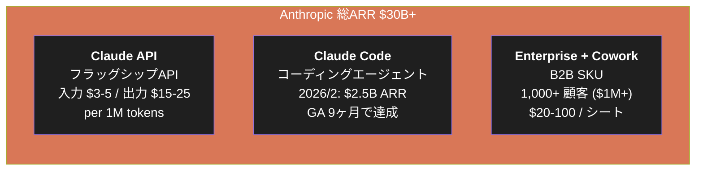

3つの製品が独立した成長軌道を持つことは、Anthropicの収益基盤が単一の製品リスクに左右されないことを意味する。 
Claude Codeが減速しても、Claude APIとEnterprise/Coworkが補完する。逆もまた然り。

## 1.6 80倍成長は何を意味するか

ARRの軌道、Code with Claude発表、 
3つの製品ラインの並列稼働を統合すると、$14B から $30B への移行は以下の構造として理解できる。

**1. 既存顧客の使用量増加**

シリーズGからシリーズGの間（2026年2月〜4月）に新規顧客の獲得だけで$16Bが増えたわけではない。 
既存顧客がClaudeの使用量を急速に増やしたことが、軌道の主要因である。 
Anthropicが2026年4月6日のブログで「年間100万ドル以上の顧客が2ヶ月で倍増」と発表したのは、この既存顧客の深化を示している。

**2. Claude Codeによる「開発者の作業時間」の取り込み**

平均的なClaude Code利用開発者が週20時間をClaude Codeとの作業に費やしているという事実は、 
Claude Codeが「補助ツール」ではなく「主要な作業環境」になったことを意味する。 
週40時間労働の半分がClaude Code経由となれば、開発者のトークン消費量は1-2桁単位で増加する。

**3. Computeの制約が成長を律速している**

ダリオ・アモディの「80倍を見た。だからComputeに苦労してきた」という発言は、 
Anthropicの成長が「需要不足」ではなく「供給不足」によって律速されていることを示している。 
需要は$30B以上に到達可能であり、Computeさえ確保できれば収益はさらに伸びる構造にある。

この3つの観測は、第3章で詳述するコンピュート同盟設計の必然性を示唆する。 
AWS（5GW、10年で1,000億ドル超）、 
Google+Broadcom（5GW、2027年以降）、 
Microsoft+NVIDIA（300億ドルのAzureコンピュート + 最大150億ドル投資）、 
SpaceX Colossus 1（300MW+、22万NVIDIA GPU）。 
これらの巨大なコンピュート確保契約は、80倍成長を継続するための「供給制約の解消」として機能している。

## 1.7 本章のまとめ

| 観測点 | 値 | 出典分類 |
| --- | --- | --- |
| 2026/2/12 ARR | $14B | Anthropic公式（Series G） |
| 2026/4/6 ARR | $30B+ | Anthropic公式 |
| 2026/3 ARR（中間値） | ~$19B | Bloomberg匿名筋 |
| 近々のARR | ~$45B | Financial Times報道 |
| Q1 2026 年率換算成長率 | 80x | Amodei発言（Code with Claude） |
| Claude Code ARR（2026/2） | $2.5B | Anthropic公式（Series G） |
| 年間$1M超顧客（2026/4） | 1,000社+ | Anthropic公式（2ヶ月で倍増） |

「$14B から $30B へ」は、Anthropicの成長軌道を象徴する2ヶ月だった。

それは単発の異常値ではなく、3つの構造的要因——既存顧客の使用量増加、 
Claude Codeの作業時間取り込み、Computeの制約解消——が同時に作用した結果である。

そしてこの軌道は、製品レイヤーが構造的にしっかり設計されていなければ起こりえない。 
次章では、その製品レイヤーの中核——Claude Code——が、 
なぜ「コーディングエージェント」というカテゴリーで$2.5B ARRに到達できたのかを解剖する。

### 参考文献

1. Anthropic. (2026/2/12). "Anthropic raises $30 billion in Series G funding at $380 billion post-money valuation." *anthropic.com*
2. Anthropic. (2026/4/6). "Anthropic expands partnership with Google and Broadcom for multiple gigawatts of next-generation compute." *anthropic.com*
3. Anthropic. (2025/9/2). "Anthropic raises $13B Series F at $183B post-money valuation." *anthropic.com*
4. VentureBeat. (2026/5/7). "Anthropic says it hit a $30 billion revenue run-rate after 'crazy' 80x growth." *venturebeat.com*
5. Sherwood News. (2026/5/7). "Anthropic's Amodei: We could grow 80x this year." *sherwood.news*
6. Latent.Space (swyx). (2026/5/9). "AINews: Anthropic growing 10x/year while everyone else is laying off >10% of their workforce." *latent.space*
7. Bloomberg. (2026/3/3). "Anthropic's run-rate revenue recently surpassed $19 billion." [anonymous-source reporting]
8. Financial Times. (2026/5/7). "Anthropic weighs deal for near $1tn valuation as revenue surges." *ft.com*
9. Business Insider via Yahoo Finance. (2026/5). "Anthropic's pre-IPO secondary market valuation: Forge Global commentary."
10. 山内怜史. (2026). *Anatomy of Anthropic — The Philosophy, Products, Economics, and Governance Behind the World's Most Deliberate AI Company*. Leading.AI LLC. CC BY 4.0. [GitHub](https://github.com/Leading-AI-IO/anatomy-of-anthropic)

 

---

# 第2章: Claude Code と Compute Alliance — 製品エンジンと物理基盤

## 2.1 製品と物理基盤が分離できない理由

Anthropicの成長エンジンを語る上で、Claude Code（製品）とCompute Alliance（物理基盤）は**分離して論じられない**。

理由は2つある。

第1に、Claude Code単体で$2.5B ARRを生む規模になれば、 
その推論ワークロードを支えるコンピュートが**数ギガワット級**で必要になる。 
製品の成功が、即座に物理インフラの制約に突き当たる。

第2に、ダリオ・アモディがCode with Claude会議（2026/5/6）で語った言葉が、この一体性を直接示している。

> 「私たちは80倍を見た。だからコンピュートに苦労してきたのだ」

成長率がコンピュートの制約と直結している。 
製品の需要は$30Bを超えており、物理的な供給能力が成長を律速している。 
本章では、この**需要側（Claude Code）と供給側（Compute Alliance）の双対関係**を解剖する。

## 2.2 Claude Code — 9ヶ月で $2.5B に到達した製品

Claude Codeは、SaaS史上最速のARR成長記録を持つ製品の一つである。

| 時点 | Claude Code ARR | 経過月数（GAから） | 出典 |
|---|---|---|---|
| 2025/2/24 | Research Preview開始 | -3ヶ月 | Claude 3.7 Sonnet告知 |
| 2025/5/22 | 一般提供（GA）開始 | 0ヶ月 | Claude 4告知 |
| 2025/11 | $1B run-rate | +6ヶ月 | Bun買収告知（2025/12） |
| 2026/2/12 | **$2.5B run-rate** | **+9ヶ月** | Series G告知 |

比較対象として、SlackがARR $100Mに到達するのに3年、SnowflakeがARR $100Mに到達するのに5年。 
Claude Codeは、これらの製品が10年かけて到達する規模を、1年以内に通過している。

この速度は、市場の偶発的な需要爆発ではない。 
**コーディングという業務カテゴリーに対する、構造的なフィット**の結果である。

## 2.3 「補助ツール」から「主要な作業環境」へ

Claude Codeを理解する出発点は、それが**コーディング補助ツールではない**ことを認識することにある。

GitHub Copilotに代表される従来のAIコーディングツールは、 
開発者が書いているコードの次の行を予測する「補完エンジン」だった。 
開発者は依然として中心であり、AIは助手だった。

Claude Codeは異なる。 
開発者がClaude Codeに**指示を与え、Claude Codeがファイルシステム全体を読み・書き・テストし・コミットする**。 
開発者は指揮者となり、Claude Codeが実行者となる。

> **Fig.1: 補助型 vs エージェント型 — 役割の逆転**

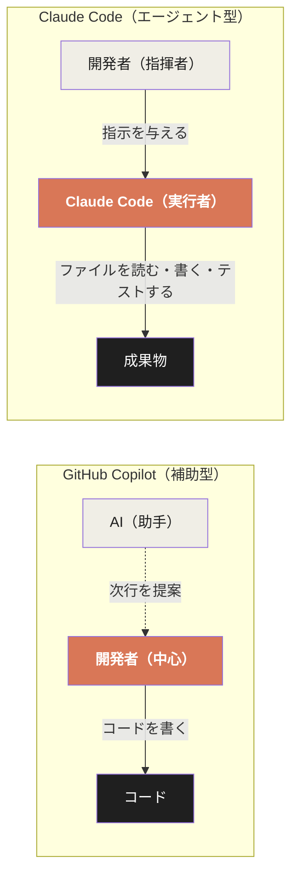

この役割の逆転が、収益構造に決定的な影響を与える。

補助型ツールの価値は「開発者の生産性を上げる」ことに留まる。 
月額数十ドルのサブスクリプション収益が上限となる。 
GitHub Copilotの個人向け料金が月10ドルであることは、この構造的天井を示している。

エージェント型ツールの価値は「開発者の作業時間を代替する」ことに到達する。 
Anthropic自身が公表したデータでは、Claude Codeを使う**平均的な開発者は週20時間をClaude Codeとの作業に費やしている**。 
（2026/5/6、ダリオ・アモディ、Code with Claude会議） 
週40時間労働の半分がClaude Code経由となれば、トークン消費量は補助型の1〜2桁単位で増加する。

## 2.4 「$13/開発者/日」という経済モデル

Anthropicの公式ドキュメント（2026/4/15-16更新、Business Insider報道）によれば、 
エンタープライズ展開におけるClaude Codeの平均コストは以下のように記録されている。

| 指標 | 値 |
|---|---|
| 平均コスト | $13 / 開発者 / アクティブ日 |
| 月額平均 | $150 - $250 / 開発者 |
| 90%パーセンタイル上限 | $30 / アクティブ日 |

この数字は、2026年4月時点のものである。 
注目すべきは、この数字が**2025年2月時点（GA前）から倍増している**ことだ。 
Anthropicが過去に公開していた旧版ドキュメントでは「$6 / 開発者 / アクティブ日」「$12 / アクティブ日が90%上限」となっていた。

Business Insiderの取材に対して、Anthropicの広報担当者は次のように説明した。

> 「料金や製品の変更はない。Opus 4.7がClaude Codeのフロンティアモデルになったことで、モデル能力が向上した結果として使用量が拡大し、それを反映して数字を更新した」

つまり、価格を上げたのではない。 
**同じ開発者が、より能力の高いモデルを、より長時間、より深いタスクに使うようになった結果として、消費が倍増した**。 
これはエージェント型ツールの経済モデルが「使用量に比例して収益が拡大する」消費ベースモデルであることを示している。

> **Fig.2: コーディングツールの経済モデル比較**

| ツール | 料金モデル | 収益の上限 | 開発者1人あたり月額 |
|---|---|---|---|
| GitHub Copilot Individual | サブスクリプション | あり（$10/月） | $10 |
| GitHub Copilot Business | サブスクリプション | あり（$19/seat/月） | $19 |
| GitHub Copilot Enterprise | サブスクリプション | あり（$39/seat/月） | $39 |
| **Claude Code** | **消費ベース + シート** | **使用量に応じて拡大** | **$150〜$250（実測値）** |

500人の開発者を抱える企業なら、月額 $75,000-125,000、年額 $900,000-1.5M。 
**1社だけでAnthropicの「年間 $1M 超顧客」リストに入る**。 
シリーズGの時点で年間100万ドル以上をAnthropicに支払う顧客が500社を超え、 
2ヶ月後に1,000社を超えた事実は、この経済構造の直接的な帰結である。

## 2.5 GitHub commits の4%という存在感、Bun買収という補完

Anthropicが2026年2月12日のSeries G告知で公表したデータの中で、 
最も構造的な意味を持つのは次の一文だった。

> 「最近の分析では、Claude Codeによって書かれたコードが、世界中の公開GitHubコミットの**4%を占めている**と推定された——わずか1ヶ月前の倍である」

公開GitHubコミット全体の4%という数字は、文脈なしには評価しづらい。 
だが、GitHubの公開リポジトリには世界中の数億人の開発者が貢献しており、 
Google・Microsoft・Meta・Amazonといった個別のテックジャイアントですら全体の数%程度である。 
**Claude Codeは、世界最大級のテックジャイアントと同等のコミットボリュームを単一の製品で生成している**。

そして「1ヶ月前の倍」という増加速度。 
これは2026年1月時点で2%、2月時点で4%。 
同じペースが続けば、3月8%、4月16%という指数関数的軌道を示唆する。

この成長を支えるため、Anthropicは2025年11月、Claude Codeが$1B run-rateに到達した直後に**Bun**を買収した。 
Bunは月間700万ダウンロード、GitHub上で82,000スターを持つ独立したJavaScript/TypeScriptランタイムだった。

> **Fig.3: Claude Code のスタック構造 — Bun買収の戦略的位置**

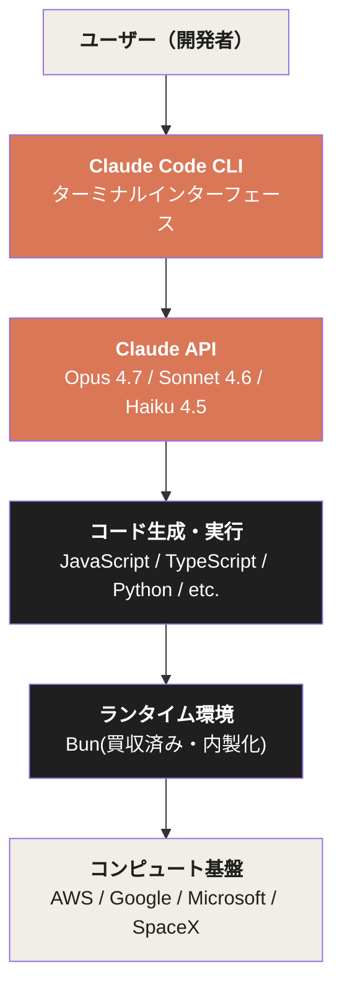

Bun買収は単なる技術買収ではなく、Claude Codeを「コーディングプラットフォーム」として完成させるための戦略的な層補完だった。 
コード生成（Claude API）から実行（Bun）まで、フルスタックを自社制御下に置いた。

## 2.6 顧客リストと競合構造

Series Gとそれ以降の公開資料から、Claude Codeを採用した名前付きエンタープライズ顧客が明示されている。

| カテゴリー | 顧客 |
|---|---|
| メディア・エンタメ | Netflix, Spotify, Disney |
| 金融 | Salesforce, Nordea, IG Group, Block, Coinbase |
| 自動車・モビリティ | Cox Automotive, Uber |
| ライフサイエンス | Novo Nordisk, Genmab, Sanofi |
| サイバーセキュリティ | Palo Alto Networks |
| 化粧品・小売 | L'Oreal, KPMG |

AIコーディング市場には複数の有力プレーヤーが並走している。

| 製品 | 提供企業 | バリュエーション/ARR | 製品形態 |
|---|---|---|---|
| **Claude Code** | Anthropic | ARR $2.5B（2026/2） | ターミナル型エージェント |
| **GitHub Copilot** | Microsoft | 4.7M有料サブスクライバー（2026/1） | IDE統合補助 |
| **Cursor / Anysphere** | Anysphere | バリュエーション $29.3B、ARR $2B（2026/2）、$50B交渉中（2026/4） | IDE置換型 |
| **OpenAI Codex** | OpenAI | 週次4M開発者ユーザー（2026/4/21） | API + CLI |

注目すべき構造的特徴は、**競合と協業が同時に成立する構造**である。 
CursorはClaude APIを大量に消費する顧客であり、GitHub CopilotはClaude（Sonnet 4.5）をデフォルトモデルの選択肢に加えた。 
MicrosoftがOpenAIに$130Bを投資しているにもかかわらず、 
最も使われるコーディングプロダクトのフロンティアモデルとしてAnthropicが選ばれている。

> **Fig.4: AIコーディング市場の構造 — 競合と協業の二重性**

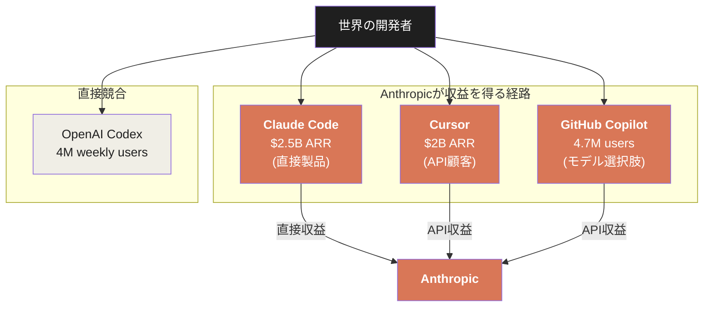

Anthropicは、コーディング市場の3つの経路から収益を得ている。 
OpenAI Codexのみが、Anthropicの収益経路の外にある純粋な競合である。 
AIコーディング市場の総和の少なくとも70-80%が、何らかの形でAnthropicの収益化対象になっている可能性がある。

## 2.7 コンピュート同盟 — 製品の物理的境界

ここまでが「製品としてのClaude Code」の構造である。 
だが、$2.5B ARRの製品が80倍の成長軌道を継続するには、**物理的な計算資源**が決定的な制約となる。

Anthropicは2025年から2026年にかけて、**4つの巨大なコンピュート確保契約**を並行して締結した。 
これらは単なるクラウド契約ではなく、**マルチギガワット級の電力消費を伴う物理インフラのコミットメント**である。

> **Fig.5: Anthropicのコンピュート同盟 — 4社並行調達構造**

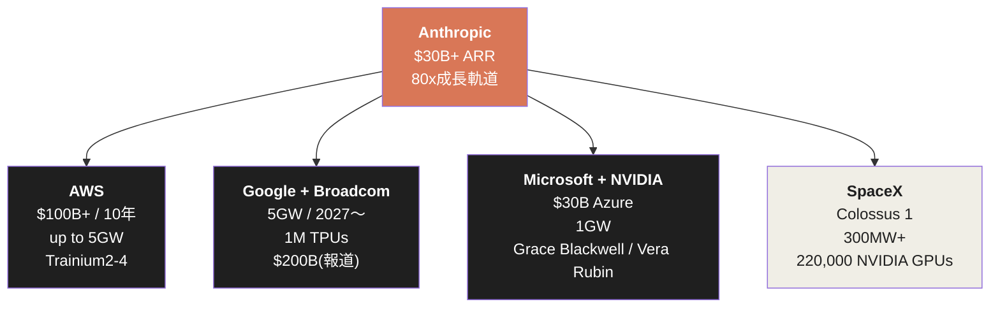

各契約の構造を順に見ていく。

## 2.8 AWS — $100B+ / 10年 / 5GW

AWSとの関係は、Anthropicのコンピュート戦略の**基層**を成している。

| 時点 | 内容 | 出典 |
|---|---|---|
| 2023/9/25 | Amazonが最大$4Bを投資 | Anthropic公式 |
| 2024/11/22 | Amazonが追加$4B投資（累計$8B）、AWSが「主要クラウド・訓練パートナー」 | Anthropic公式 |
| 2026/4/20 | AWS との大規模拡張、$5B即時投資 + 最大$20B追加 | Amazon公式 |

2026年4月の拡張で、Anthropicは公式に次のようにコミットした。

> 「私たちは今後10年間で、AWSテクノロジーに$100B以上を投じる。Claudeの訓練と運用のため、up to 5GWの新規容量を確保する。このコミットメントはGraviton、Trainium2、Trainium3、Trainium4にまたがる」

「5ギガワット」という規模感は、原子力発電所5基分に相当する電力消費である。 
これを単一企業の単一用途（AI推論）に充てる契約は、テクノロジー業界において**前例がない**。

AWSとの提携の中核は「**Project Rainier**」と呼ばれるクラスタである。 
Anthropicが2025年10月29日に公開した情報によれば、 
Project Rainierは**約500,000基のTrainium2チップ**を含む、世界最大級のAI推論クラスタの一つとなっている。

Andy Jassy（Amazon CEO）はこのコミットメントを次のように評価した。

> 「Anthropicが今後10年間、AWS Trainium上で大規模言語モデルを動かすという決定は、私たちが共同で進めてきたカスタムシリコンの進歩を反映している」

## 2.9 Google + Broadcom — 5GW / 2027〜 / TPU

Googleとの提携は、AWSとは異なる時間軸で進む。

| 時点 | 内容 | 出典 |
|---|---|---|
| 2025/10/23 | Google Cloud TPUの利用拡大、最大100万TPU、2026年内に1GW以上 | Anthropic公式 |
| 2026/4/6 | Google + Broadcomとの次世代TPU契約、2027年以降にマルチギガワット | Anthropic公式 |
| 2026/4/24 | Alphabetが最大$40Bを投資（即時$10B + 条件付き$30B） | WSJ / Bloomberg |
| 2026/5/6 | 「5GW Google・Broadcom契約」として総括 | Anthropic公式 |

Googleとの契約は、AWSの「Trainium2-4」とは異なり、**Broadcomが共同設計するカスタムTPU**を中核とする。 
これは2027年以降に立ち上がる**次世代インフラ**であり、現時点ではまだ稼働していない。

メディアの一部（The Information、2026/5/5）はこの契約の金銭規模を「$200B / 5年」と報じている。 
ただしAnthropic・Google双方が公式に金額を確認していないため、本書では「$200B」は**報道された未確認値**として扱う。 
確認されているのは、**5GW の物理容量** と **Alphabetの$40B 投資コミットメント** である。

## 2.10 Microsoft + NVIDIA — $30B Azure + 1GW

Microsoftとの提携（2025年11月18日告知）は、構造的に最も興味深い契約だ。

| 内容 | 値 |
|---|---|
| Anthropicの Azure 購入コミット | $30B |
| 追加容量 | up to 1 GW |
| Microsoftの Anthropic 投資 | up to $5B |
| NVIDIAの Anthropic 投資 | up to $10B |
| 技術提携 | Grace Blackwell / Vera Rubin システム |

注目すべきは、Microsoftが**OpenAI に$130Bを投資している立場**でありながら、 
Anthropicとの $30B Azure 契約 + $5B 投資 を実行している事実だ。

これはMicrosoftの「最適なモデルを提供者に関係なく選ぶ」マルチモデル戦略の一環である。 
だが結果として、Anthropicは**Microsoftのエンタープライズ顧客ベースに直接アクセスする経路**を獲得した。 
Microsoft 365へのClaude統合（Copilot Cowork）、GitHub Copilotでのモデル選択肢、Azureマーケットプレイスでのクラウド配信—— 
これら全てが、Microsoftの巨大な販路をAnthropicに開いている。

## 2.11 SpaceX Colossus 1 — 300MW即時投入

最も新しく、最も即効性のある契約が、SpaceXとの取引である（2026年5月6日告知）。

Anthropicの公式発表は次のように記述している。

> 「私たちはSpaceXと契約を締結し、Colossus 1データセンターの全てのコンピュート容量を使用する。これにより、私たちは月内に**300MW以上の新規容量（220,000基以上のNVIDIA GPU）**にアクセスできる」

「Colossus 1」は、もともとxAI（イーロン・マスクのAI企業）のために構築されたデータセンターだ。 
2026年2月にSpaceXがxAIを買収・統合した後、その容量が**全面的にAnthropicへ貸し出された**。

このタイミングは、ダリオ・アモディの「80倍を見た。だからコンピュートに苦労してきた」発言と同日（5月6日、Code with Claude会議）である。 
**急成長する需要に対して、即時投入可能な唯一の解として、競合企業のデータセンターをまるごと借りるという異例の措置**を取ったことを意味する。

300MWは、AWSの5GWやGoogleの5GWと比べれば小さい。 
だが、AWSやGoogleの容量は**2026年後半から2027年以降**に立ち上がる。 
Colossus 1は**「今月中」**に立ち上がる。 
短期の需要爆発に対応するための、緊急的なブリッジ容量である。

## 2.12 マルチクラウド戦略の構造的意味

Anthropicが4社（AWS / Google / Microsoft / SpaceX）と並行してコンピュート契約を結んでいる構造は、**業界において前例がない**。

| 観点 | OpenAI | Anthropic |
|---|---|---|
| 主要クラウドパートナー | Microsoft（独占的） | AWS（主要） + Google + Microsoft + SpaceX |
| カスタムシリコン | NVIDIA中心 | AWS Trainium + Google TPU + NVIDIA |
| マルチモデルクラウド配信 | Azure中心 | AWS Bedrock + Google Vertex + Azure Foundry |

Anthropicは「**Claudeが、世界の3大クラウド（AWS Bedrock / Google Cloud Vertex AI / Microsoft Azure Foundry）**  
**すべてで提供される唯一のフロンティアモデルである**」とSeries G告知で明示した（2026/2/12）。

この構造には3つの戦略的意味がある。

**1. 単一プラットフォーム・ロックインの回避**

OpenAIがMicrosoftに依存している構造とは対照的に、 
Anthropicはどの単一クラウドにもロックインされていない。 
これは交渉力の維持につながる。

**2. エンタープライズ顧客への到達経路の最大化**

エンタープライズ顧客は、すでに使っているクラウド（多くの場合、AWS or Azure or GCP）からシームレスにClaudeを呼びたい。 
3大クラウド全てに対応していることで、**顧客がAnthropicを採用するための摩擦が最小化**される。

**3. ハードウェア多様性によるリスク分散**

NVIDIA GPU、AWS Trainium、Google TPU——3種類のシリコンで訓練・推論を行うことは、 
**特定のハードウェア供給制約に対する免疫**を作る。 
NVIDIA GPUの供給が逼迫しても、Trainium2やTPUで代替できる。

## 2.13 「コーディング」というカテゴリーの構造的優位

ここまで、Claude Code（需要側）とCompute Alliance（供給側）の両面を見てきた。 
最後に、なぜ「コーディング」がAIエージェント経済の最初のキラーカテゴリーになったのか、構造的要因を整理する。

3つの要因が指摘できる。

**1. 検証可能性が高い**

コードは「動くか、動かないか」が即座に判定できる。 
AIが生成したコードは、コンパイル・テスト・実行という客観的な検証プロセスを通る。 
誤った生成があっても、開発者が即座に発見・修正できる。 
これは、文章生成や画像生成のような主観的評価が必要な領域とは決定的に異なる。

**2. 構造化された入出力**

プログラミング言語は、自然言語と異なり**厳密な文法と意味論**を持つ。 
LLMがコードを生成する際の「ハルシネーション」は、構文エラーやテスト失敗として可視化される。 
AIにとって、コーディングは「正解が存在し、その正解が機械的に判定可能な」タスクである。

**3. 開発者の経済価値の高さ**

ソフトウェアエンジニアの人件費は、全職業の中でも極めて高い水準にある（米国平均で年収 $130K〜$200K）。 
週20時間の作業がClaude Codeに代替されれば、 
企業にとっての価値は年間 $30K〜$50K / 開発者。月額 $150-250 / 開発者というClaude Codeのコストは、その20%以下に過ぎない。 
**ROIが圧倒的に成立する**。

この3要因が揃った結果、コーディングはAIエージェント経済の最初の大規模商業化領域となった。 
そしてその商業化を支えるために、AWS・Google・Microsoft・SpaceXとの**マルチギガワット級のコンピュート同盟**が物理的に必要となった。

## 2.14 本章のまとめ

| 観点 | 値 | 出典 |
|---|---|---|
| Claude Code GA | 2025/5/22 | Claude 4告知 |
| 9ヶ月で到達したARR | $2.5B | Series G告知 |
| 平均開発者コスト | $13 / アクティブ日 | Anthropic公式 |
| 平均利用時間 | 週20時間 / 開発者 | Amodei発言 |
| GitHub公開コミット占有率 | 4%(1ヶ月で倍増) | Anthropic公式 |
| AWS契約規模 | $100B+ / 10年 / up to 5GW | Anthropic公式 |
| Google+Broadcom契約 | 5GW / 2027〜 | Anthropic公式 |
| Microsoft Azure契約 | $30B + up to 1GW | Microsoft公式 |
| SpaceX Colossus 1 | 300MW+ / 220,000 GPUs | Anthropic公式 |
| Alphabetの投資コミット | up to $40B | WSJ / Bloomberg |

製品（Claude Code）と物理基盤（Compute Alliance）は、Anthropicの成長エンジンの両輪を構成している。 
$2.5B ARRの製品が80倍の成長軌道に乗っているからこそ、4社並行で**マルチギガワット級のコンピュート契約**を結ぶ必然性が生まれる。 
逆に、これだけのコンピュートを確保できるからこそ、製品の成長を律速から解放できる。

両者の双対性は、Anthropicという企業が**ソフトウェア企業であると同時に物理インフラ企業でもある**ことを意味している。 
これは、伝統的なSaaS企業のバリュエーション・モデルでは説明できない構造である。 
第5章で詳述するバリュエーション非線形性は、この物理性に由来する。

次章では、需要と供給の物理的構造を支える、Anthropicのもう一つの基盤——**Constitutional AIが生む信頼の経済**を解剖する。 
なぜエンタープライズはAnthropicを選ぶのか。なぜ規制された業界（金融・医療・政府）が、最初にAnthropicに到達するのか。 
答えは、製品の機能やコンピュートの規模にはない。**思想がもたらす信頼**にある。

### 参考文献

1. Anthropic. (2026/2/12). "Anthropic raises $30 billion in Series G funding at $380 billion post-money valuation." *anthropic.com*
2. Anthropic. (2025/12). "Anthropic acquires Bun as Claude Code reaches $1B milestone." *anthropic.com*
3. Anthropic. (2025/2/24). "Claude 3.7 Sonnet and Claude Code." *anthropic.com*
4. Anthropic. (2025/5/22). "Introducing Claude 4." *anthropic.com*
5. VentureBeat. (2026/5/7). "Anthropic says it hit a $30 billion revenue run-rate after 'crazy' 80x growth." *venturebeat.com*
6. Business Insider via Yahoo Finance. (2026/4). "Anthropic raises Claude Code cost estimates."
7. Anthropic. (2026/4/20). "Anthropic and Amazon expand collaboration for up to 5 gigawatts of new compute." *anthropic.com*
8. Anthropic. (2025/10/23). "Expanding our use of Google Cloud TPUs and Services." *anthropic.com*
9. Anthropic. (2026/4/6). "Anthropic expands partnership with Google and Broadcom for multiple gigawatts of next-generation compute." *anthropic.com*
10. Microsoft. (2025/11/18). "Microsoft, NVIDIA, and Anthropic announce strategic partnerships." *blogs.microsoft.com*
11. Anthropic. (2026/5/6). "Higher usage limits for Claude and a compute deal with SpaceX." *anthropic.com*
12. AWS. (2025/10/29). "AWS activates Project Rainier: One of the world's largest AI compute clusters comes online." *aboutamazon.com*
13. WSJ. (2026/4/24). "Google Expands Anthropic Investment With $40 Billion Commitment."
14. The Information. (2026/5/5). "Anthropic said to commit to $200B in AI capacity on Google Cloud."

 

---

# 第3章: Constitutional AIが生む信頼の経済 — 思想が収益を駆動する構造

## 3.1 なぜ規制業界がAnthropicに到達するのか

Anthropicの顧客リストには、ある奇妙な偏りがある。 
金融、医療、政府——**最も規制が厳しい業界**が、最も早くAnthropicに到達している。 
Brex（フィンテック）、Coinbase（暗号資産）、Visa（決済）、Bridgewater（ヘッジファンド）、 
Banner Health（医療システム）、Sanofi（製薬）、Novo Nordisk（製薬）、米国国防総省、米国GSA、Lawrence Livermore国立研究所。

通常、新興テック企業がこれらの業界に到達するには、5年〜10年の長い信頼構築期間が必要となる。 
だがAnthropicは創業から5年で、これらの「最も警戒心の強い顧客」を獲得している。

なぜか。

答えは、製品の機能でも価格でもない。 
**Constitutional AIという思想が生み出す信頼**が、Anthropicの最も強力な参入障壁となっている。 
本章では、思想と収益が直接的に接続している構造を解剖する。

## 3.2 Constitutional AI — 思想の経済的価値

Constitutional AI（CAI）の技術的詳細は、姉妹書『Anatomy of Anthropic』の第2章で扱った。 
本章では、その**経済的帰結**にフォーカスする。

Constitutional AIの中核は、AIに「憲法」——明示的な原則のセット——を与え、 
AI自身に自らの出力を評価・修正させる手法である。 
人間の評価者を介さない、スケーラブルで一貫した安全性確保メカニズム。

このアプローチは、AIの能力を制限するものとして語られることが多い。 
だが、エンタープライズ顧客の視点から見ると、Constitutional AIは**製品の機能の一部**として機能している。

> **Fig.1: Constitutional AIが生む経済価値の構造**

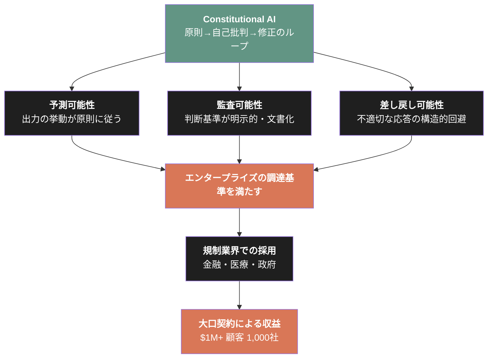

予測可能性・監査可能性・差し戻し可能性—— 
これらはエンタープライズ調達において、機能の有無と同等に重要な評価軸である。 
Constitutional AIは、これらの軸でAnthropicに構造的な優位を与える。

## 3.3 顧客の声 — 「信頼」が選定理由として言語化される

エンタープライズが製品を選ぶ理由を「信頼」と明言することは、テック業界では稀である。 
通常、選定理由は機能、価格、サポート、エコシステムといった具体的な要素として表現される。

だがAnthropicの顧客は、Constitutional AIや安全性アプローチを**明示的に選定理由として言語化**している。

| 顧客 | 業界 | 発言の要旨 | 出典 |
|---|---|---|---|
| Banner Health | 医療システム | 「Anthropicの安全性へのフォーカスとConstitutional AIアプローチに惹かれた」 | Anthropic公式 |
| Elation Health | 電子カルテ | 「性能と信頼のバランスが決定的な要因だった」 | Anthropic公式 |
| Brex | フィンテック | 「顧客との会話はデータプライバシーから始まる」 | Anthropic公式 |
| Coinbase | 暗号資産 | 「Anthropicのセキュリティプロファイルが私たちの全要件を満たした」 | Anthropic公式 |
| Visa | 決済 | 「同意、プライバシー、透明性、セキュリティを重視した」 | Anthropic公式 |
| Salesforce Ventures | ベンチャー投資 | 「顧客、特に金融とヘルスケアが、Anthropicとの関係深化を私たちに求めた」 | Salesforce Ventures公式 |

注目すべきは、これらの発言が**マーケティング目的のテンプレート的称賛ではない**ことだ。 
各社が自社の調達プロセスにおいて、Constitutional AIや安全性アプローチを**具体的な選定基準**として記述している。

特にSalesforce Venturesの発言は構造的に重要だ。 
「**顧客が私たちに、Anthropicとの関係を深めるよう求めた**」という記述は、 
信頼が顧客から発信される**プル型のシグナル**となっていることを示している。 
プッシュ型の営業ではなく、顧客側からの要求として安全性が機能している。

## 3.4 政府アクセス — 信頼の最終形態

エンタープライズ信頼の最終形態が、**政府への到達**である。 
Anthropicは2025年から2026年にかけて、米国政府との関係を段階的に深化させた。

| 時点 | 内容 | 出典 |
|---|---|---|
| 2025/6/6 | Claude Govモデル発表、「米国国家安全保障の最高レベル」で展開中 | Anthropic公式 |
| 2025/8/5 | GSA Schedule への登録（全連邦機関へ$1で提供可能に） | GSA公式 |
| 2025年 | FedRAMP High および DoD IL4/5 認証（AWS Bedrock経由） | AWS公式 |
| 2025年 | DoD との $200M ceiling 契約（CDAO経由） | Anthropic公式 |
| 2025年 | Lawrence Livermore国立研究所、10,000人にClaude for Enterprise展開 | Anthropic公式 |
| 2025/10/29 | 日本AI Safety Institute との協力覚書 | Anthropic公式 |
| 2025年以前 | 英国AISI および 米国AISI との協力覚書 | Anthropic公式 |

GSA Schedule への登録は、米国連邦政府の全機関がClaude を**1ドルで利用可能**になることを意味する。 
これは商業契約として見れば不合理だが、**政府を製品開発のフィードバックループに組み込む戦略**として理解すれば合理的だ。

Lawrence Livermore国立研究所への10,000人展開は、Anthropicが開示している中で**最大規模の単一公的セクター展開**である。 
同研究所は核兵器シミュレーション、気候モデリング、材料科学などの最先端研究を行う、米国エネルギー省傘下の機関である。 
最も厳しい情報管理が求められる組織がClaudeを採用した事実は、Constitutional AIが生む信頼の到達点を示している。

> **Fig.2: 政府アクセス構造 — 信頼が法的認証として制度化される**

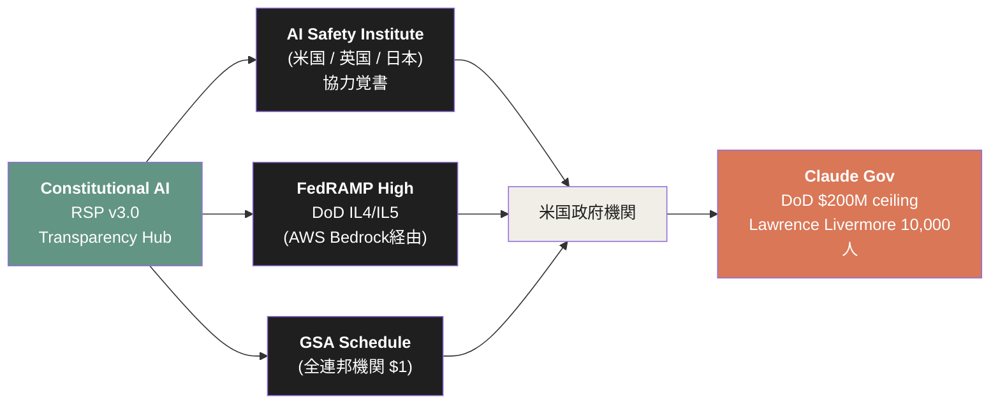

## 3.5 エンタープライズ規模の急成長

信頼が規制業界での採用を生み、規制業界での採用が**ARRの構造的拡大**を生む。

| 時点 | 数字 | 出典 |
|---|---|---|
| 2025/9/2 (Series F) | 300,000社超のビジネス顧客 | Anthropic公式 |
| 2025/9/2 (Series F) | $100K超 ARR顧客が前年比7倍 | Anthropic公式 |
| 2025/9/2 (Series F) | $1M超 ARR顧客が500社以上 | Anthropic公式 |
| 2026/4/6 | $1M超 ARR顧客が**1,000社超**（2ヶ月で倍増） | Anthropic公式 |

「2ヶ月で大口顧客が倍増」という事実は、エンタープライズ市場における信頼形成の**雪崩効果**を示唆する。 
一度ある業界（例えば金融）で2-3社が採用すると、同業他社も追随する。 
コンプライアンス・調達基準の比較において「あの会社も使っている」という参照点が、後続の意思決定を加速させる。

## 3.6 業界別ソリューション — 信頼を業界規制に整合させる構造

Anthropicは2025年から、業界別の特化ソリューションを順次発表している。 
これは単なる製品ラインナップ拡大ではなく、**Constitutional AIの「信頼」を業界規制と整合させる構造設計**である。

| ソリューション | 発表時期 | 業界特化要素 | 名前付き顧客 |
|---|---|---|---|
| Claude for Enterprise | 2024/9/10 | SSO、RBAC、監査ログ、SCIM、500K context | GitLab、Midjourney |
| Claude for Financial Services | 2025/7/15 | FactSet・S&P Global・PitchBook統合 | Bridgewater、Brex、Block、Coinbase、Visa |
| Claude for Healthcare | 2026/1 | HIPAA対応、生命科学ツールキット | Banner Health、Novo Nordisk、Sanofi、Genmab |
| Claude Gov | 2025/6/6 | 国家安全保障対応 | DoD、Lawrence Livermore |

業界別ソリューションの発表は、**信頼が「汎用的な評判」から、**  
**「業界規制に整合した具体的なコンプライアンス機能」へと変換される過程**を示している。

例えばClaude for Financial Servicesは、 
FactSet・S&P Global・PitchBook・Daloopa・Palantir・Bloomberg代替データソースとの統合を提供する。 
これは金融機関の既存のデータインフラに直接接続するためのレイヤーであり、 
**業界の規制要件・データ要件・ワークフロー要件の全てに対応する形でClaude を組み込む**設計だ。

## 3.7 知的権威 — Constitutional AIから経済研究へ

Constitutional AIが生む信頼は、エンタープライズ調達における選定基準として機能するだけではない。 
Anthropicはこの信頼を、**産業全体の知的権威**へと拡張している。

その中核が「**Anthropic Economic Index**（経済指数）」である。

2025年2月、Anthropicは Anthropic Economic Index を発表した。 
AIが経済と労働市場に与える影響を、推測やアンケートではなく、 
**実際のClaudeの会話データから直接測定する**プロジェクトである。

> **Fig.3: 知的権威の構築構造 — 思想から研究へ**

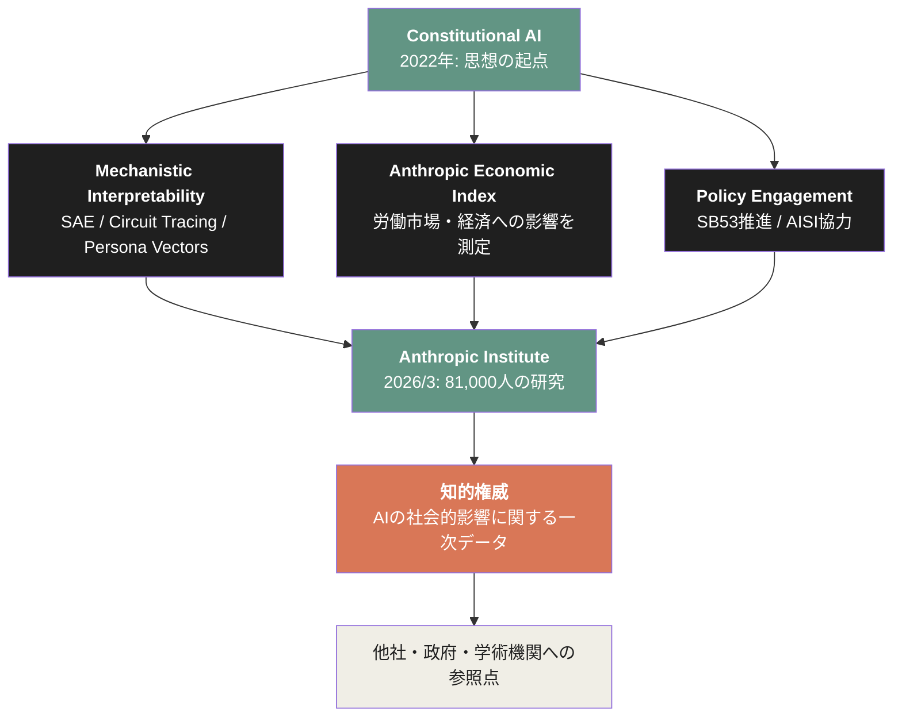

Anthropic Economic Index は、**約100万のClaude会話**を匿名化した上で、**  
**米国労働省の O*NET データベース（約20,000の業務タスク）に紐づけた。**  
「Claudeが実際にどの職業のどのタスクに使われているか」を、推測ではなく実データから導出する。

このプロジェクトの構造的意味は3つある。

**1. AIの社会的影響に関する一次データの独占**

OpenAI も Google も Meta も、自社製品が実世界でどのように使われているかの大規模なデータを公開していない。 
Anthropic は、自社のデータを**研究公器として開示**することで、AIの社会的影響を語る上での「一次情報源」のポジションを取った。

**2. 学術・政策コミュニティへの食い込み**

Economic Indexの研究は、Maxim Massenkoff、Peter McCrory といったAnthropicの経済学者が主導している。 
彼らの論文は学術メディアで広く引用され、政策議論の参照点になっている。 
AIの労働市場影響を語る議論は、もはやAnthropicの研究なしには成立しない。

**3. 「危機を測定するが、自社製品が原因」というメタ構造**

Economic Index は、**AIによる労働市場への影響を警告する**研究である。 
ダリオ・アモディは「エントリーレベルのホワイトカラー職の半分が5年以内に消える可能性がある」と公開発言し、 
その予測を裏付けるデータを Anthropic 自身が収集・公開している。 
**自社製品が原因となる現象を、自社が測定し警告する**——この特異な構造が、 
Anthropic を「単なる製品ベンダー」から「AI時代の社会的構造を語る公器」へと変換している。

## 3.8 労働市場研究 — 75%と14%の数字

2026年3月5日、Anthropicは「**Labor market impacts of AI: A new measure and early evidence**」と題したレポートを発表した。 
MaximMassenkoff・Peter McCrory による研究で、 
AIが労働市場に与える影響を**事後分析ではなく事前に検出する**測定フレームワークを構築するものだ。

主要な発見は2つある。

**1. コンピュータプログラマーの75%が観測される露出度を持つ**

「コンピュータプログラマー」は、 
**現在のAI使用パターンにおいて、業務タスクの75%がAIによってカバーされている**最も露出度の高い職業となった。 
次いでカスタマーサービス代表が70.1%、データ入力者が67.1%。

この「75%」という数字は、Claude Codeの$2.5B ARRと整合する。 
コーディング業務の大部分がAIによって代替可能であるからこそ、その業務の経済価値がAnthropicへ流れている。

**2. 22-25歳の若年層で雇用率が14%低下**

レポートは、ChatGPT登場（2022年末）以降、**AI露出度の高い職業において、22-25歳の雇用率が約14%低下している**ことを観測した。 
「AI影響度の高い」と「低い」職業の失業率の差は統計的有意ではなく、26歳以上の労働者には影響が見られない。 
だが**若年層・新規参入者**には、AIの代替効果が雇用減速として可視化されている。

> **Fig.4: 労働市場露出度マップ — Anthropic Economic Indexから**

| 職業カテゴリ | 観測されるAI露出度 | 構造的意味 |
|---|---|---|
| コンピュータプログラマー | **75%** | Claude Code $2.5B ARRの収益源 |
| カスタマーサービス代表 | 70.1% | 第2の大規模商業化候補 |
| データ入力者 | 67.1% | 第3の自動化対象 |
| (他職業) | 30-50% | 段階的に拡張中 |

| 若年層雇用への影響 | 観測値 |
|---|---|
| 22-25歳・AI露出度高職業 | -14%（ChatGPT登場以降） |
| 26歳以上・AI露出度高職業 | 統計的有意差なし |

この研究の構造的意味は重大だ。 
AnthropicはAI企業として**自社製品が労働市場に与える影響を、自社が学術的に測定**している。 
これは「自社製品の副作用を自社が公開する製薬会社」に近い構造であり、業界において前例がない。

## 3.9 SB 53 — 思想を法律に翻訳する

2025年、Anthropicは**カリフォルニア州 上院法案 SB 53（"Transparency in Frontier Artificial Intelligence Act"）**を公式に支持した。 
これは、フロンティアAI開発企業に対して、**標準化された安全フレームワークと事故報告の公開を義務付ける**法律である。

Anthropic自身は、この法律に対応するため「**Frontier Compliance Framework（FCF）**」を公開し、 
自社の catastrophic risk assessments を構造化して開示している。

なぜAnthropicは、自社を縛る規制を**自ら支持・推進**するのか。

答えは、Constitutional AIの思想と整合的だ。 
Anthropicは「AI開発が安全に進むためには、業界全体の規制が必要」と公言している。 
自社だけが安全性に投資しても、競合が安全性を軽視すれば、市場全体のリスクは下がらない。 
**業界全体に同等の規制を課すことで、安全性投資が競争上の不利にならない構造**を作る。

これは「規制を歓迎する企業」という珍しい立場である。 
だが、その立場こそが、政府・学術界・市民社会からの信頼を強化する。

> **Fig.5: 思想 → 信頼 → 収益のフライホイール（完成形）**

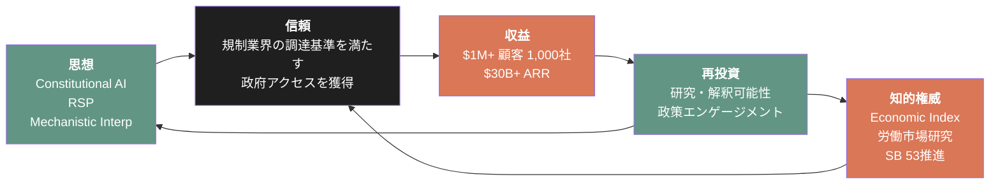

このフライホイールが、Anthropic の成長エンジンの**最も深い層**である。 
製品（Claude Code）が表層、コンピュート（AWS / Google / Microsoft / SpaceX）が中層、思想と信頼の構造が深層を成している。

## 3.10 本章のまとめ

| 観点 | 値 | 構造的意味 |
|---|---|---|
| エンタープライズ顧客 | 300,000社超（2025/9） | 信頼の量的指標 |
| $1M+ ARR顧客 | 1,000社超（2026/4、2ヶ月で倍増） | 信頼の質的指標 |
| 政府アクセス | GSA $1、DoD $200M ceiling、LLNL 10,000人 | 信頼の最終形態 |
| 業界別ソリューション | Financial / Healthcare / Gov / Enterprise | 信頼の業界規制への翻訳 |
| Anthropic Economic Index | 約100万会話の分析 | 知的権威の構築 |
| 労働市場研究 | プログラマー75%露出 / 22-25歳 -14% | 自社製品の社会的影響を自社が測定 |
| SB 53支持 / FCF公開 | 自社を縛る規制を推進 | 思想を法律に翻訳 |

Constitutional AIは、Anthropicの製品の機能ではなく、**Anthropicという企業の存在様式**である。 
思想が信頼を生み、信頼が規制業界での採用を生み、採用が大口契約を生み、 
契約からの収益が研究へ再投資され、研究がさらに思想を深化させる。

このフライホイールは、AnthropicがOpenAIや他のAI企業と**構造的に異なる存在**であることを意味する。 
OpenAIが「最も性能の高いAIを最も早く市場に出す」競争を選んだのに対し、 
Anthropicは「最も信頼できるAIを最も慎重に組織として体現する」道を選んだ。 
後者の道は、短期的には遅く見える。 
だが2026年現在、その道のほうが**より大規模で持続的な収益と社会的影響を生んでいる**。

次章では、この構造をフロンティアラボ4社——OpenAI、Google DeepMind、Meta、xAI——との比較において、客観的事実から位置づける。

### 参考文献

1. Bai, Y., Kadavath, S., Kundu, S., et al. (2022). "Constitutional AI: Harmlessness from AI Feedback." *arXiv:2212.08073*
2. Anthropic. (2025/9/2). "Anthropic raises $13B Series F at $183B post-money valuation." *anthropic.com*
3. Anthropic. (2026/4/6). "Anthropic expands partnership with Google and Broadcom..." *anthropic.com* （$1M+顧客1,000社の出典）
4. Anthropic. (2024/9/10). "Claude for Enterprise." *anthropic.com*
5. Anthropic. (2025/7/15). "Claude for Financial Services." *anthropic.com*
6. Anthropic. (2026/1). "Advancing Claude in healthcare and the life sciences." *anthropic.com*
7. Anthropic. (2025/6/6). "Claude Gov models for U.S. national security customers." *anthropic.com*
8. GSA. (2025/8/12). "GSA strikes OneGov deal with Anthropic."
9. Anthropic. (2026/1). "Anthropic Economic Index report: Economic primitives." *anthropic.com*
10. Massenkoff, M., McCrory, P. (2026/3/5). "Labor market impacts of AI: A new measure and early evidence." *anthropic.com/research*
11. Anthropic. (2025). "Anthropic is endorsing SB 53." *anthropic.com*
12. Anthropic. (2026). "Sharing our compliance framework for California's Transparency in Frontier AI Act." *anthropic.com*
13. Salesforce Ventures. (2025/9/30). "Behind the Investment: Anthropic."

 

---

# 第4章: フロンティアラボの構造比較 — OpenAI / Google / Meta / xAI

## 4.1 比較の方法論

本章では、Anthropicと並走する4つのフロンティアラボ——OpenAI、Google DeepMind、Meta、xAI——を、観測可能な事実から比較する。

最初に断っておくべきことが2つある。

第1に、本章は**優劣の判定ではない**。 
各社は異なる戦略選択を行っており、それぞれの選択がそれぞれの構造を生んでいる。 
「どこが勝っているか」を論じるのではなく、「どこがどう違うか」を構造として記述する。

第2に、比較可能なデータには**情報非対称性**がある。 
OpenAIは非公開企業のため、財務開示は限定的。 
Google・Metaは公開企業だがAI部門の収益を切り出さない。 
xAIはSpaceX買収により単独企業として消滅した。 
データの粒度が異なる中で、可能な限り**一次情報源**から比較を試みる。

## 4.2 5社の現在地 — 公開ファクトのみによる現状把握

2026年5月時点の各社の主要な公開数値を整理する。

> **Fig.1: フロンティアラボ5社の構造比較**

| 項目 | Anthropic | OpenAI | Google | Meta | xAI |
|---|---|---|---|---|---|
| **最新評価額** | $380B（Series G、2026/2/12） | $852B（2026/3/31） | 親会社Alphabet公開 | 親会社Meta公開 | $230B（2026/1）→SpaceX買収（$1.25T統合体） |
| **報道される追加調達** | ~$50B for ~$900B-1T（FT、2026/5/7） | - | - | - | - |
| **直近ARR / 収益** | $30B+（2026/4/6公式） | 月$2B＝~$24B年率（2026/3/31） | Google Cloud Q1 $20B、Gemini収益は別出ししない | Q1 $56B（全社）、AI別出ししない | $3.3B年率（Sacra推計） |
| **法人形態** | PBC（公益法人） | キャップ付き営利法人 | 公開上場企業の一部 | 公開上場企業の一部 | LLC（旧）→ SpaceX統合 |
| **主要パートナー** | AWS / Google / Microsoft / SpaceX | Microsoft（独占的） | 内製 | 内製 | SpaceX / NVIDIA |
| **主要投資家** | GIC / Coatue / Amazon / Google / Microsoft / NVIDIA | Microsoft / SoftBank | Alphabet内 | Meta内 | SpaceX |
| **CapEx 2026** | $11+GW のコンピュート確保 | Stargate $500B initiative | Alphabet $175-185B | $125-145B | SpaceXに統合 |

ここから読み取れる構造的差異を、順に解説していく。

## 4.3 OpenAI — 製品エコシステム最大化

OpenAIは、2026年3月31日に**$122Bを$852Bの評価額で調達**したと公式発表した。 
同時に開示された主要数値は以下の通り。

| 指標 | 値 |
|---|---|
| 月次収益 | $2B（年率換算$24B） |
| 週間アクティブChatGPT利用者 | 900M超 |
| 有料サブスクライバー | 50M超 |
| 法人有料ユーザー | 9M |
| エンタープライズ収益比率 | 全体の40%超 |
| Codex週間利用者 | 4M（2026/4/21） |

OpenAIの戦略は明確だ。 
**消費者向けChatGPTから始まる広範なエコシステム**を構築し、その上で全方位の製品を展開する。 
ChatGPT、Codex、Sora、Dall-E、Custom GPTs、Operator——多様な製品ラインを単一のブランドの下に統合している。

Anthropicとの構造的差異は3つある。

**1. クラウド依存の集中**

OpenAIは2019年からMicrosoftと独占的なパートナーシップを結び、Azure上でのみ商用展開してきた。 
2025年10月の再構築で独占は終了したが、依然としてMicrosoft が**$130B超を投資**しており、最大の戦略的依存先である。 
一方Anthropicは4社並行調達。

**2. 消費者vs エンタープライズの比率**

ChatGPT 900M週次ユーザーは消費者市場の支配を意味する。 
だがエンタープライズ収益は全体の40%。 
一方Anthropicは消費者向けClaude.aiも存在するが、収益の中核は**エンタープライズと開発者**である。

**3. 法人構造**

OpenAIは2019年に「キャップ付き営利」、2024年に「ガバナンス再編成」を経て、 
依然として完全な営利法人ではない複雑な構造を持つ。 
AnthropicはPBC（公益法人）として一貫している。

| 観点 | OpenAI | Anthropic |
|---|---|---|
| 戦略の中心 | 消費者ChatGPTエコシステム | エンタープライズ×開発者 |
| クラウド戦略 | Microsoft中心 | 4社並行 |
| 法人形態 | キャップ付き営利 | PBC |
| 安全性ポジショニング | 機能の一部として実装 | 企業構造に内蔵 |

## 4.4 Google DeepMind — 内製インフラ統合

Googleは独立した「DeepMind」企業ではなく、 
**Alphabet傘下の研究部門 + Google Cloud配信**という統合構造で動いている。 
財務情報は親会社Alphabetの公開財務に含まれる。

2026年Q1（2026/1-3）の主要数値は以下の通り。

| 指標 | 値 |
|---|---|
| Google Cloud Q1収益 | $20B超（前年同期比 +63%） |
| クラウドバックログ | $462B（過去最高） |
| Gemini Enterprise paid MAU | 前四半期比 +40% |
| 1st-party モデル経由のトークン処理量 | 16B トークン / 分（直接API） |
| Alphabet 2026 CapEx ガイダンス | $175-185B |

Googleの構造的特徴は、**フルスタック内製**である。

| レイヤー | Googleの位置 |
|---|---|
| シリコン | TPU（自社設計、Broadcom共同製造） |
| データセンター | 自社運営（複数大陸） |
| 基盤モデル | Gemini（自社開発） |
| 配信プラットフォーム | Google Cloud Vertex AI |
| 消費者プロダクト | Google Search、YouTube、Workspace |

このフルスタック構造は、長期的には**コスト構造の優位**を生む可能性がある。 
NVIDIA GPUを買う必要がなく、自社TPUで訓練・推論を行う。 
クラウドプロバイダーへ支払うマージンが存在しない。

ただし2026年5月時点で、**Gemini単独のARRや収益はAlphabetが切り出して開示していない**。 
Google Cloud全体の$20B/Qには Gemini Enterprise の収益も含まれるが、 
Geminiが単独でどれだけ収益を生んでいるかは外部から確定できない。

注目すべきは、**AlphabetがAnthropicに最大$40Bを投資**している事実だ（2026/4/24、WSJ報道）。 
Alphabetは自社のGeminiを持ちながら、競合のAnthropicに大規模投資する戦略を取っている。 
これは「フロンティアモデル市場が単一企業に独占される構造ではなく、複数モデルの共存が長期的な現実になる」という認識を示している。

## 4.5 Meta — 内製＋オープンウェイト

Metaは、フロンティアモデル領域における特異な戦略を取っている。 
**オープンウェイト**——モデルの重みを公開する——を戦略の中核に据えている。

| 指標 | 値 |
|---|---|
| 2026 Q1 売上 | $56.3B（全社） |
| 2026 Q1 CapEx | $19.84B |
| 2026 Q1 R&D費 | $17.7B |
| 2026年 CapEx ガイダンス | $125-145B（引き上げ） |
| Meta Superintelligence Labs | 2025/6 発足 |
| Muse Spark（フロンティアモデル） | 2026/4/8 リリース |
| 従業員数 | 77,986名 |

Markl Zuckerberg は2026 Q1決算で「**Personal Superintelligence の実現**」をMetaの長期目標として明示した。 
Meta Superintelligence Labs（MSL）は、その実現のための社内研究組織だ。

Anthropicとの構造的差異の中核は、**オープンウェイト vs クローズドウェイト**である。

| 観点 | Anthropic | Meta |
|---|---|---|
| モデルの提供形態 | API経由のクローズド | Llamaオープン公開 + Muse Sparkクローズド |
| 収益構造 | API・サブスクリプション直接 | 広告（FB/IG）+ AIインフラ販売 |
| 安全性のアプローチ | Constitutional AI（事前統制） | オープン公開 + コミュニティガバナンス |
| エンタープライズ顧客への到達 | 直接（規制業界含む） | クラウドパートナー経由が中心 |

Metaの「オープンウェイト」戦略は、AnthropicのConstitutional AIとは正反対の哲学に立つ。 
Anthropicが「モデルの内部を制御できなければ安全性は保証できない」と考えるのに対し、 
Metaは「モデルを広く公開することでコミュニティが安全性を検証できる」と考える。

この哲学的対立は、エンタープライズ顧客の選択にも影響する。 
規制業界（金融・医療・政府）は、**説明責任が明確な単一ベンダー**を選好する傾向があり、 
Anthropicのクローズド・Constitutional AIアプローチが整合する。 
一方、技術的に成熟した開発者コミュニティは、**カスタマイズ可能なオープンモデル**を選好する傾向がある。

## 4.6 xAI — 統合と消滅

xAI（イーロン・マスクのAI企業）は、2026年に**SpaceXに買収・統合**された。 
これは2026年のフロンティアラボ業界において、最も構造的変化の大きいイベントの一つだった。

| 時点 | 内容 | 出典 |
|---|---|---|
| 2026/1/6 | xAI Series E：$20Bを$230B評価額で調達 | 報道 |
| 2026/2 | SpaceXがxAIを買収、$1.25T統合体を形成 | 報道 |
| 2026/5/6 | xAIのColossus 1データセンター（300MW、220K NVIDIA GPUs）が**Anthropicに貸し出される** | Anthropic公式 |
| 2026/5 | xAIブランドの「SpaceXAI」へのリブランド報道 | 報道 |

xAIの単独企業としての存在は、実質的に2026年5月で終了した。 
最も劇的なのは、xAIが構築した**Colossus 1データセンター**が、 
競合であるAnthropicに全面貸出されたことだ。

この事実は、フロンティアモデル市場における**コンピュート資産の流動性**を示している。 
データセンターは、特定の企業の「所有物」ではなく、**最も使う者が借りる**金融資産的な性質を持ち始めている。 
xAIがコンピュートを必要としなくなった瞬間、それは即座にAnthropicに流れる。

xAIの消滅は、フロンティアラボの数が**減少方向に向かう可能性**を示唆している。 
2025年時点では「OpenAI、Anthropic、Google、Meta、xAI」の5社が並走していた。 
2026年5月時点では実質4社に集約。今後さらに集約が進む可能性がある。

## 4.7 マネタイズ構造の比較 — どこから収益が来るのか

5社の収益源を整理すると、それぞれの戦略的選択が明確に見える。

> **Fig.2: フロンティアラボの収益源マトリクス**

| 企業 | API / モデル提供 | 消費者サブスク | 広告 | 既存事業との統合 | ハードウェア / コンピュート販売 |
|---|---|---|---|---|---|
| **Anthropic** | ◎ 中核 | ○ Claude.ai | ✕ | △ Microsoft / AWS経由 | ✕ |
| **OpenAI** | ○ | ◎ 中核（ChatGPT） | △ 一部広告統合の議論 | ◎ Microsoft 365統合 | ✕ |
| **Google** | △ Vertex AI | ○ Gemini Advanced | ◎ 中核（広告） | ◎ Search/YouTube/Workspace | △ TPU販売 |
| **Meta** | △ 限定的 | ✕ | ◎ 中核（広告） | ○ Meta AI in WhatsApp/IG | ✕ |
| **xAI** | △ 限定的 | △ Grok | ✕ | △ X統合 | （SpaceX統合） |

Anthropicの位置は明確だ。 
**API / モデル提供を中核とする、最もシンプルな収益構造**を持つ。 
広告も、既存事業との統合も、ハードウェア販売もない。 
製品（Claude API・Claude Code・Claude Enterprise）を売って、その対価を受け取る。

このシンプルさが、Anthropicのバリュエーション・モデルの透明性を高めている。 
第5章で詳述する「ARRに対するマルチプル」が機能するのは、収益源が単一であるからだ。 
広告・既存事業統合・ハードウェアといった複合的な収益を持つGoogleやMetaでは、 
AI部門のバリュエーションを切り出すこと自体が困難である。

## 4.8 安全性ポジショニングの構造比較

「安全性」は、フロンティアラボ業界で頻繁に言及される論点だが、 
その**組織への実装方法**は5社で大きく異なる。

| 企業 | 安全性の組織的位置づけ | 公開された方法論 | 公開された政策エンゲージメント |
|---|---|---|---|
| **Anthropic** | 企業構造（PBC）に内蔵 / 全社的 | Constitutional AI / RSP v3.0 / Mechanistic Interp / Transparency Hub | SB 53推進 / AISI協力 |
| **OpenAI** | 「Safety & Alignment」チーム | Preparedness Framework / 一部公開 | 限定的 |
| **Google** | 「Responsible AI」イニシアチブ | Responsible AI Practices | 政策提言 |
| **Meta** | 「Trustworthy AI」イニシアチブ | コミュニティガバナンス / オープン公開 | オープンウェイト推進 |
| **xAI** | 限定的開示 | 「Maximum truth-seeking」原則 | 限定的 |

Anthropicの安全性ポジショニングが他社と決定的に異なるのは、 
**安全性を企業構造そのものに内蔵している**点だ。 
PBC（公益法人）として「公益と株主利益のバランス」を法的に義務付けられている。 
Long-Term Benefit Trust（LTBT）が取締役の選任権を持つ。 
これらは経営判断ではなく、**変更困難な制度的設計**である。

他のラボでは、安全性は「重要な経営課題」として扱われるが、 
ガバナンス構造には組み込まれていない。 
経営陣が判断を変えれば、優先順位は変化しうる。

この差は、エンタープライズ調達において意味を持つ。 
「あの企業はいま安全性を重視している」と「あの企業は安全性を放棄できない構造になっている」は、 
長期契約の判断材料として根本的に異なる。

## 4.9 「重力場の中心」という観測点

第3章までで論じた構造を、フロンティアラボ4社の比較から再確認できる。

Latent.Space の swyx が 2026年5月9日に発表したテーゼ 
——「Anthropicは年10倍成長を続けている一方で、それ以外のAI関連企業は10%超の人員削減を行っている」—— 
は、フロンティアラボ業界の重力場が**Anthropicに引き寄せられている**ことを示唆していた。

> **Fig.3: フロンティアラボ業界の重力場 — 2026年5月時点**

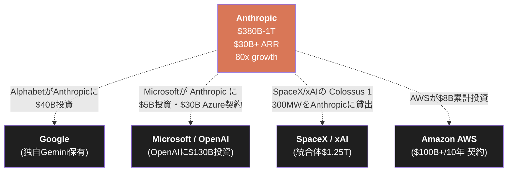

注目すべきは、**主要な競合相手（Google）と主要なクラウド競合（Microsoft）と主要なAI企業（xAI）の全てが、**  
**Anthropicに資金または資産を流している**事実だ。これは異常な状態である。

通常、企業間の競争は資金の奪い合いとして展開される。 
だがフロンティアモデル市場では、競合同士が**相互投資・相互依存**している。 
Microsoftは OpenAI に $130B 投資しながら、Anthropic に $5B 投資し、 $30B Azure 契約を結ぶ。 
Alphabet は自社の Gemini を持ちながら、Anthropic に $40B 投資する。 
xAI は競合の Anthropic に Colossus 1 全面貸出を行う。

このパターンが意味するのは、**AI 市場の規模がそれぞれの企業の単独成長能力を超えている**ということだ。 
「自社モデルだけで世界の AI 需要を満たす」ことが物理的に不可能な規模に達している以上、 
競合への投資が**自社の AI インフラ事業（クラウド・チップ）の販路確保**につながる。

その重力場の中心に、現在 Anthropic がいる。

## 4.10 本章のまとめ

| 企業 | 主要評価額 | ARR / 収益 | 戦略の中核 | 法人形態 |
|---|---|---|---|---|
| **Anthropic** | $380B（実）/ ~$1T（二次市場推計） | $30B+ ARR | エンタープライズ×開発者・PBC | PBC |
| **OpenAI** | $852B | $24B年率 | 消費者ChatGPT エコシステム | キャップ付き営利 |
| **Google** | （Alphabet公開） | 切出非開示 | フルスタック内製 | 公開上場の一部 |
| **Meta** | （Meta公開） | 切出非開示 | オープンウェイト + 内製 | 公開上場の一部 |
| **xAI** | （SpaceX統合） | $3.3B年率 | SpaceX/X統合（消滅） | LLC→統合 |

フロンティアラボ 5 社の比較から見えるのは、各社が**異なる戦略選択**をしており、 
その選択がそれぞれの構造を生んでいるという事実である。

Anthropic の特徴は、シンプルさにある。 
エンタープライズと開発者向けに、API とプロダクトを売る。 
Constitutional AI を中核とする思想・信頼の構造を企業形態に内蔵する。 
コンピュートは 4 社並行で調達する。 
広告も既存事業統合もハードウェア販売もない。

この**シンプルな構造**こそが、現在のフロンティアラボ業界において Anthropic を中心に置いている。 
複雑な多角化を回避し、最もスケーラブルな単一の収益エンジンを最大限に拡張する。

ただし、業界の構造は流動的である。 
OpenAI のエコシステム拡張、Google のフルスタック統合、Meta のオープンウェイト戦略—— 
これらが将来的に Anthropic の地位を脅かす可能性は否定できない。

次章では、この構造を支える**組織設計・人材戦略・資本構造**を解剖する。 
なぜ Anthropic は、わずか 2,500 人 の組織で $30B+ ARR を生み、 $1T 規模の評価額を獲得できるのか。 
組織と資本の非線形性が、本章で論じたシンプルさをいかに可能にしているかを見る。

### 参考文献

1. Anthropic. (2026/2/12). "Anthropic raises $30 billion in Series G funding at $380 billion post-money valuation." *anthropic.com*
2. OpenAI. (2026/3/31). "OpenAI raises $122 billion to accelerate the next phase of AI." *openai.com*
3. Alphabet. (2026/Q1). "Q1 2026 Earnings Call." *abc.xyz/investor*
4. Meta. (2026/Q1). "Meta Reports First Quarter 2026 Results." *investor.atmeta.com*
5. Sacra. "xAI revenue, valuation & funding." *sacra.com/c/xai*
6. Bloomberg. (2026/4/24). "Google Expands Anthropic Investment With $40 Billion Commitment."
7. Microsoft. (2025/11/18). "Microsoft, NVIDIA, and Anthropic announce strategic partnerships." *blogs.microsoft.com*
8. Anthropic. (2026/5/6). "Higher usage limits for Claude and a compute deal with SpaceX." *anthropic.com*
9. Latent.Space (swyx). (2026/5/9). "AINews: Anthropic growing 10x/year while everyone else is laying off >10% of their workforce." *latent.space*
10. Anthropic. (2025). "Anthropic is endorsing SB 53." *anthropic.com*
11. Financial Times. (2026/5/7). "Anthropic weighs deal for near $1tn valuation as revenue surges."
12. Sherwood News. (2026/5/7). "Anthropic's Amodei: We could grow 80x this year." *sherwood.news*

 

---

# 第5章: 組織・資本・バリュエーション非線形性 — 経営構造の解剖

## 5.1 2,500人 × $30B+ ARR という異常値

2026年5月時点、Anthropicの従業員数は**約2,500人**と推定されている。 
（複数報道から、出典により1,500〜5,000人のレンジで分散している） 
同時点のARRは**$30B以上**。

この比率は、SaaS史上ほぼ前例がない。

| 企業 | 従業員数 | ARR | 従業員1人あたりARR |
|---|---|---|---|
| **Anthropic（2026/5）** | ~2,500 | $30B+ | **$12M+** |
| Salesforce（成熟期） | ~75,000 | $35B | $467K |
| Snowflake（IPO直後） | ~5,000 | $2.5B | $500K |
| Slack（IPO時） | ~2,500 | $400M | $160K |
| Microsoft（全社） | ~230,000 | $250B | $1.1M |
| Apple（全社） | ~165,000 | $390B | $2.4M |

従業員1人あたり $12M 以上のARR。 
Salesforce の 25倍、Slack の 75倍。 
Microsoft や Apple のような巨大企業すら大幅に上回る。

この異常値は、Anthropic の組織構造が**SaaS の伝統的なスケーリング法則から外れた何か**であることを示唆する。 
本章では、なぜ少人数組織でこの規模のARRを生めるのか、その構造を解剖する。

## 5.2 創業7名と組織の中核

Anthropicは、2021年に**7名の共同創業者**によって設立された。

| 名前 | 役職 | 役割 |
|---|---|---|
| Dario Amodei | CEO | 全体戦略・対外発信 |
| Daniela Amodei | President | 経営・組織運営 |
| Tom Brown | Co-founder | GPT-3 共同筆頭著者（OpenAI出身） |
| Sam McCandlish | Chief Science | 研究統括 |
| Jared Kaplan | Chief Science Officer | Scaling Laws 共同著者 |
| Jack Clark | Head of Policy | 政策・知的権威 |
| Chris Olah | Interpretability Research | Mechanistic Interpretability 中核 |

加えて Ben Mann を含めると、Anthropic の創業中核チームは **8名**となる。

これらの創業者は全員、2026年現在もAnthropicに在籍している。 
（Daniela Amodei は2026年初頭に日常業務から一歩引いたが、取締役会には残留している） 
**3年半経過しても創業中核が分裂していない**ことは、テック業界では稀である。

注目すべきは、創業中核が**研究・思想・政策のラインに集中**している点だ。 
「営業」「マーケティング」「BizDev」といった伝統的な企業機能の長は、創業中核には含まれない。 
これらは後から、外部のエンタープライズ経験者を採用して埋めた。

> **Fig.1: Anthropic組織構造 — 創業中核と後付け機能の分離**

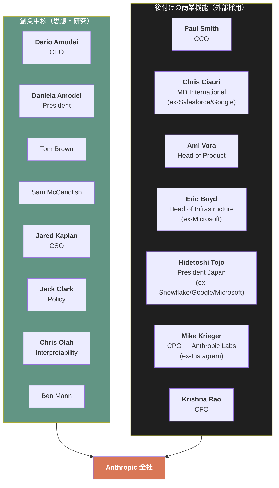

この構造は、**思想を作る人と、その思想を商業化する人を分けている**ことを示す。 
創業中核は思想・研究・政策に集中し、商業機能は別の専門家集団が担う。 
両者が同じ組織の中で異なる役割を果たすことで、思想の純度を保ちながら大規模商業化が可能になる。

## 5.3 報酬と離職率 — 「最も働きたいAI企業」の構造

Levels.fyi（2026/5/9更新）によれば、Anthropic従業員の**中央値総合報酬は $420,388**。 
リードソフトウェアエンジニアの最高額は **$784,781**。

Glassdoor（2026年時点）では、222件の従業員レビューで**4.4/5.0**の総合評価。 
具体的には:

- 95%の従業員が「友人に推薦する」
- 93%が Dario Amodei を CEOとして承認
- 報酬評価 **4.8/5.0**（JobsByCulture が追跡する45の AI 企業中**最高**）

Anthropic は**2026年に一度もレイオフを発表していない**。 
同時期、Block (40%), Coinbase (14%), Cloudflare (20%) などのテック企業が大規模人員削減を実行している中で、Anthropic は採用を継続。 
Tracxn によれば、2026年3月時点で **423-443 の公開求人**を抱えている。

この構造は、**人材プールにおける Anthropic の引力**を物語る。

| 観点 | Anthropic | 業界一般のAI企業 |
|---|---|---|
| 中央値報酬 | $420K | $200-300K |
| 上位エンジニア報酬 | ~$780K | $400-600K |
| 従業員推薦率 | 95% | 60-70% |
| CEO 承認率 | 93% | 60-80% |
| レイオフ（2026年） | なし | 多数 |

これは Meta の Superintelligence Labs が、 
**最大 $300M の報酬パッケージ**で Anthropic / OpenAI から人材を引き抜こうとしている背景と整合する。 
フロンティアラボ間の人材争奪戦において、Anthropic は**最も優位な引力**を持っている。

## 5.4 ARR / 従業員 の構造的意味

なぜ Anthropic は、2,500人で $30B+ ARR を生めるのか。

3つの構造的要因が指摘できる。

**1. ソフトウェアの限界費用ゼロ性が極限まで効いている**

伝統的な SaaS では、顧客が増えると以下のスケーリングコストが発生する。

- カスタマーサクセスチーム
- セールスエンジニア
- 営業組織
- サポート組織

Anthropic の場合、API ベースの提供形態と、Constitutional AI による「説明可能で予測可能なAI」という性質から、**これらのスケーリングコストが構造的に低い**。 
エンタープライズは Claude を AWS / Google / Azure マーケットプレイス経由で調達できるため、Anthropic 自身のセールス組織は最小限で済む。

**2. 製品が一定の知能を持っているため、サポート工数が圧縮される**

通常のSaaSプロダクトでは、顧客サポートは人間が担う。 
質問への回答、トラブルシューティング、設定ガイダンス。 
Anthropic では、これらの**多くを Claude 自身が担う**。 
Claude.ai のヘルプは Claude 経由で提供される。 
Claude Code のドキュメントは Claude 経由で対話的に説明される。 
**自社製品が、自社のサポート工数を削減している**構造である。

**3. 4社並行のコンピュート同盟が、インフラ運営工数を外部化している**

データセンターの物理運営は、AWS / Google / Microsoft / SpaceX が担う。 
Anthropic 自身は、これらのインフラの上でモデルを動かすことに集中できる。 
インフラのスケーラビリティはパートナーに委ね、自社は**研究と製品の中核**にリソースを集中する。

> **Fig.2: ARR / 従業員 の構造的説明**

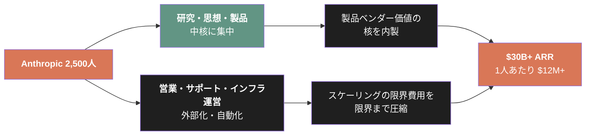

## 5.5 資本構造 — 株主が経営権を持たない設計

Anthropic の資本構造は、伝統的なテック企業とは決定的に異なる。

第3章で言及した通り、Anthropic は **Public Benefit Corporation（公益法人）** として登記されている。 
さらに、**Long-Term Benefit Trust（LTBT）**が取締役の選任権を持つ。

この構造の帰結は、**主要投資家であっても経営権を持たない**ことだ。

| 投資家 | 累計投資額 | 取締役会への代表権 |
|---|---|---|
| Amazon | $13B（$8B + $5B + up to $20B追加） | なし（情報権のみ） |
| Alphabet | up to $40B（$10B + 条件付き $30B） | なし |
| Microsoft | up to $5B | なし |
| NVIDIA | up to $10B | なし |
| GIC | Series G lead（規模非開示） | なし |
| Coatue | Series G lead（規模非開示） | なし |
| 他多数 | 累計 ~$67B 以上 | なし |

この構造の前例は、テック業界では極めて限定的だ。 
通常、$10B 以上を投資する投資家は、取締役会に代表者を送る権利を持つ。 
Microsoft が OpenAI に $130B 投資する代わりに、 
OpenAI のガバナンスに深く関与しているのとは対照的に、 
Anthropic は投資家からの**経営的独立性**を維持している。

> **Fig.3: 資本構造の対比 — 経営権の所在**

| 観点 | OpenAI | Anthropic |
|---|---|---|
| 主要投資家の経営権 | Microsoft が大きく関与 | LTBT が独立して取締役選任 |
| 取締役会の構成 | 投資家代表を含む | 創業者 + LTBT 指名 |
| 利益分配の制約 | キャップ付き営利（複雑） | PBC（公益優先） |
| ガバナンス変更の容易さ | 数回の構造変更を実施 | LTBT による安定性 |

なぜ Amazon・Alphabet・Microsoft・NVIDIA が、 
**経営権を持たない** Anthropic に $67B 以上を投じるのか。

答えは、これらの企業が**Anthropic のガバナンス独立性に価値を見出している**からだ。 
各社は競合関係にある。 
もし Anthropic が Microsoft の経営権下にあれば、Amazon は投資しない。 
逆もまた然り。 
**全ての主要クラウドプロバイダーが Anthropic に投資できるのは、Anthropic が誰の経営権下にもないから**である。

LTBT 構造は「投資家からの自律性を確保するため」と思想的に説明されることが多いが、 
**競合クラウドプロバイダー間の共同投資を可能にする商業的構造**としても機能している。

## 5.6 バリュエーション軌道 — 4年で 380x

Anthropic のバリュエーション軌道を、確定したラウンドのみで追跡する。

| 時点 | ラウンド | 規模 | 評価額（ポストマネー） | リード投資家 |
|---|---|---|---|---|
| 2021/5/28 | Series A | $124M | ~$550M（一部報道） | Jaan Tallinn |
| 2022/4/29 | Series B | $580M | 非開示 | FTX / SBF |
| 2023/5/23 | Series C | $450M | $4.1B | Spark Capital |
| 2023/9/25 | Amazon Strategic | $4B | - | Amazon |
| 2024/11/22 | Amazon追加 | $4B（累計 $8B） | $18.4B（Jan 2024時点・報道） | Amazon |
| 2025/3/3 | Series E | $3.5B | $61.5B | Lightspeed |
| 2025/9/2 | Series F | $13B | $183B | ICONIQ |
| 2025/11/18 | Microsoft / NVIDIA Strategic | up to $15B | ~$350B（CNBC報道） | Microsoft / NVIDIA |
| **2026/2/12** | **Series G** | **$30B** | **$380B** | **GIC / Coatue** |

確定値のみで、Series A の $550M から Series G の $380B まで、 
**4年9ヶ月で 約690倍**の評価額拡大である。

報道されているがクローズしていない調達まで含めると:

| 時点 | 報道内容 | 評価額（報道） |
|---|---|---|
| 2026/4/20 | Amazon 追加 $5B + 最大 $20B（aboutamazon.com、Amazon公式） | $350B（Bloomberg報道） |
| 2026/4/24 | Alphabet up to $40B（WSJ / Reuters） | $350B 参照 |
| 2026/4/29 | 「$900B超」での新規調達検討（Reuters） | ~$900B |
| 2026/5/7 | 「~$50B for ~$900B-1T」（Financial Times） | ~$1T |
| 2026/5/9 | 二次市場（Forge / Jupiter Prestocks）implied | **~$1.2T**（推計） |

Series G の $380B から、わずか 3ヶ月で 二次市場 implied $1.2T まで、**約3倍**に。 
これが本書冒頭で論じた「$14B から $30B へ、80倍の成長」と整合する。

## 5.7 マルチプル分析 — ARRに対する評価額の規律

バリュエーションが急騰している中で、 
**ARR に対するマルチプル（評価額/ARR比）が一貫している**ことは、 
本書の最も構造的な発見の一つである。

| 時点 | 評価額 | ARR | マルチプル |
|---|---|---|---|
| 2026/2/12（Series G） | $380B | $14B | **27.1x** |
| 2026/4/6（report） | ~$350B（参照点） | $30B+ | ~11.7x |
| 2026/5（二次市場 implied） | $1.0-1.2T | ~$30B+ | 33-40x |
| 2026/5（FT報道） | ~$1T | ~$45B（推測） | ~22x |

確定 ラウンド（Series G）でのマルチプル 27.1x は、 
SaaS 業界の標準レンジ（10-30x）の上端に位置する。 
OpenAI の同期比較（$852B / 月$2B=$24B年率 = ~35.5x）と類似のレベル。

二次市場 implied の $1.2T を採用すると、マルチプルは 33-40x まで拡大するが、 
ARR も $45B に拡大すると、再び 22x 程度に収束する。 
**評価額とARRが同時に急成長することで、マルチプルが「異常な値」ではなく「合理的なレンジ」内に留まっている**。

> **Fig.4: マルチプルの規律性 — 評価額とARRの同時拡大**

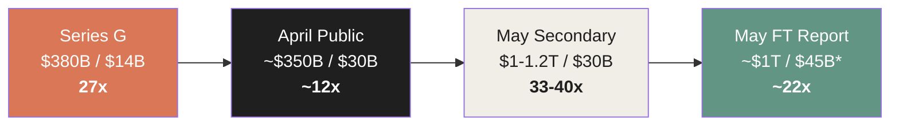

*：$45B は Financial Times の報道による想定値、Anthropic 公式確認なし。

この「マルチプル規律」は、Anthropic のバリュエーション軌道が、 
**投機的バブルではなく、ARR の急成長を反映した合理的拡大である**ことを示唆する。 
もちろん 33-40x は高水準であり、ARR の成長が止まれば評価額は急速に再評価される。 
だが、現時点で「ARR と評価額がそれぞれ独立に異常な値になっている」わけではない。 
**両者が連動して拡大している**。

## 5.8 投資家構成の戦略的意味

Anthropic の投資家リストには、戦略的に重要な構造がある。

| 分類 | 主要投資家 |
|---|---|
| **戦略的（クラウド）** | Amazon, Alphabet, Microsoft, NVIDIA |
| **ソブリン・ウェルス** | GIC（Singapore）, Qatar Investment Authority |
| **トップティアVC** | Lightspeed, ICONIQ, Coatue, Founders Fund, Spark Capital, General Catalyst, Bessemer, Sequoia, Menlo |
| **金融機関** | Fidelity, BlackRock, Blackstone, D.E. Shaw, Dragoneer, Cisco, Salesforce Ventures |
| **政府関連** | MGX（UAE） |

注目すべき特徴は3つある。

**1. 主要クラウドプロバイダー4社全てが投資**

Amazon・Alphabet・Microsoft・NVIDIA。 
これらは互いに激しい競合関係にある企業群だが、全社が Anthropic に投資している。 
これは LTBT 構造があるからこそ可能であり、 
また、各社が「Claude を自社プラットフォーム上で配信する経済的インセンティブ」を共有しているからだ。

**2. ソブリン・ウェルス・ファンドの大規模参加**

GIC（Series G リード）、QIA、MGX。 
これらは「数十年単位」の投資ホライズンを持ち、短期リターンを求めない。 
Anthropic の長期的な構造投資に対して、最も整合的な資金源である。

**3. 金融機関の多様性**

公開市場の金融機関（Fidelity、BlackRock）から、ヘッジファンド（D.E. Shaw）、PE（Blackstone）まで多様。 
これは Anthropic 株式が**幅広い金融市場で流動性を持つ**ことを示唆する。 
将来の IPO に向けた地盤整備とも解釈できる。

## 5.9 「物理性」と「ソフトウェア性」の混合

第2章で論じた通り、Anthropic は**ソフトウェア企業であると同時に物理インフラ企業でもある**。 
この二重性が、バリュエーション・モデルに重要な含意を持つ。

伝統的な SaaS 企業のバリュエーションは、ARR とその成長率の関数として算出される。 
だが Anthropic の場合、ARR 以外に**物理コンピュート資産へのアクセス権**という、別の価値源泉が存在する。

| 価値源泉 | 内容 | バリュエーションへの影響 |
|---|---|---|
| ARR | $30B+、80x 成長 | 27-40x マルチプル |
| Claude API/Code | 開発者・エンタープライズの依存 | 顧客LTV の延長 |
| コンピュート確保 | 11+GW のマルチクラウド契約 | 物理的な参入障壁 |
| Constitutional AI | 規制業界での信頼 | 顧客獲得コストの低下 |
| LTBT 構造 | 競合クラウド全社の共同投資を可能にする | 投資家からのアクセス拡大 |

これら全てが同時に Anthropic の価値を構成する。 
$1T 規模のバリュエーションは、ARR だけでは説明できない。 
物理性とソフトウェア性、思想と商業、組織の少人数性と影響力の大きさ——複数の要因が**非線形に積み重なって**、現在の評価額を構成している。

## 5.10 本章のまとめ

| 観点 | 値 | 構造的意味 |
|---|---|---|
| 従業員数 | ~2,500人（推定） | SaaS史上稀な少人数組織 |
| 従業員1人あたりARR | $12M+ | Salesforceの25倍、Slackの75倍 |
| 創業中核の在籍状況 | 7名全員（5年経過、Daniela一歩引く） | 思想の連続性が保たれている |
| 報酬（中央値） | $420K | フロンティアラボで最高水準 |
| レイオフ（2026年） | なし | テック業界全体の人員削減傾向に逆行 |
| 主要投資家 | クラウド4社・ソブリン・トップVC・金融機関 | LTBT による経営独立性が共同投資を可能に |
| Series G評価額 | $380B（2026/2/12） | 確定値の最高 |
| 二次市場 implied | ~$1.0-1.2T | 報道された参照点 |
| マルチプル（Series G） | 27.1x | SaaS 標準レンジの上端 |
| マルチプル規律 | ARR と評価額が同時拡大 | 投機的バブルではなく構造的成長 |

Anthropic の組織・資本・バリュエーションは、**異常値の積層**として理解できる。 
少人数で巨額のARRを生み、創業中核が割れず、競合クラウド全社が共同投資し、マルチプルは規律を保ちながら拡大する。 
これらの異常値は、それぞれ独立に発生しているのではなく、**互いに強化し合う構造**を形成している。

少人数だから思想の純度が保たれる。 
思想の純度が保たれるから信頼が育つ。 
信頼が育つから規制業界が採用する。 
規制業界が採用するから収益が拡大する。 
収益が拡大するから優秀な人材が集まる。 
優秀な人材が集まるから少人数で大規模なARRを生む——フライホイールが完結する。

そしてLTBT 構造が、このフライホイールを**外部からの攻撃に対して保護**している。 
投資家が短期的なリターンを求めて経営判断を歪めることができない。 
創業者の思想が、株主の意思によって書き換えられない。

最終章では、これらの構造が**地理的に展開する事例**として、Anthropic Japan を解剖する。 
なぜ Anthropic は東京を最初のアジア太平洋拠点に選んだのか。 
NEC・Rakuten・NRI・Mercari・DeNA・Classmethod という日本企業の採用パターンが、 
本書で論じてきた構造とどう接続するかを見る。

### 参考文献

1. Anthropic. (2026/2/12). "Anthropic raises $30 billion in Series G funding at $380 billion post-money valuation." *anthropic.com*
2. Anthropic. (2025/9/2). "Anthropic raises $13B Series F at $183B post-money valuation." *anthropic.com*
3. Anthropic. (2025/3/3). "Anthropic raises Series E at $61.5B post-money valuation." *anthropic.com*
4. Anthropic. (2026/4/6). "Anthropic expands partnership with Google and Broadcom..." *anthropic.com*
5. Crunchbase News. "Anthropic Raises $30B At $380B Valuation In Second-Largest Venture Funding Deal Of All Time."
6. Anthropic. (2025/9). "Anthropic expands global leadership in enterprise AI, naming Chris Ciauri as Managing Director of International." *anthropic.com*
7. Anthropic. (2026/1/13). "Introducing Anthropic Labs." *anthropic.com*
8. Levels.fyi. (2026/5/9 更新). "Anthropic salaries."
9. Glassdoor. "Anthropic employee reviews."
10. Tracxn. "Anthropic 2026 Funding Rounds & List of Investors."
11. DeepLearning.ai. "Meta's Hiring Spree Raised Compensation for Top AI Engineers and Executives."
12. Bloomberg. (2026/4/20). "Amazon to Invest an Additional $5 Billion in Anthropic."
13. WSJ. (2026/4/24). "Google Expands Anthropic Investment With $40 Billion Commitment."
14. Financial Times. (2026/5/7). "Anthropic weighs deal for near $1tn valuation as revenue surges."
15. Anthropic. (2023). "Anthropic's Long-Term Benefit Trust." *anthropic.com*

 

---

# 第6章: Anthropic Japan という前線基地 — グローバル構造の地理的展開

## 6.1 東京というアジア太平洋の起点

2025年10月29日、Anthropic は**東京に最初のアジア太平洋拠点**を開設した。 
同日、ダリオ・アモディは高市早苗首相、松本剛明デジタル大臣と会談。 
日本AI Safety Institute との**協力覚書**にも署名した。

東京を選んだことは、複数の戦略的シグナルを発信している。

**1. アジア太平洋の収益成長を反映**

Anthropic は東京開所と同時に「**アジア太平洋地域の run-rate revenue が過去1年で10倍以上に成長した**」と公表した。 
日本・韓国・シンガポール・オーストラリア・東南アジアを含むこの地域は、Anthropic の急成長の重要なエンジンになっている。

**2. 規制適合性が高い市場**

日本は AI 規制の議論で世界をリードする立場にある。 
Hiroshima AI Process（広島AIプロセス）、AI Safety Institute の設立、G7議長国としての国際協調。 
Constitutional AI を中核とする Anthropic の安全性アプローチは、日本の規制環境と**思想的に整合**する。

**3. 「Claudeを使う文化」への適合**

Anthropic Economic Index（2026/1）は、 
Claude.ai 使用の上位国として米国・インド・日本・英国・韓国を挙げている。 
日本のClaude使用は、欧米と並んで**世界トップ層**である。

## 6.2 Hidetoshi Tojo — 日本責任者の人選

Anthropic は2025年8月7日、**東條英俊（Hidetoshi Tojo）**を日本責任者に任命した。 
代表執行役社長（Representative Executive Officer and President）として東京拠点を率いる。

東條氏のキャリアは、Anthropic の戦略選択を象徴している。

| 時期 | 役職 |
|---|---|
| 以前 | Microsoft（日本） |
| 以前 | Google Cloud（日本） |
| 直前 | Snowflake Japan 社長 |
| 2025/8/7 | Anthropic Japan 代表執行役社長 |

**Microsoft → Google Cloud → Snowflake → Anthropic**。 
エンタープライズ・テクノロジーで日本市場を立ち上げた経験を、3度繰り返している。

この人選は、Anthropic Japan が**消費者向けではなくエンタープライズ向けに最初から最適化**されることを示す。 
日本市場における Snowflake の展開は、データプラットフォームとして大手金融機関・小売・製造業に深く浸透した実績がある。 
同じパターンを Claude で再現する設計だ。

## 6.3 NEC — 「Client Zero」としての全社展開

Anthropic Japan の最も象徴的な顧客は、**NEC**である。

2026年4月24日、Anthropic と NEC は**戦略的パートナーシップ**を発表した。 
NEC は **Anthropic 初の日本拠点グローバルパートナー**となり、Claude を以下の規模で展開する。

| 項目 | 内容 |
|---|---|
| 展開人数 | NEC グループ全体で約30,000人 |
| 主要製品 | Claude Code、Claude Cowork |
| 統合先 | NEC BluStellar シナリオ、Security Operations Center (SOC) |
| 目標 | 日本最大級の AI-native エンジニアリングチームを構築 |

NEC の発表文は次のように述べた。

> 「NECは、日本最大級のAI-nativeエンジニアリングチームを構築することを目指す」

この「Client Zero」モデル——大手企業が**自らAI-nativeへ全社変革する事例**として、 
業界全体に波及効果を生む——は、Anthropic の日本戦略の中核である。 
NEC の30,000人展開は、競合の日本企業に対する「自社も同様にAI-nativeになる必要がある」という構造的圧力を生む。

> **Fig.1: NEC Client Zero モデルの構造**

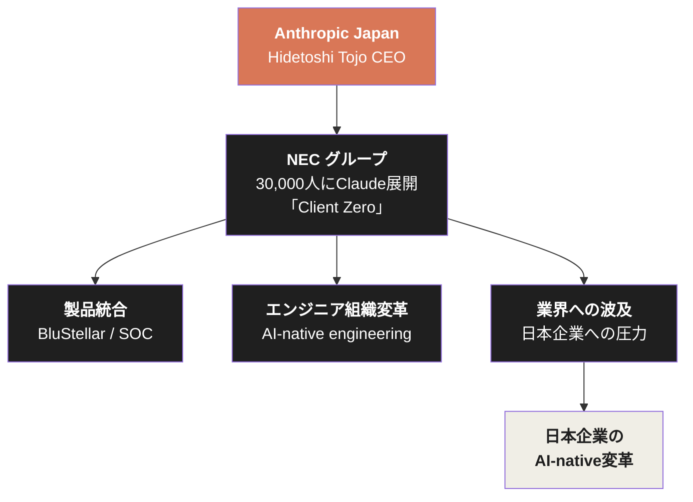

## 6.4 日本企業の採用パターン

NEC を中心としつつ、Anthropic Japan は複数の日本企業との関係を構築している。

| 企業 | 業界 | Claude の採用 | 報告された効果 |
|---|---|---|---|
| **NEC** | テクノロジー / 通信 | Claude Code / Cowork、30,000人 | AI-native エンジニアリング組織化 |
| **Rakuten** | EC / 金融 / モバイル | Claude Code（自律的コーディング） | 開発者生産性向上 |
| **NRI**（野村総合研究所） | コンサル / IT | Claude（Amazon Bedrock 経由） | 日本語ドキュメント分析時間を50%削減 |
| **Mizuho** | 金融 | 確認顧客（Digital Today 韓国報道） | - |
| **Panasonic** | エレクトロニクス / 家電 | 全社統合 | 業務オペレーション / 消費者アプリ |
| **Mercari** | EC / フリマ | コンタクトセンター刷新（AI で工数20%削減） | 内部API「Ellie」公開 |
| **DeNA** | ゲーム / IT | AI Coding Hands-on Workshop、数百人エンジニア参加 | 開発文化への浸透 |
| **Classmethod** | クラウド統合 | Anthropic Authorized Reseller（2026/3） | 10倍の生産性、99%コードがClaude生成 |

注目すべきは、これらの企業の**業界の幅広さ**だ。 
テクノロジー、金融、製造、コンサル、EC、ゲーム—— 
日本の主要産業の中核プレイヤーが、それぞれ自社のコンテキストで Claude を採用している。

NRI の「日本語ドキュメント分析時間50%削減」は、特に構造的に重要だ。 
日本企業の業務文書は、**英語中心の他のLLMでは精度が出にくい**領域である。 
Claude は日本語処理で競合より優位な性能を示しており、これが日本市場での採用加速につながっている。

## 6.5 リセラー・ネットワークの構築

Anthropic Japan は、直接販売だけでなく**日本市場特化のリセラーネットワーク**を構築している。

| リセラー | 認定時期 | 役割 |
|---|---|---|
| **NRI（野村総合研究所）** | 2025年11月 | 日本初の Anthropic 認定リセラー（Amazon Bedrock経由） |
| **Classmethod** | 2026年3月 | クラウド統合・実装支援 |
| **NHN Techorus** | 2026年3月 | クラウドインフラ展開 |

NRI が「日本初の認定リセラー」となった事実は、 
Anthropic の日本市場戦略における**金融・コンサルファースト**のアプローチを示す。 
NRI は野村ホールディングス傘下の総合シンクタンク・SIerであり、日本の大手金融機関の AI 導入を支援する立場にある。 
Anthropic は NRI 経由で、メガバンク・地銀・保険会社など金融業界全体への到達経路を獲得した。

Classmethod の事例は、技術コミュニティへの浸透を象徴する。 
Classmethod は AWS / Google Cloud のトップティアパートナーとして知られ、技術者コミュニティで強い影響力を持つ。 
同社の「**99%のコードが Claude Code で生成された**」という公開発言は、 
日本の技術コミュニティにおける Claude の信頼性を急速に向上させた。

## 6.6 日本政府との関係

Anthropic Japan は、日本政府との関係も急速に深めている。

| 時点 | 内容 |
|---|---|
| 2025/10/29 | 日本AI Safety Institute と協力覚書、東京拠点開設 |
| 2025/10/29 | 高市早苗首相と Dario Amodei 会談 |
| 2025/10/29 | 松本剛明デジタル大臣と会談 |
| 2025/10/29 | LDP デジタル化推進本部委員会との対話 |

これらの政府関係構築は、第3章で論じた**信頼の経済**の日本版である。 
米国における GSA Schedule、DoD、Lawrence Livermore と同様の構造を、日本でも構築している。

特に AI Safety Institute との協力覚書は重要だ。 
日本AI Safety Institute は経済産業省所管の組織で、生成AIの安全性評価基準を策定する立場にある。 
Anthropic がこの組織と協力関係を結ぶことは、**日本における AI 規制の枠組み形成に発言権を持つ**ことを意味する。

## 6.7 Builder Summit Tokyo — 開発者コミュニティへの浸透

2025年10月の東京拠点開設と同時に、Anthropic は **Builder Summit Tokyo** を開催した。 
150社以上の日本のスタートアップ・創業者が参加。

このイベントの構造的意味は、 
Anthropic が日本市場で**エンタープライズだけでなく、**  
**新興企業のエコシステム**にも同時に投資していることだ。

日本のスタートアップエコシステムは、米国・中国・インドと比較すると規模が小さい。 
だが、ロボティクス、製造業AIモデル、金融AI、医療AIなど、**深い専門領域に特化したスタートアップ**が存在する。 
Anthropic は、これらのスタートアップが Claude をベースに製品を構築するエコシステムを意図的に育てている。

## 6.8 アジア太平洋の起点としての東京

東京は、Anthropic にとって**日本市場だけの拠点ではない**。 
アジア太平洋全体の起点として機能する。

| 国 | Anthropic の主要展開 |
|---|---|
| 日本 | 東京拠点、NEC、NRI、Rakuten、Mercari、DeNA、Classmethod |
| 韓国 | Mizuho 等の確認顧客（Digital Today 報道） |
| インド | Claude.ai 上位使用国（Anthropic Economic Index） |
| シンガポール | GIC が Series G リード投資家 |
| オーストラリア | Commonwealth Bank of Australia（Anthropic 公式顧客） |

GIC（シンガポール政府投資公社）が Series G のリード投資家となった事実は、 
シンガポール政府が**戦略的に Anthropic に長期投資している**ことを示す。 
アジア太平洋地域における Anthropic のプレゼンスは、 
東京・シンガポール・主要顧客都市を結ぶネットワークとして構築されている。

## 6.9 まだ未確認の事項

第3章のスタンスを維持し、本書では確認できていない事項を**未確認**として明示する。

- Anthropic Japan の合同会社としての正確な登記日（複数報道で 2025年中期〜後期と推定されるが、官報による正確な日付確認は本書執筆時点では未取得）
- 東京オフィスの正確な所在地・規模
- Anthropic Japan の従業員数
- アジア太平洋地域における Anthropic の収益が、グローバル ARR の何 % を占めるか

これらは Anthropic Japan の今後の公開情報や、商業登記・税務開示によって明らかになる事項である。 
本書では現時点で確認できない数字を推測で記述することを避け、 
**確認可能な事実のみ**から日本展開の構造を記述している。

## 6.10 本章のまとめ

| 観点 | 値 | 構造的意味 |
|---|---|---|
| 東京拠点開設 | 2025/10/29 | アジア太平洋初の拠点 |
| 日本責任者 | Hidetoshi Tojo（ex-Microsoft/Google/Snowflake） | エンタープライズ展開経験者 |
| NEC 展開規模 | 30,000人 | Client Zero モデル |
| NRI 効率向上 | 日本語ドキュメント分析時間50%削減 | 日本語AIの優位性 |
| Classmethod 実績 | 99%コードが Claude Code 生成 | 技術コミュニティ浸透 |
| アジア太平洋 ARR 成長 | 過去1年で10倍以上 | グローバル成長の主要エンジン |
| 政府関係 | AI Safety Institute 協定、首相・大臣会談 | 規制環境への適合 |

Anthropic Japan は、本書で論じてきた構造の**地理的縮図**である。

製品（Claude Code）と物理基盤（AWS / Google を経由した日本展開）の双対性。 
Constitutional AI が生む信頼が、規制業界（金融・通信・製造）の早期採用を可能にする。 
少人数（東京オフィスの正確な人数は未公開だが、Anthropic 全社2,500人の中の一部）が大規模な収益を生む構造。 
投資家（GIC）の戦略的長期投資。

すべてが、本書のこれまでの章で論じた構造の**地理的具現化**として理解できる。 
日本市場は、Anthropic というグローバル企業の構造的特性を最も鮮明に観測できる前線基地である。

次は、本書の議論を統合する終章へ向かう。

### 参考文献

1. Anthropic. (2025/10/29). "Anthropic opens Tokyo office, signs a Memorandum of Cooperation with the Japan AI Safety Institute." *anthropic.com*
2. Anthropic. (2025/8/7). "Anthropic appoints Hidetoshi Tojo as Head of Japan and announces hiring plans." *anthropic.com*
3. Anthropic. (2026/4/24). "Anthropic and NEC partner to build AI-native engineering at scale in Japan." *anthropic.com*
4. NEC. (2026/4/23). "NEC Announces Strategic Collaboration with Anthropic Focused on Enterprise AI." *nec.com*
5. JCN Newswire via IPROS GMS. "Hidetoshi Tojo appointed as the representative executive president of the U.S. Anthropic Japan Corporation."
6. NRI. (2026/3/6). NRI Anthropic Authorized Reseller press release.
7. Anthropic. (2026/1). "Anthropic Economic Index report: Economic primitives." *anthropic.com*
8. Mercari Engineering Blog. "The Generative AI/LLM Team's Goal of Creating a Platform Equipped with a Wide Selection of AI Tools."
9. Zenn / mizchi. (2025/7). "Conducting an AI Coding Hands-on Workshop: A Case Study at DeNA."
10. TechTradeAsia. (2025/11). "Anthropic opens first Asia-Pacific office in Japan."

 

---

# 終章: 構造の含意 — $1兆ドルの先にあるもの

## 終.1 6つのレイヤーの統合

本書では、Anthropic の $1兆ドル軌道を6つのレイヤーから解剖してきた。

| 章 | 解剖対象 | 中核的な発見 |
|---|---|---|
| 序章 + 第1章 | 軌道の事実 | $14B → $30B(2ヶ月) / 80倍年率 / $1.2T 二次市場 implied |
| 第2章 | 製品エンジン + 物理基盤 | Claude Code $2.5B ARR / 11+ GW のマルチクラウド同盟 |
| 第3章 | 思想と信頼 | Constitutional AI / 規制業界の早期採用 / 1,000+ の $1M+顧客 |
| 第4章 | フロンティアラボ4社比較 | Anthropic は「シンプル」「PBC」「マルチクラウド」で独特 |
| 第5章 | 組織・資本・バリュエーション | 2,500人で $30B+ ARR / マルチプル規律 / LTBT構造 |
| 第6章 | Anthropic Japan | グローバル構造の地理的具現化 / NEC Client Zero モデル |

これら6つのレイヤーは、独立に存在しているのではなく、 
**互いに強化し合うフライホイール**を形成している。

> **Fig.1: 6レイヤーの統合構造**

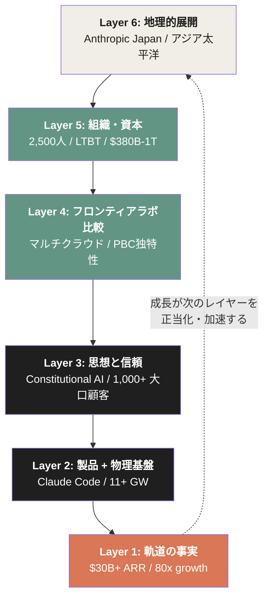

ARR 成長 → コンピュート確保 → 信頼の深化 → 競合との差異化 → 資本流入 → 地理的拡張 → さらなる ARR 成長。 
フライホイールが回るたびに、各レイヤーが強化される。

## 終.2 swyx のテーゼの再考

本書冒頭で引用した、Latent.Space の swyx（2026/5/9）のテーゼを再度引く。

> 「Anthropicは年間10倍成長を続けている一方で、それ以外のAI関連企業は10%超の人員削減を行っている」

このテーゼは、本書の解剖を通じてより深く理解できる。

Anthropic 単独の成長は、業界全体の縮小を意味しない。 
むしろ、AI 業界の**価値が再配置されている**ことを示している。

- 伝統的SaaS（ServiceNow、Salesforce 等）の機能 → Claude Code / Cowork へ吸収される一部
- 一般的なソフトウェア開発工数 → Claude Code への移行で削減される人員
- 中位ベンダー → フロンティアラボへの収斂

「**フロンティアモデルが業界の重力の中心になる**」という構造的シフトが、進行している。 
Anthropic はこのシフトの**最も顕著な受益者**だが、Google・OpenAI・Meta も同方向の重力に引かれている。

## 終.3 「Anthropic勝利」と語らない理由

本書は、序章で「Anthropic が勝った」という表現を避けると宣言した。 
終章でもこの方針を維持する。

理由は3つある。

**1. 軌道はまだ進行中である**

$30B+ ARR、$1.2T implied valuation は印象的な数字だが、AI 業界の構造は急速に変化している。 
OpenAI のエコシステム拡張、Google のフルスタック統合、新興企業の出現—— 
これらが Anthropic の地位を変動させる可能性は常にある。 
「勝った」と語ることは、**過去形を未来に押し付けること**であり、構造分析の精度を下げる。

**2. 構造的優位は「勝利」ではなく「位置」である**

Anthropic の独自性は、競争に勝利したことではなく、**異なるゲームをしていること**にある。 
OpenAI が消費者エコシステム、Google がフルスタック、Meta がオープンウェイトを選ぶ中で、 
Anthropic は「エンタープライズ + 開発者 + Constitutional AI」のシンプルさを選んだ。 
各社が異なるポジションを取っており、それぞれのポジションがそれぞれの市場で機能している。

**3. 「勝者」フレームは思考を停止させる**

「Anthropic 勝利」と言った瞬間、それ以上の構造分析が不要に感じられる。 
本書の目的は、**勝敗判定ではなく構造解剖**である。 
読者が本書を読み終えた後、 
Anthropic だけでなく、OpenAI・Google・Meta・新興企業を見るときも、 
同じ構造的視点で観察できるようになることが目標である。

## 終.4 1兆ドルの先

本書は「The Growth Engine of Anthropic」と題している。 
「The Growth Story」でも「The Anthropic Phenomenon」でもない。 
**エンジン**——成長を駆動する構造的な仕組み——を解剖することが本書の目的だった。

エンジンは、燃料が供給され続ける限り回り続ける。 
Anthropic の場合、燃料は4つある。

1. **製品需要**：Claude Code・Cowork・Enterprise の拡大
2. **コンピュート供給**：AWS / Google / Microsoft / SpaceX の物理容量
3. **思想による信頼**：規制業界・政府の継続的採用
4. **資本流入**：戦略投資家・ソブリン・トップVC の長期コミット

これら4つの燃料が、現時点では全て供給されている。 
Claude Code は GitHub commits の4%、 
コンピュートは 11+ GW 確保、 
$1M+ 顧客は2ヶ月で倍増、 
Series G は $30B 調達。 

だが、永続的なエンジンは存在しない。

OpenAI が GPT-5、GPT-6、新製品で Claude のシェアを奪う可能性。 
Google が TPU の優位性で計算コストを劇的に下げる可能性。 
Meta のオープンウェイトモデルが**「無料で十分良い」**という選択肢を提供する可能性。 
Anthropic 自身がスケールに伴う組織課題で減速する可能性。

これらのリスクが顕在化すれば、エンジンの一部が止まる。 
本書で論じた構造的優位は、**永続性の保証ではなく、現時点での観測結果**である。

## 終.5 本書を超えて

Anthropic を理解することは、AI 産業全体を理解することの一部でしかない。

本書は **Silence of Intelligence**（ダリオ・アモディの思想）と、 
**Anatomy of Anthropic**（企業体の解剖）の続編として書かれた。 
さらに広い文脈で AI 産業を理解するには、以下のテーマがすべて関連する。

- フロンティアラボ4社の競争構造（本書第4章で概観）
- AI が労働市場に与える影響（本書第3章で部分的に扱った）
- AI 規制と政府関係（本書第3章・第6章で扱った）
- コンピュート供給の物理的制約（本書第2章で扱った）
- 大規模言語モデルの技術的進化（本書では扱わなかった）
- ロボティクス・自動運転との接続（本書では扱わなかった）

これらの隣接領域は、別の書籍が必要なテーマである。 
本書の目的は、Anthropic という**一つの企業の構造**を可能な限り正確に解剖することだった。

そして、その構造の解剖を通じて、読者が**AI 産業全体を構造的視点で観察する力**を獲得することを願っている。 
「どの企業が勝つか」ではなく、「各企業がどんな構造でどう動いているか」を見る視点。 
「Anthropic が $1兆ドル」という結果ではなく、「なぜそうなったか」を問う思考。

Anthropic の軌道は、まだ進行中である。 
本書は、その軌道の一時点における断面である。 
次の断面で何が起きるかは、誰にも確実には分からない。 
だが、本書で解剖した構造が崩れない限り、エンジンは回り続ける。

それが、**The Growth Engine of Anthropic** の現時点での結論である。

### 参考文献

1. Latent.Space (swyx). (2026/5/9). "AINews: Anthropic growing 10x/year while everyone else is laying off >10% of their workforce." *latent.space*
2. Anthropic. (2026/2/12). "Anthropic raises $30 billion in Series G funding at $380 billion post-money valuation." *anthropic.com*
3. Anthropic. (2026/4/6). "Anthropic expands partnership with Google and Broadcom..." *anthropic.com*
4. VentureBeat. (2026/5/7). "Anthropic says it hit a $30 billion revenue run-rate after 'crazy' 80x growth." *venturebeat.com*
5. Financial Times. (2026/5/7). "Anthropic weighs deal for near $1tn valuation as revenue surges."
6. 山内怜史. (2025). *Silence of Intelligence — ダリオ・アモディの思想を構造分析する*. Leading AI, LLC. CC BY 4.0. [GitHub](https://github.com/Leading-AI-IO/silence-of-intelligence)
7. 山内怜史. (2026). *Anatomy of Anthropic — The Philosophy, Products, Economics, and Governance Behind the World's Most Deliberate AI Company*. Leading.AI LLC. CC BY 4.0. [GitHub](https://github.com/Leading-AI-IO/anatomy-of-anthropic)

---

*The Growth Engine of Anthropic — Decoding the $1T Trajectory*
*© 2026 Satoshi Yamauchi / [Leading.AI LLC](https://www.leading-ai.io/)*
*Licensed under [CC BY 4.0](https://creativecommons.org/licenses/by/4.0/)*

*This work is an independent analysis. It is not affiliated with, endorsed by, or sponsored by Anthropic, PBC.*
